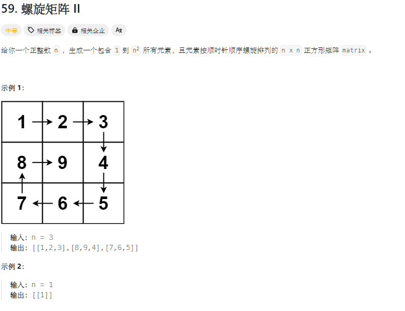

+++
title = '螺旋矩阵'
draft = false
tags = ["代码随想录"]
+++



处理边界条件？

循环不可靠！找到循环不变量！

```c++
#include "../cunion.h"

class Solution {
public:
    vector<vector<int>> generateMatrix(int n) {
        int num = 1;
        //注意这里是全闭区间
        vector<vector<int>> matrix(n, vector<int>(n));
        int left = 0, right = n - 1, top = 0, bottom = n - 1;
        while (left <= right && top <= bottom) {
            //从左往右
            for (int column = left; column <= right; ++column) {
                matrix[top][column] = num;
                num++;
            }
            for (int row = top + 1; row <= bottom; ++row) {
                matrix[row][right] = num;
                num++;
            }
            //从右往左
            if (left < right && top < bottom) {
                for (int column = right - 1; column > left; --column) {
                    matrix[bottom][column] = num;
                    num++;
                }
                for (int row = bottom; row > top; --row) {
                    matrix[row][left] = num;
                    num++;
                }
            }
            left++;
            right--;
            top++;
            bottom--;
        }
        return matrix;
    }
};

int main() {
    Solution *solution;
    vector<vector<int>> vo = solution->generateMatrix(4);
    for (int i = 0; i < vo.size(); ++i) {
        for (int j = 0; j < vo[i].size(); ++j) {
            printf("%d ", vo[i][j]);
        }
        cout << endl;
    }
}
```

```java
class Solution {
    public int[][] generateMatrix(int n) {
        int [][]matrix=new int[n][n];
        int left=0,right=n-1,top=0,bottom=n-1;
        int num=1;
        while(left<=right&&top<=bottom){
            //从左往右：
            for(int column =left;column<=right;column++){
                matrix[top][column]=num;
                num++;
            }
            //从上到下：
            for(int row =top+1;row<=bottom;row++){
                matrix[row][right]=num;
                num++;
            }
            if(left<right&&top<bottom){
                //从右往左
                for(int column=right-1;column>left;column--){
                    matrix[bottom][column]=num;
                    num++;
                }
                //从下到上
                for(int row=bottom;row>top;row--){
                    matrix[row][left]=num;
                    num++;
                }
            }
            left++;
            right--;
            bottom--;
            top++;
        }
        return matrix;
    }
}
```
