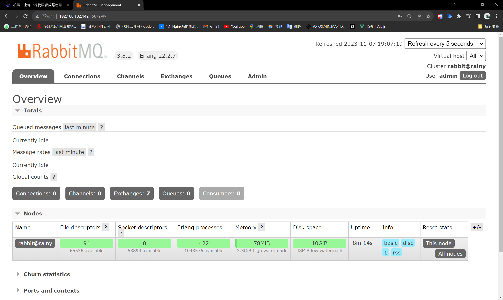
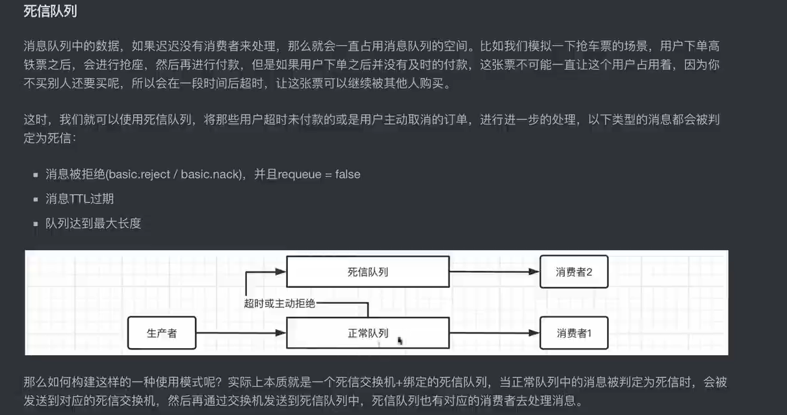
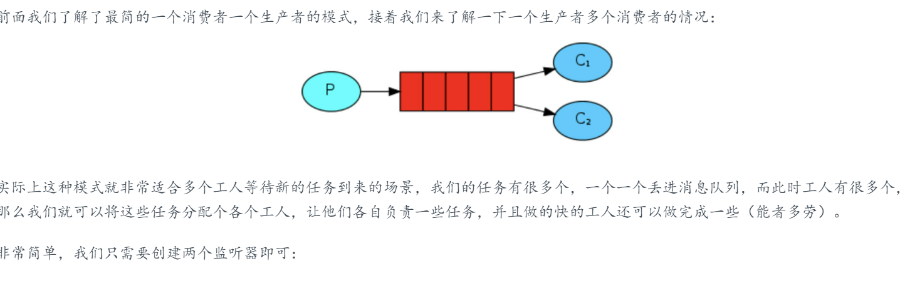
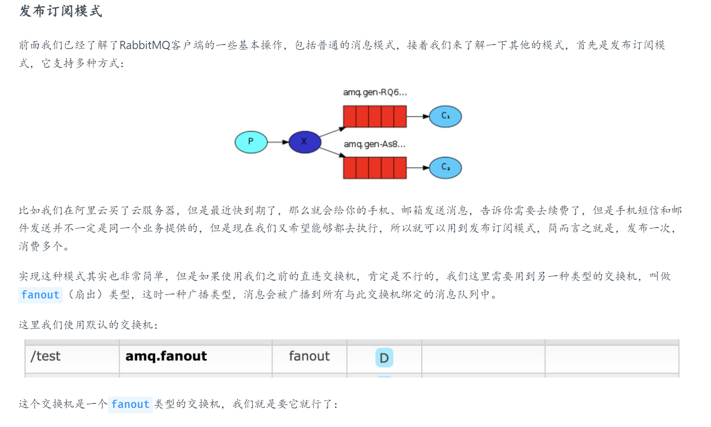
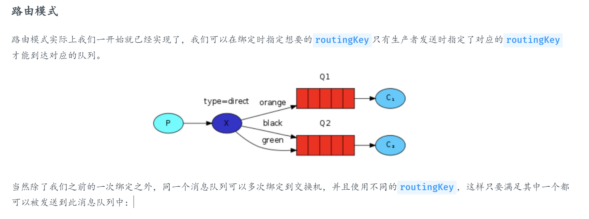
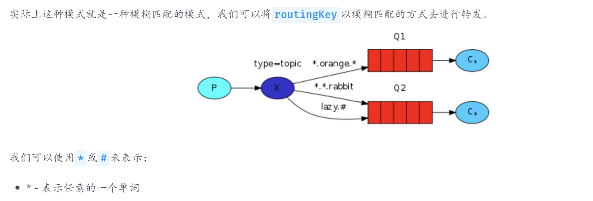
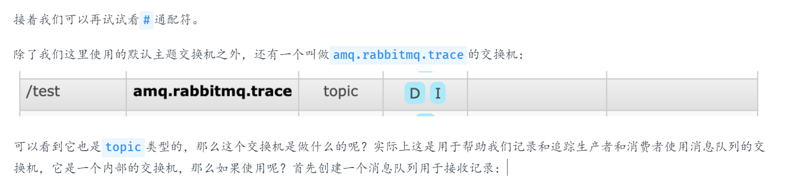
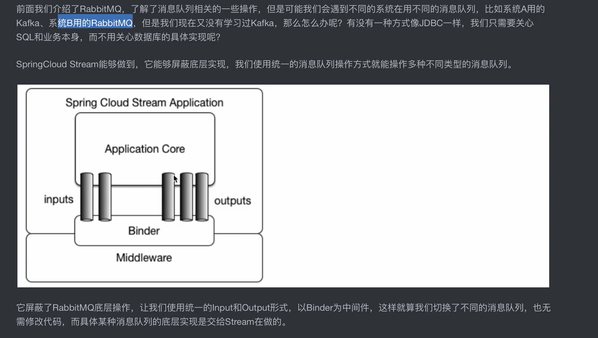
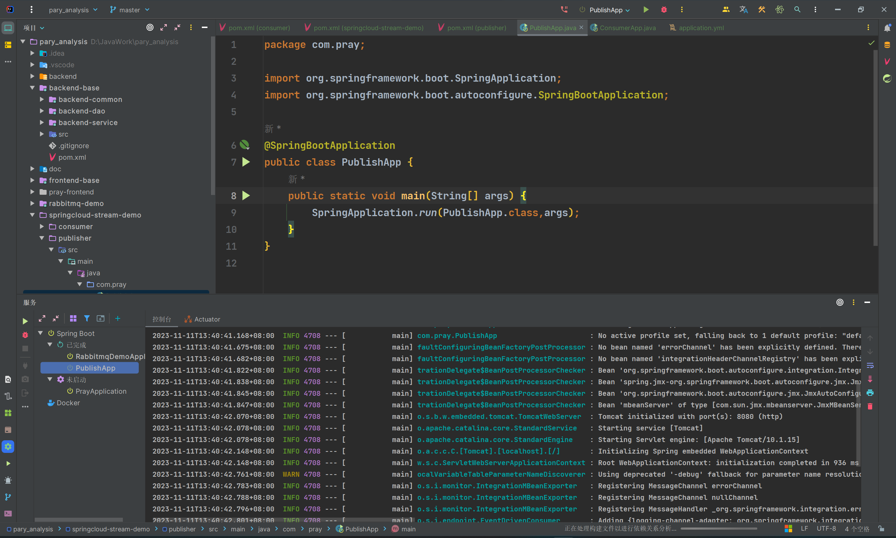

## 认识RabbitMQ
### 环境：ubangtu 

访问协议： amqp

了解安装（反正也记不住）：

```sh
sudo apt install erlang


sudo apt install rabbitmq-server


sudo rabbitmqctl status


sudo rabbitmq-plugins enable rabbitmq_management


sudo rabbitmqctl add_user 用户名 密码


sudo rabbitmqctl set_user_tags admin administrator
```




设计架构图：


**生产者（Publisher）和消费者（Consumer）：**不用多说了吧。
**Channel：**我们的客户端连接都会使用一个Channel，再通过Channel去访问到RabbitMQ服务器，注意通信协议不是http，而是amqp协议。
**Exchange：**类似于交换机一样的存在，会根据我们的请求，转发给相应的消息队列，每个队列都可以绑定到Exchange上，这样Exchange就可以将数据转发给队列了，可以存在很多个，不同的Exchange类型可以用于实现不同消息的模式。
**Queue：**消息队列本体，生产者所有的消息都存放在消息队列中，等待消费者取出。
**Virtual Host：**有点类似于环境隔离，不同环境都可以单独配置一个Virtual Host，每个Virtual Host可以包含很多个Exchange和Queue，每个Virtual Host相互之间不影响。


### 交换机

交换机有持久化和短暂区分

- 默认交换机：AMQP default，查找方法：根据名称来确定
- 普通直连交换机：让某个队列直接绑定，查找方法：routingKey指定哪一个队列


### 创建队列


### 获取消息模式 Ack Mode

拒绝消息：Nack mq true

确认应答：Ack mq false

拒绝消息：Reject mq true/false


## RabbitMq整合SpringBoot

### 创建队列：

```latex
@Configuration
public class RabbitConfiguration {
    @Bean("directExchange")  //定义交换机Bean，可以很多个
    public Exchange exchange(){
        return ExchangeBuilder.directExchange("amq.direct").build();
    }

    @Bean("yydsQueue")     //定义消息队列
    public Queue queue(){
        return QueueBuilder
                .nonDurable("my-rainy")   //非持久化类型
                .build();
    }
    @Bean("binding")
    public Binding binding(@Qualifier("directExchange") Exchange exchange,
                           @Qualifier("yydsQueue") Queue queue){
        //将我们刚刚定义的交换机和队列进行绑定
        return BindingBuilder
                .bind(queue)   //绑定队列
                .to(exchange)  //到交换机
                .with("rainy")   //使用自定义的routingKey
                .noargs();
    }
    //转换为Json实体数据
    @Bean(name = "Jackson2JsonMessageConverter")
    public Jackson2JsonMessageConverter jsonMessageConverter(){
        return new Jackson2JsonMessageConverter();
    }
}
```
在上面的配置中，创建了队列并且绑定了routingkey和对应的交换机，同时加入了自定义的json转换器件

### 发送消息

——> 借助RabbitTemplate

```latex
@SpringBootTest
@Import(RabbitConfiguration.class)
class RabbitmqDemoApplicationTests {

	//消息解释器
	@Resource
	RabbitTemplate template;

	@Test
	void publisher() {
		//使用convertAndSend方法一步到位，参数基本和之前是一样的
		//最后一个消息本体可以是Object类型，真是大大的方便
		template.convertAndSend("amq.direct", "rainy", "Hello World!");//发送消息
		//如何知道发送的消息是否经过处理了？
		Object ackMsg = template.convertSendAndReceive("amq.direct", "rainy", "Hello World!");

	}
}
```

### 处理消息

```latex
/**
 * TestListener
 * 监听器，实际上作为消费者
 * @author 春江花朝秋月夜
 * @since 2023/11/10 0:12
 */
@Component  //注册为Bean,作为接受消息同时处理返回的监听器
public class TestListener {

    @RabbitListener(queues = "rainy")   //定义此方法为队列rainy的监听器，一旦监听到新的消息，就会接受并处理
    public void test(Message message){
        System.out.println(new String(message.getBody()));//打印消息体,消息payload可以自动转换成消息实体
    }
    @RabbitListener(queues = "rainy")   //定义此方法为队列rainy的监听器，一旦监听到新的消息，就会接受并处理，同时还要返回响应信息
    public String ackMsg(Message message){
        System.out.println(new String(message.getBody()));//打印消息体,消息payload可以自动转换成消息实体
        return "响应成功！";
    }
    @RabbitListener(queues = "rainy",messageConverter = "Jackson2JsonMessageConverter")   //定义此方法为队列rainy的监听器，一旦监听到新的消息，就会接受并处理，同时还要返回响应信息
    public String ackDTOMsg(Account message){
        System.out.println(message);//打印消息体,使用定义好的json转换器来转换消息中的json数据
        return "响应成功！";
    }
}
```
## 消息队列

### 死信队列



判定死信：

- 消息被拒绝
- 消息TTL过期
- 队列达到最大长度，相当于被拒绝reject

死信队列创建和监听和正常队列差不多

RabbitMQ支持将超过一定时间没被消费的消息自动删除，这需要消息队列设定TTL值，如果消息的存活时间超过了Time To Live值，就会被自动删除，自动删除后的消息如果有死信队列，那么就会进入到死信队列中。

如果到达队列长度限制，那么每次插入都会把位于队首的消息丢进死信队列，来腾出空间给新来的消息。

### 工作队列模式


**轮询分发消息**：默认交替分发消息，但每个消费者都有一个预先获取数量，最开始一次性获取数量不一定是1

配置消费者预获取数量：

```latex
@Resource
private CachingConnectionFactory connectionFactory;

@Bean(name = "listenerContainer")
public SimpleRabbitListenerContainerFactory listenerContainer(){
    SimpleRabbitListenerContainerFactory factory = new SimpleRabbitListenerContainerFactory();
    factory.setConnectionFactory(connectionFactory);
    factory.setPrefetchCount(1);   //将PrefetchCount设定为1表示一次只能取一个
    return factory;
}
```

配置监听器：
```latex
 //指定的监听器工厂和消费者数量
    @RabbitListener(queues = "rainy",containerFactory = "listenerContainer",concurrency = "10")
    public void listenMsg(Message message){
        System.out.println(message);
    }
```
### 发布订阅模式



注意这时候交换机已经发生变化了，直连交换机不可行，需要使用channel-exchange一对多也就是amq.finout，扇出类型

### 路由模式
通过路由来确定绑定到哪些队列里面去



通过指定不同的routingkey来实现
```java
@Configuration
public class RabbitConfiguration {

    @Bean("fanoutExchange")
    public Exchange exchange(){
      	//注意这里是fanoutExchange
        return ExchangeBuilder.fanoutExchange("amq.fanout").build();
    }

    @Bean("yydsQueue1")
    public Queue queue(){
        return QueueBuilder.nonDurable("yyds1").build();
    }

    @Bean("binding")
    public Binding binding(@Qualifier("fanoutExchange") Exchange exchange,
                           @Qualifier("yydsQueue1") Queue queue){
        return BindingBuilder
                .bind(queue)
                .to(exchange)
                .with("yyds1")
                .noargs();
    }

    @Bean("yydsQueue2")
    public Queue queue2(){
        return QueueBuilder.nonDurable("yyds2").build();
    }

    @Bean("binding2")
    public Binding binding2(@Qualifier("fanoutExchange") Exchange exchange,
                           @Qualifier("yydsQueue2") Queue queue){
        return BindingBuilder
                .bind(queue)
                .to(exchange)
                .with("yyds2")
                .noargs();
    }
}
```
### 主题模式 trace

通过routingKey的模糊匹配来实现，帮助进行日志追踪





### 第四种交换机类型（使用头部信息来实现路由消息到队列中）

已经介绍了三种交换机类型，现在来介绍一下第四种交换机类型header，它是根据头部信息来决定的，
在我们发送的消息中是可以携带一些头部信息的（类似于HTTP），我们可以根据这些头部信息来决定路由到哪一个消息队列中。

### 搭建集群

```shell
sudo rabbitmqctl stop_app
sudo rabbitmqctl join_cluster rabbit@ubuntu-server
sudo rabbitmqctl start_app
```
## SpringCloud消息组件

KafKa?RabbitMq?



尝试搭建微服务项目


