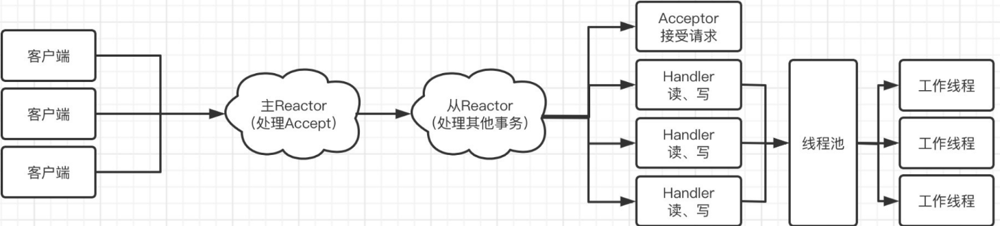

## 通过NIO非阻塞式模型我们可以搭建一个Reactor-SubReactor-Handler的消息服务器

netty的三大基本组件是：buffer，channel，selector

目的：
>
> 主要目的是利用Selector选择器实现IO多路复用
>

先来编写一下客户端，简单起见，只需要建立一个SocketChannel获取管道流传输数据

```java

/**
 * @author 春江花朝秋月夜
 */
public class ClientReactor {
    public static void main(String[] args) {
        // 创建一个新的SocketChannel，一会通过通道进行通信
        try (SocketChannel channel =SocketChannel.open(newInetSocketAddress("localhost", 9000));
                Scanner scanner = new Scanner(System.in)) {
            System.out.println("已连接到服务端！");
            while (true) { // 咱给它套个无限循环，这样就能一直发消息了
                System.out.println("请输入要发送给服务端的内容：");
                String text = scanner.nextLine();
                // 直接向通道中写入数据
                channel.write(ByteBuffer.wrap(text.getBytes(StandardCharsets.UTF_8)));
                System.out.println("已发送！");
                ByteBuffer buffer = ByteBuffer.allocate(128);
                channel.read(buffer); // 直接从通道中读取数据
                buffer.flip();
                System.out.println("收到服务器返回：" + new String(buffer.array(), 0, buffer.remaining()));
            }
        } catch (IOException e) {
            throw new RuntimeException(e);
        }
    }
}

```

现在来考虑一下服务端模型



由于是主从模式，先是有一个主Reactor作为请求接收器件，然后将任务代理给Sub-Reactor