## 基于SpringCloudAlibaba+Nacos+Feign+Seata+Sentinel作为微服务路线叙述

> 前言：本次SpringCloud微服务学习涉及NetFlix和Alibaba两不同版本，主要对应关系为：

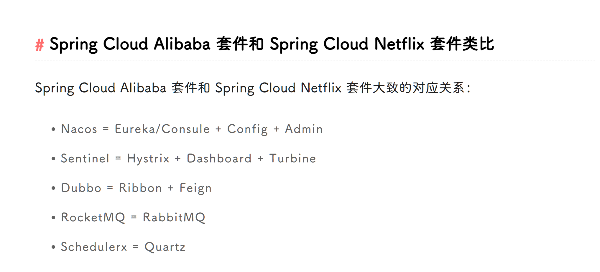

微服务原则：所有的服务都需要保证职责的单一原则

**SpringCloud作为一系列框架的有序集合，是SOA的延续**

SpringCloud Alibaba 是遵循SpringCloud来开发的套件，Nacos亦然

### 服务注册和发现

#### Eureka
Eureka能够自动注册并发现微服务，然后对服务的状态、信息进行集中管理，这样当我们需要获取其他服务的信息时，我们只需要向Eureka进行查询就可以了。

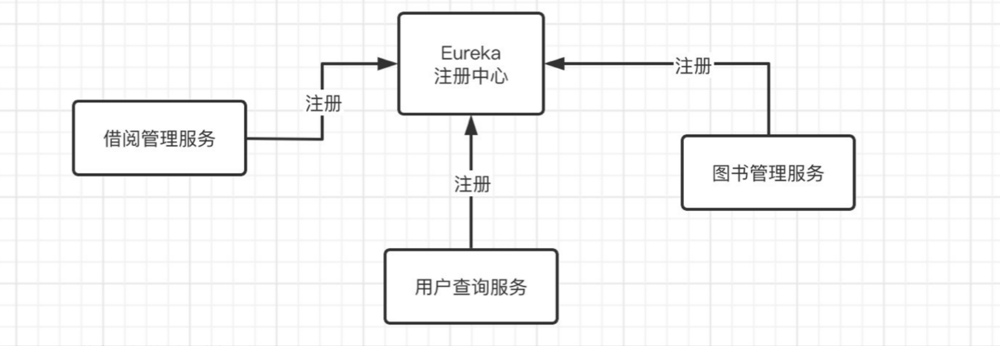

> 通过Eureka服务器进行服务注册与发现，那么现在我们来看看，它的负载均衡到底是如何实现的，实际上之前演示的负载均衡是依靠LoadBalancer实现的。

> 在2020年前的SpringCloud版本是采用Ribbon作为负载均衡实现，但是2020年的版本之后SpringCloud把Ribbon移除了，进而用自己编写的LoadBalancer替代。

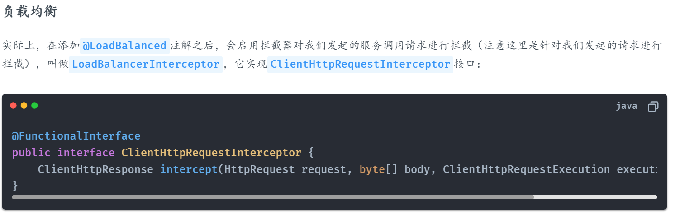

如何找到服务？

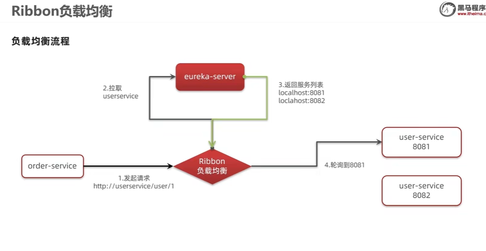

#### Nacos
##### Nacos注册中心
功能：

* 服务注册发现
* 配置中心
* 服务元数据/实例元数据：可以用于流量控制（在实例的metadata（元数据）中加上标签信息。通过IRule获取Server列表并根据这些Server中元数据的标签信息决定路由情况）
* 局域网内服务信息传输快

服务集群分级模式

服务-集群-实例

修改yml：

```yaml
spring:
  cloud:
    nacos:
      server-addr: localhost:8848
      discovery:
        cluster-name: ClUSTER-01
```

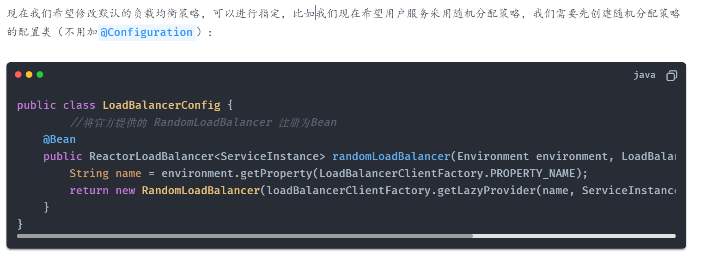

**对指定服务进行配置**

必须重写负载均衡的轮询规则才可以改变负载均衡规则（实现方式为注入Bean或yml配置）

```java
@Configuration
@LoadBalancerClient(value = "userservice",      //指定为 userservice 服务，只要是调用此服务都会使用我们指定的策略
        configuration = LoadBalancerConfig.class)   //指定我们刚刚定义好的配置类
public class BeanConfig {
    @Bean
    @LoadBalanced
    RestTemplate template(){
        return new RestTemplate();
    }
}
```

这样子就实现了对服务的指定负载均衡策略配置

**集群优先**

Nacos优先访问本地集群，当本地集群宕机时，会发生跨集群访问，确定实例之后，会在本地实例中随机轮询

**权重负载均衡**

和Nginx差不多，通过更改集群中实例权重改变负载策略

利用：将服务实例权重调为0~0.01,放入少量请求实现服务升级

**环境隔离**

namespace

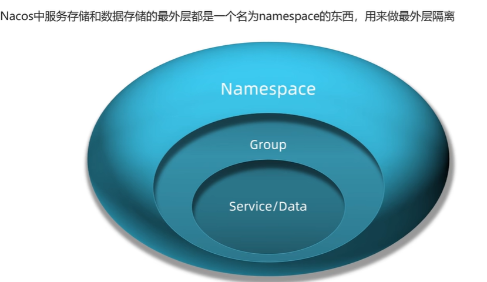

相关度高时可以放入同一组

不同namespace之间不可通过RPC相互调用！

**心跳检测**

临时实例挂掉直接剔除，非临时实例（主动检测）挂掉时，Nacos将会询问健康状况，同时挂起直到实例重启，同时主动发送服务实例变更消息
给服务调用方。Nacos采用CP，Eureka采用AP

##### Nacos配置管理

Data-ID：ServiceName-dev/pro.yaml

依赖：

```xml
<dependency>
    <groupId>com.alibaba.cloud</groupId>
    <artifactId>spring-cloud-starter-alibaba-nacos-config</artifactId>
</dependency>
```

一般只在有热更新需求的配置加入 Nacos配置中心

**统一配置管理**

添加bootstrap.yml

实现热更新

注解@Refreshed

配置文件根据不同环境，具有共享配置和dev/test配置文件等，配置优先级为远端>服务名>本地环境

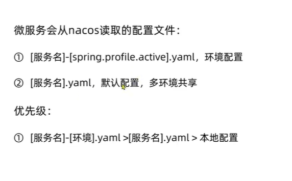

**统一配置中心**

作为远端配置统一管理，本地可以直接fetch然后使用，提高维护性

依赖：

```xml
<dependencies>
    <dependency>
        <groupId>org.springframework.cloud</groupId>
        <artifactId>spring-cloud-starter-config</artifactId>
    </dependency>

    <dependency>
        <groupId>org.springframework.cloud</groupId>
        <artifactId>spring-cloud-starter-bootstrap</artifactId>
    </dependency>
</dependencies>
```
### 负载均衡

Spring实现了一套自己的负载均衡LoadBalancer.
实际上在进行负载均衡的时候，会向Eureka发起请求，选择一个可用的对应服务，然后会返回此服务的主机地址等信息,然后才进行实际的服务调用。

**负载均衡策略**

- 轮询策略
- 权重策略
- 随机策略
- 最小连接数策略（选择连接数最小的的服务实例）
- 重试策略（当服务实例尝试失败之后，尝试继续获取，若多次失败返回null）
- 可用性敏感策略（随机轮询，判断是否可用）
- 区域敏感策略（可用和不可用相互的分区中选取可用分区中的实例）

**限流方案**

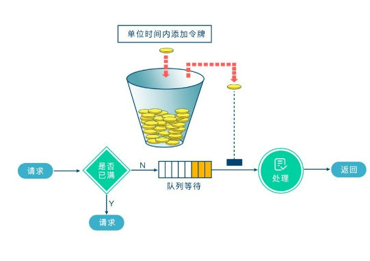

* Guava RateLimiter：基于令牌桶算法限流，单机的。
* Sentinel：基于滑动窗口、漏桶、令牌桶限流，支持单机，也支持集群。
* Redission RateLimiter：令牌桶，支持单机，也支持集群。

添加依赖：

```xml
<dependency>
    <groupId>org.springframework.cloud</groupId>
    <artifactId>spring-cloud-loadbalancer</artifactId>
</dependency>
```

**自定义负载均衡策略**
LoadBalancer默认提供了两种负载均衡策略：

RandomLoadBalancer - 随机分配策略
(默认) RoundRobinLoadBalancer - 轮询分配策略

服务名称-》 LoadBalancerInterceptor-> execute -》 通过轮询规则选择服务 -》返回服务名称以供调用

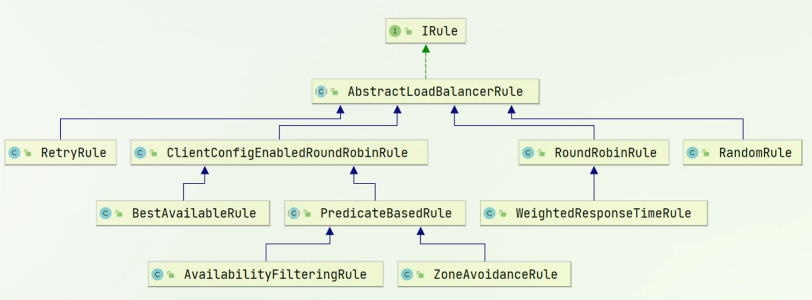

Ribbion懒加载&饥饿加载

第一次加载耗时很长，然后将数据缓存

配置饥饿加载

```yml
ribbon:
  eager-load:
    enabled: true
    clients:
      -service1
      -service2
```

### RPC远程调用

Feign和RestTemplate一样，也是HTTP客户端请求工具，但是它的使用方式更加便捷。首先是依赖：

不同于RestTemplate,Feign是自动集成Ribbon的，同时默认不重试

```xml
<dependency>
    <groupId>org.springframework.cloud</groupId>
    <artifactId>spring-cloud-starter-openfeign</artifactId>
</dependency>
```

feign配置部分：

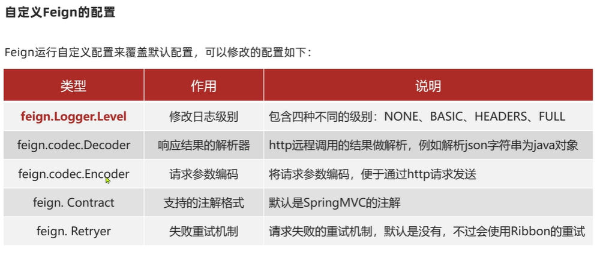


添加接口：

```java
@FeignClient("cloud_service")
public interface RoleClient
{
    //        List<Role> listRole=restTemplate.getForObject("http://localhost:8066/cache/role/list?key="+key,List.class);
    @GetMapping
    List<Role> getRoleCache(@RequestParam  String key);
}
```

**性能优化解决方案**

- 使用HTTP连接池
- 关闭日志

```java
@FeignClient("cloud_service")
public interface RoleClient
{
    @GetMapping
    List<Role> getRoleCache(@RequestParam  String key);
}
```

**Feign的最佳实践方式**

- 继承方式

RPC到达controller，声明方式和controller必须一样，注意实际开发在Feign调用中可能会对请求头中加入相关的鉴权信息

一般不推荐继承方式，因为定义了同一接口，造成了紧耦合

- 抽取Feign

独立出feign-api，模块 负责实体，配置等服务

### 服务网关

统一网关GateWay(基于WebFlux实现，有响应式编程的优势)

> 服务网关是微服务架构中一个非常关键的角色，作为后端服务的统一入口，负责统筹和管理后端服务。能够提供的功能有路由功能、
> 负载均衡、安全认证、流量染色、灰度发布、限流熔断、协议转换、日志收集等

基本作用：认证，校验，路由微服务请求，负载均衡，限流,路由过滤器

工作原理：

客户端向Spring Cloud Gateway发出请求。然后在Gateway Handler Mapping中找到与请求相匹配的路由，
将其发送到Gateway Web Handler。Gateway Web Handler再通过指定的过滤器链来将请求发送到我们实际的服务执行业务逻辑，然后返回。

配置方法：

```text
<!-- 引入Gateway -->
<dependency>
  <groupId>org.springframework.cloud</groupId>
  <artifactId>spring-cloud-starter-gateway</artifactId>
</dependency>

spring:
  cloud:
    gateway:
      routes:
        - id: auth-center
          uri: lb://auth-center #加上lb代表负载均衡
          predicates:
            - Path=/oauth #谓词判断依据
```

1. lb：固定格式，指的是从Nacos中按照名称获取微服务，并遵循负载均衡策略
2. service-name：Nacos注册中心的服务名称

通过重写过滤器实现自定义GateWay过滤器

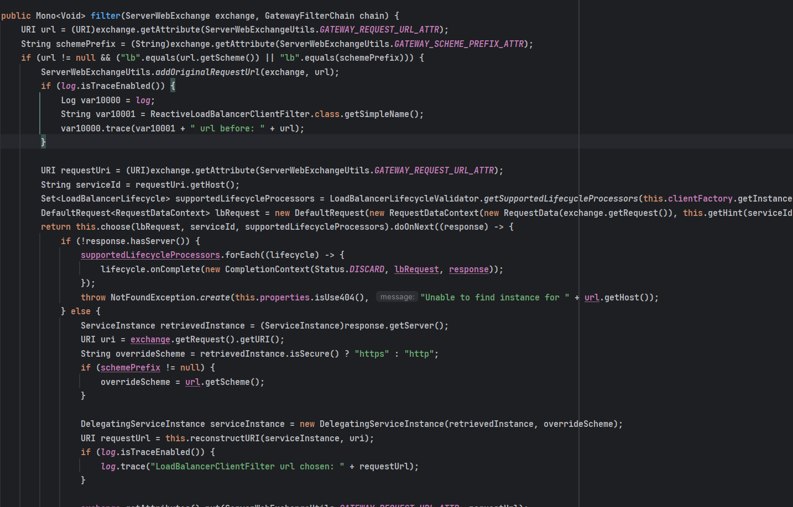

断言：

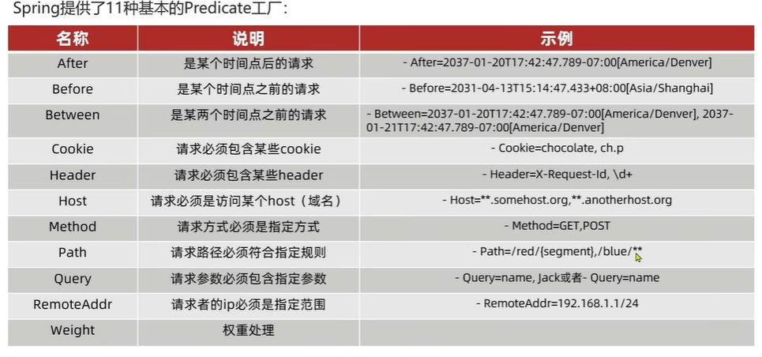

简单架构：

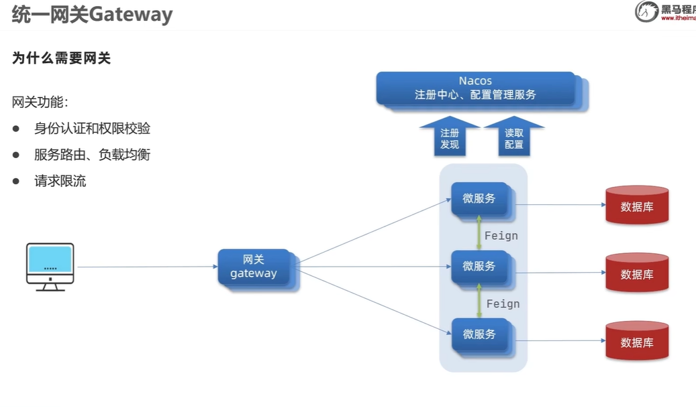

搭建网关

适配器模式：将多个不同的接口实现顶级，变成希望的类或者属性

过滤器执行顺序：

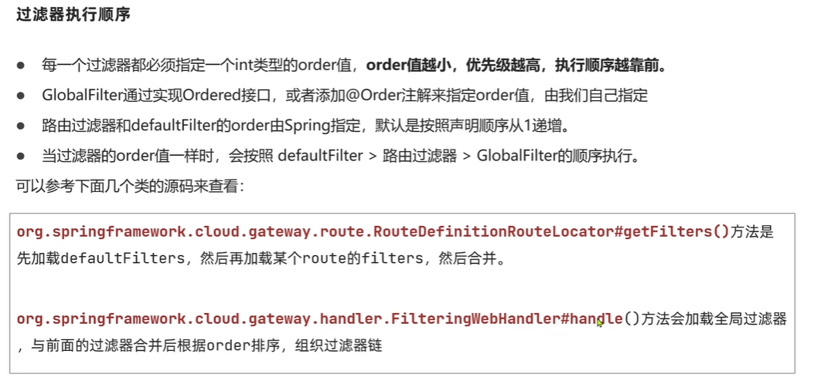 装饰者模式

网关跨域问题：

实际上就是RPC的codec层面

### 断路器

微服务存在雪崩问题，也就是说一个微服务出现问题，有可能导致整个链路直接不可用，这种时候我们就需要进行及时的熔断和降级

#### Hystrix

Hystrix断路器，已经停止维护

依赖：
```xml
<dependency>
    <groupId>org.springframework.cloud</groupId>
    <artifactId>spring-cloud-starter-netflix-hystrix</artifactId>
    <version>2.2.10.RELEASE</version>
</dependency>
```

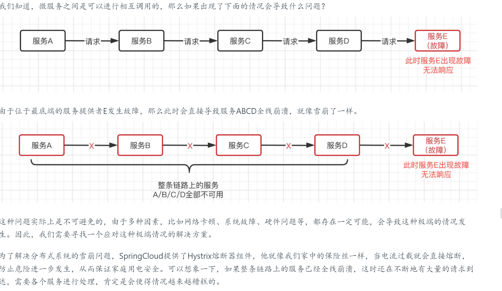

服务失败转为服务降级，而后当服务多次调用失败后，将会发生服务熔断

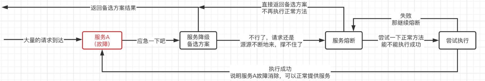

#### Sentinel

随着微服务的流行，服务和服务之间的稳定性变得越来越重要。Sentinel 以流量为切入点，
从流量控制、熔断降级、系统负载保护等多个维度保护服务的稳定性。

```xml
<dependency>
    <groupId>com.alibaba.cloud</groupId>
    <artifactId>spring-cloud-starter-alibaba-sentinel</artifactId>
</dependency>
```

可以实现的监控事项有：

时间点、QPS(每秒查询率)、响应时间等数据。

**三种限流策略**

1. 方案一：快速拒绝，既然不再接受新的请求，那么我们可以直接返回一个拒绝信息，告诉用户访问频率过高。
2. 方案二：预热，依然基于方案一，但是由于某些情况下高并发请求是在某一时刻突然到来，我们可以缓慢地将阈值提高到指定阈值，形成一个缓冲保护。
3. 方案三：排队等待，不接受新的请求，但是也不直接拒绝，而是进队列先等一下，如果规定时间内能够执行，那么就执行，要是超时就算了。

流量阈值的判断，这里我们提4种算法：

漏桶算法，令牌桶算法，固定时间窗口算法，滑动时间窗口算法

限流时，如果发生异常，可以有替代方案；

注解:

```text
@SentinelResource(value = "test",
        fallback = "except",    //fallback指定出现异常时的替代方案
        exceptionsToIgnore = IOException.class)
```

思考： 服务降级时，新来的请求就会导致线程数不断地增加，这样，CPU的资源很快就会被耗尽。

解决办法：

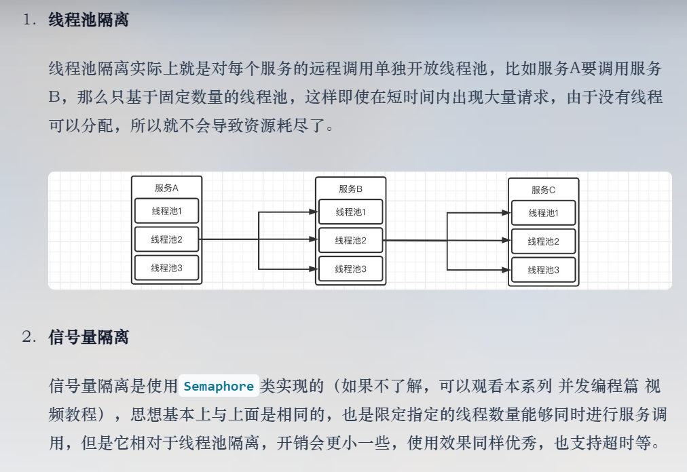

对feign开启断路器

```yaml
feign:
  sentinel:
    enabled: true
```

### 分布式事务

### 单点登录

> 参考文章：[SpringSecurity-Oauth基于Spring3.x](https://blog.csdn.net/m0_64469199/article/details/130477346)

名词解释（UA）：user account and authentication

请求流程图：

客户端模式：

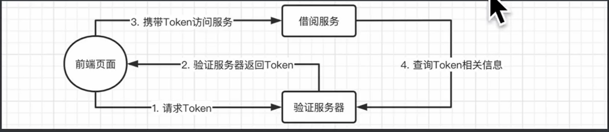

密码模式：

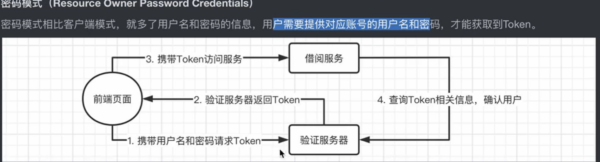

隐式授权模式

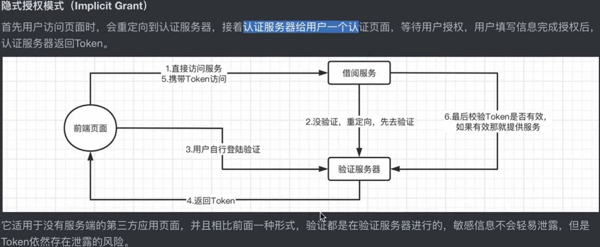


授权码模式（目前采用的主流方案）：

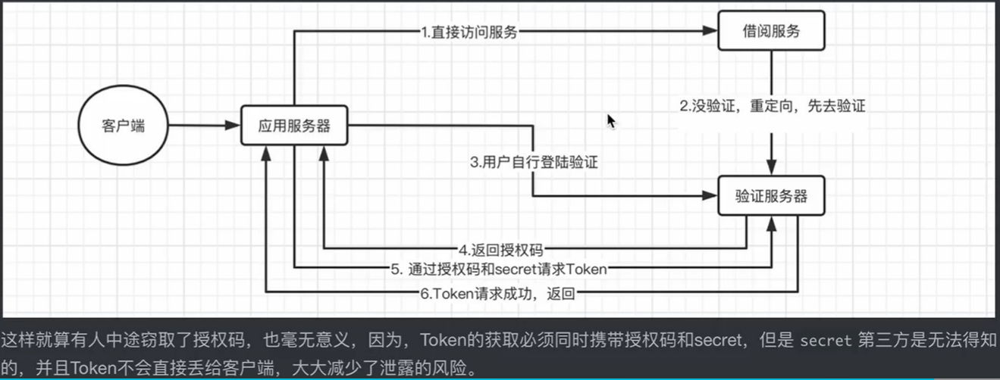

第三方登录Oauth2示意图：


使用jwt存储Token

官网：https://jwt.io

```txt
	JSON Web Token令牌（JWT）是一个开放标准（RFC 7519），它定义了一种紧凑和自成一体的方式，用于在各方之间作为JSON对象安全地传输信息。这些信息可以被验证和信任，因为它是数字签名的。

    JWT可以使用密钥（使用HMAC算法）或使用RSA或ECDSA进行公钥/私钥对进行签名。
	
	实际上，我们之前都是携带Token向资源服务器发起请求后，资源服务器由于不知道我们Token的用户信息，所以需要向验证服务器询问此Token的认证信息，
    
    这样才能得到Token代表的用户信息，但是各位是否考虑过，如果每次用户请求都去查询用户信息，那么在大量请求下，验证服务器的压力可能会非常的大。而使用JWT之后，Token中会直接保存用户信息，
    这样资源服务器就不再需要询问验证服务器，自行就可以完成解析，我们的目标是不联系验证服务器就能直接完成验证。
	
	一个JWT令牌由3部分组成：标头(Header)、有效载荷(Payload)和签名(Signature)。在传输的时候，会将JWT的3部分分别进行Base64编码后用.进行连接形成最终需要传输的字符串。
	
	标头：包含一些元数据信息，比如JWT签名所使用的加密算法，还有类型，这里统一都是JWT。
	有效载荷：包括用户名称、令牌发布时间、过期时间、JWT ID等，当然我们也可以自定义添加字段，我们的用户信息一般都在这里存放。
	签名：首先需要指定一个密钥，该密钥仅仅保存在服务器中，保证不能让其他用户知道。然后使用Header中指定的算法对Header和Payload进行base64加密之后的结果通过密钥计算哈希值，然后就得出一个签名哈希。这个会用于之后验证内容是否被篡改。
	
    	Base64（不是加密算法而是编码方式）： 就是包括小写字母a-z、大写字母A-Z、数字0-9、符号"+"、"/"一共64个字符的字符集（末尾还有1个或多个=用来凑够字节数），任何的符号都可以转换成这个字符集中的字符，
    这个转换过程就叫做Base64编码，编码之后会生成只包含上述64个字符的字符串。相反，如果需要原本的内容，我们也可以进行Base64解码，回到原有的样子。
    	
    	加密算法： 加密算法分为对称加密和非对称加密，其中**对称加密（Symmetric Cryptography）**比较好理解，就像一把锁配了两把钥匙一样，这两把钥匙你和别人都有一把，然后你们直接传递数据，都会把数据用锁给锁上，
    就算传递的途中有人把数据窃取了，也没办法解密，因为钥匙只有你和对方有，没有钥匙无法进行解密，但是这样有个问题，既然解密的关键在于钥匙本身，那么如果有人不仅窃取了数据，而且对方那边的治安也不好，
    于是顺手就偷走了钥匙，那你们之间发的数据不就凉凉了吗。
    	
    	因此，**非对称加密（Asymmetric Cryptography）**算法出现了，它并不是直接生成一把钥匙，而是生成一个公钥和一个私钥，私钥只能由你保管，而公钥交给对方或是你要发送的任何人都行，现在你需要把数据传给对方，
    那么就需要使用私钥进行加密，但是，这个数据只能使用对应的公钥进行解密，相反，如果对方需要给你发送数据，那么就需要用公钥进行加密，而数据只能使用私钥进行解密，这样的话就算对方的公钥被窃取，那么别人发给你的数据也没办法解密出来，
    因为需要私钥才能解密，而只有你才有私钥。
    	
    	因此，非对称加密的安全性会更高一些，包括HTTPS的隐私信息正是使用非对称加密来保障传输数据的安全（当然HTTPS并不是单纯地使用非对称加密完成的，感兴趣的可以去了解一下）
    	
    	对称加密和非对称加密都有很多的算法，比如对称加密，就有：DES、IDEA、RC2，非对称加密有：RSA、DAS、ECC
    	
    	不可逆加密算法： 常见的不可逆加密算法有MD5, HMAC, SHA-1, SHA-224, SHA-256, SHA-384, 和SHA-512, 其中SHA-224、SHA-256、SHA-384，和SHA-512我们可以统称为SHA2加密算法，
    SHA加密算法的安全性要比MD5更高，而SHA2加密算法比SHA1的要高，其中SHA后面的数字表示的是加密后的字符串长度，SHA1默认会产生一个160位的信息摘要。经过不可逆加密算法得到的加密结果，是无法解密回去的，
    也就是说加密出来是什么就是什么了。本质上，其就是一种哈希函数，用于对一段信息产生摘要，以防止被篡改。
    	
	实际上这种算法就常常被用作信息摘要计算，同样的数据通过同样的算法计算得到的结果肯定也一样，而如果数据被修改，那么计算的结果肯定就不一样了。
```


