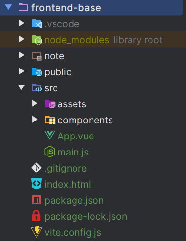
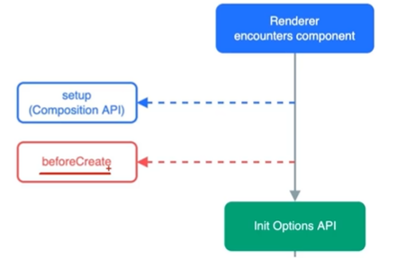
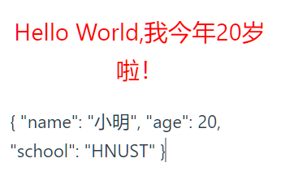
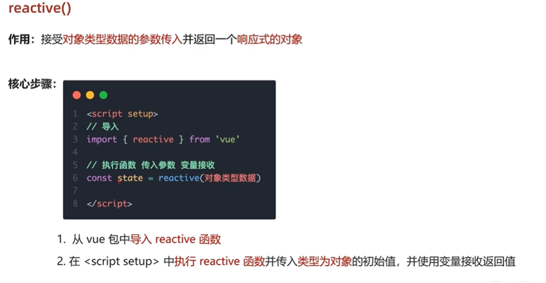
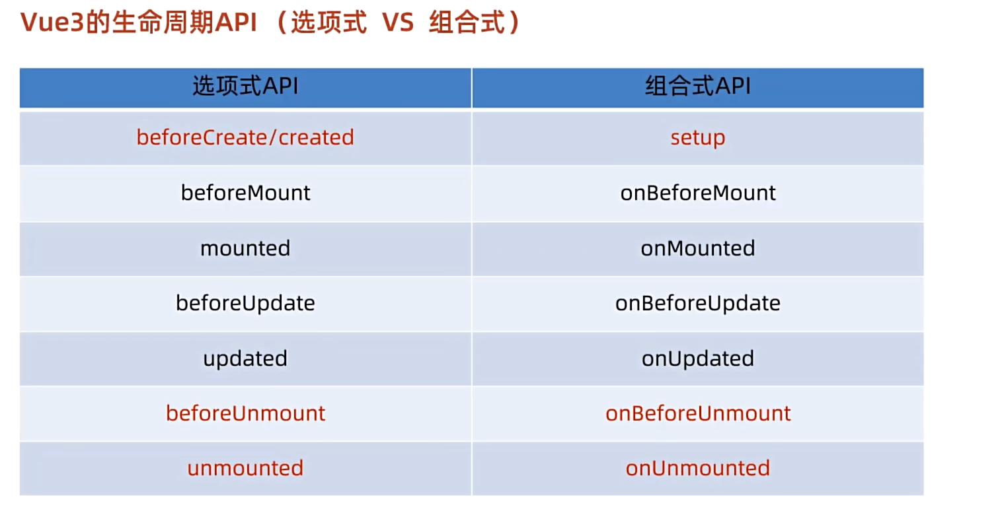
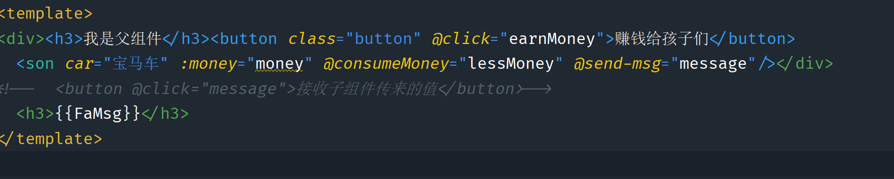
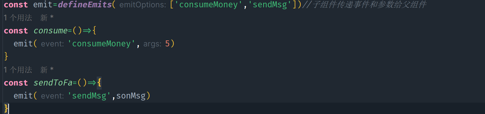
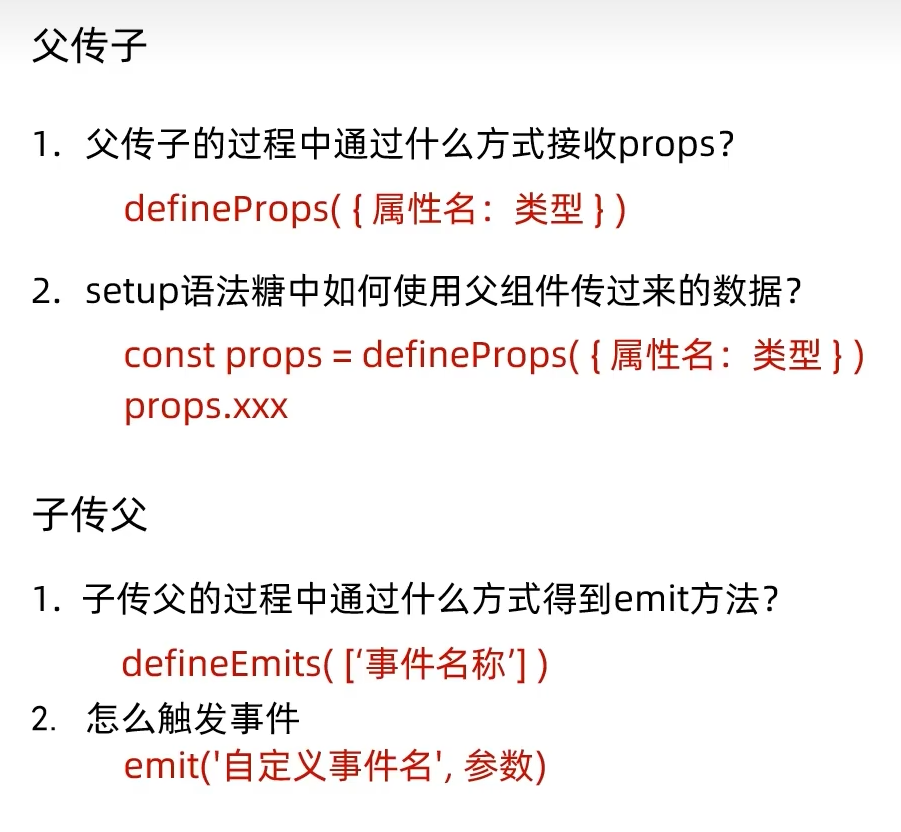

+++
title = 'Vue3 响应式Api开发笔记'
date = 2023-11-04T11:31:54+08:00
draft = false
tags = ['vue']
+++

# Vue3 响应式Api开发笔记

## 目录结构：

用vite构建的Vue3目录结构：



src:

这里是我们要开发的目录，基本上要做的事情都在这个目录里。里面包含了几个目录及文件：

* assets: 放置一些图片，如logo等。
* components: 目录里面放了一个组件文件，可以不用。
* App.vue: 项目入口文件，我们也可以直接将组件写这里，而不使用 components 目录。
* main.js: 项目的核心文件。
* index.css: 样式文件。

static	静态资源目录，如图片、字体等。

public	公共资源目录。

package.json	项目配置文件。

## vue3创建应用

##### 实际案例

- 语法： const app = Vue.createApp({ /* 选项 */ })

传递给 createApp 的选项用于配置根组件。在使用 mount() 挂载应用时，该组件被用作渲染的起点。

案例：

```vue
Vue.createApp(HelloVueApp).mount('#hello-vue')
//createApp 的参数是根组件（HelloVueApp），在挂载应用时，该组件是渲染的起点。
```

一个应用需要被挂载到一个 DOM 元素中，以上代码使用 mount('#hello-vue') 将 Vue 应用 HelloVueApp 挂载到 <div id="hello-vue"></div> 中。

也就是说vue3是把应用程序挂载到mount下面的节点上的，作为渲染页面的起点

##### data选项

data 选项是一个函数。Vue 在创建新组件实例的过程中调用此函数。它应该返回一个对象，然后 Vue 会通过响应性系统将其包裹起来，并以 $data 的形式存储在组件实例中。

##### setup选项

setup创建非常前面：



因此在setup中将不能使用this关键字

```vue
<script >
import {ref,reactive} from "vue";

export default {
  name:'HelloWorld',
  setup(){
    let msg='Hello World'
    let color='red'
    let age=ref(20)
    //声明对象：
    let Person=reactive({
      name:"小明",
      age:20,
      school:'HNUST'
    })
    return{msg,color,age,Person}
  },
}
</script>

<template>
<h1 style="color: red;text-align: center">{{msg}},我今年{{age}}岁啦！</h1>
  <br/>
  <h2>{{Person}}</h2>
</template>

<style scoped>

</style>

```



所有的变量（数据或者函数）都必须返回出去才可以使用

###### setup语法糖

```vue
<script setup>
//不需要手动return，写入内部将会自动return
</script>
```

#### reactive和ref

默认情况下，数据并不是响应式的数据，需要通过这两个关键字来声明响应式数据



对象类型：reactive返回响应式对象

基本数据：ref包了一层对象，访问数据需要通过.value,template访问时不需要

建议声明数据用ref，无论对象还是原始数据

```vue
<script xmlns="http://www.w3.org/1999/html" setup>
import {ref, reactive, watch} from "vue";
  name='WatchParam'
    const  count=ref(0);
    const  clickTimes=ref(0);
     function button(){
      clickTimes.value++;
      console.log(clickTimes)
    }
    //监听普通变量：
    watch(clickTimes,(newV,OldV)=>{
      count.value=newV
      console.log(count)
    })
</script>

<template>
  <button @click="button">点击这个 +1</button>
  <br/>
  <h3>{{clickTimes}}</h3>
  <br/>
  <h3>{{count}}</h3>
</template>
```

#### 组合式API-computed

```vue
<script setup>
//计算属性
import {computed, ref} from "vue";

const list=ref([1,2,3,4,5,6,7,8])
//基于list派生数据

const res=computed(()=>{
  return list.value.filter(item =>item>4)
})

const arr=ref([])
const  additem=()=>{
  arr.value.push("科目三必过")
}
</script>

<template>
<h3>{{list}}</h3>
  <br/>
<h3>{{res}}</h3>
  <br/>
<h3>{{arr}}</h3>
  <br/>
  <button @click="additem">点击添加数据</button>
</template>
```

要求：计算属性不要去处理请求和修稿dom树

#### watch函数

侦察单个元素或者一个对象，同时侦听多个数据也可

```vue
<script setup>
watch([clickTimes,count],(newV,OldV)=>{
  count.value=newV
  console.log(OldV)
  console.log(count)
})
</script>
```

###### 立即执行：immediate:true

###### 深层监视：deep:true 所有属性都将会被监听

###### 修改才出发监听的回调函数：

```vue
watch(()=>count,(newV,OldV)=>{
  count.value=newV
  console.log(OldV)
  console.log(count)
})
```

#### 生命周期函数

created和onMounted

对应关系



```vue
<script setup>
import {onMounted} from "vue";

onMounted(()=>{
  console.log("生命周期函数1")
})

onMounted(()=>{
  console.log("生命周期函数2")
})
</script>
```

#### 父子通信

父组件绑定属性传值给子组件，子组件通过props接收属性

编译器宏：defineProps

父组件动态动态传值：v-model

父组件形态：



这张图片里面，所有的遗传属性需要在引用子组件的时候中声明，子组件定义的通信函数也要在引用时用**@+函数名**的方法声明！

子组件形态：



```vue
<script setup>
import Son from "@/components/heredity/Son.vue";
import {ref} from "vue";
const money=ref(100);
const earnMoney=()=>{
  money.value+=100
}
</script>

<template>
<div><h3>我是父组件</h3><button @click="earnMoney">赚钱给孩子们</button><son car="宝马车" :money="money"/></div>

</template>

<script setup>
//编译器宏组件
const  props=defineProps({
  car: String,
  money:String
})
</script>

<template>
  <div class="son">我是子组件</div>
  <div class="son">遗产{{car}}</div>
  <div class="son">父亲的遗产{{money}}</div>
</template>

<style scoped>
.son{
  border: 1px solid black;
  padding: 30px;
}
</style>
```

##### 子组件传递事件给父组件

> 理论上来讲，子组件修改父组件的值是可以的，但是由于父组件的可以引用多个子组件，其中一个子组件改了父组件的值后，
> 其他的子组件的数据可能会有问题，所以不推荐使用子组件修改父组件的值，而是在父组件中定义属性和方法，在子组件中修改。

子组件内部通过emit触发事件，前提是子组件通过编译器宏声明了事件

子组件部分传递事件：

```vue
const emit=defineEmits(['consumeMoney'])
const consume=()=>{
  emit('consumeMoney',5)
}
```

父组件部分接受事件：

```latex
//传入参数也可以接收
const lessMoney=(args)=>{
  money.value-=args;
}


<son car="宝马车" :money="money" @consumeMoney="lessMoney"/></div>
```



#### 模板引用

ref标识获取dom或者组件实例

创建->绑定->使用
