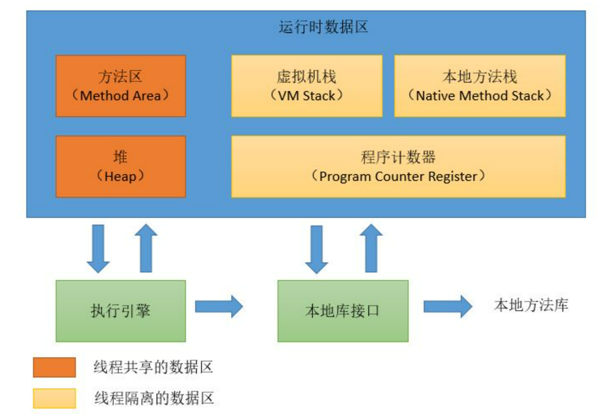
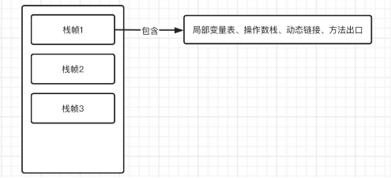

# 概述

JVM 是模拟物理机实现的将 javac 编译为.class 文件，jvm 支持平台无关性。
class 文件通过类加载器-》解释器-》硬件沟通

Jvm 基于 HotSpot 虚拟机架构同时也是基于栈实现的。与 C 语言不同，不同架构的操作系统编译输出的文件不同，jvm 编译后产生的
文件完全相同。

由于执行一段程序需要不断地编译和反编译，将热点执行的代买柜内为热点代码再转换为机器码提高执行效率。同时 jdk1.2 之后支持使用 JNI 来
调用 C/C++代码提升代码执行效率

## 指令

> 基本数据结构：堆栈+队列

常见的编译命令：

> javap -g :vars xxx.java
>
> 反编译：
> javap -v .class 文件地址


反编译后的代码栈顶元素作为操作数，当需要保存变量的时候，进入队列

部分变量某些关键字无法保存将会保存到常量池里面。例如 bipush 只支持单字节数据

## 环境部署

Linux 下下载相关依赖

```shell
sudo yum install build-essential libxrender-dev xorg-dev libasound2-dev libcups2-dev gawk zip libxtst-dev libxi-dev libxt-dev gobjc
```

gcc 环境：


make


jdk 环境：open-jdk8

Linux 下编译结果：


编译 Hello World：


### 手动编译 jdk8 部分



## JVM 内存管理

> C/C++开发中，我们经常通过使用申请内存的方式来创建对象或是存放某些数据，但是这样也带来了一些额外的问题，我们要在何时释放这些内存，怎么才能使得内存的使用最高效，> 因此，内存管
> 理是一个非常严肃的问题。

```c
#include <stdlib.h>
#include <stdio.h>

int main(){
    //动态申请4个int大小的内存空间
    int* memory = malloc(sizeof(int) * 4);
    //修改第一个int空间的值
    memory[0] = 10;
    //修改第二个int空间的值
    memory[1] = 2;
    //遍历内存区域中所有的值
    for (int i = 0;i < 4;i++){
        printf("%d ", memory[i]);
    }
    //释放指针所指向的内存区域
    free(memory);
    //最后将指针赋值为NULL
    memory = NULL;
}
```

> 一旦出现内存问题，我们就无法像 C/C++那样对所管理的内存进行合理地处理，因为所有的内存操作都是由 JVM 在进行，只有了解了 JVM 的内存管理机制，我们才能够在出现内存相关问题时找到解决方案。

#### JNI

调用本地方法，调用 C 语言，关键字 native,通过静态代码块调用 C/C++的实现部分

```latex
    public static void main(String[] args) {
        System.out.println(sum(1,2));
    }

    private static native int sum(int a, int b);//原生的方法不可以具有函数实现
```

内存区域划分



- 内存区域划分为：方法区（线程共享），堆（线程共享），虚拟机栈，本地方法栈，程序计数器
- 方法区和堆栈随 JVM 生消，虚拟机栈，本地方法栈，程序计数器不共享彼此


- 程序计数器 ：作为内存地址，每个地址指向下一条即将指令执行，自动更新，在 jvm 字节码解释器工作时改变时改变值确定指令位置
  public static void main(String[] args) {
  System.out.println(sum(1,2));
  }

  private static native int sum(int a, int b);//原生的方法不可以具有函数实现

- 虚拟机栈 （关键部分），内次当 java 虚拟机创建的时候即可同步一个栈帧（栈里面的元素），栈帧包含了当前方法的一些元素信息：（局部变量表，操作数栈，动态链接，方法出口）

### 虚拟机栈（线程私有）



每个栈帧保存一个可以**指向当前方法所在类 的常量池**，目的是：当前方法 8 中如果需要调用其他方法的时候，能够从运行时常量池中找到对应的符号引用，然后将符号引用转换为直接引用，
然后就能直接调用对应方法，这就是动态链接


在虚拟机栈里面执行的行为就是对方法不断压栈出栈的过程，只有当所有方法出栈之后才可以执行主函数栈

### 堆（线程共享）

作为虚拟机中最大的一块内存空间，区域职责是作为存放对象和数组，垃圾回收器也作用于此



### 方法区（线程共享）（重点）

所有程序共享区域，存储类信息，静态变量，动态编译缓存部分，分为两大部分：类信息表+运行时常量池


编译生成的常量也可以加入常量池里面。

>
> 面试题：String 的常量池，常量池优化
>

```latex
//String a="I am a student";

//        String b="I am a student";
//        String a=new String("I am a student");
//        String b=new String("I am a student");

String a=new String("I am ")+new String("a student");
String b=new String("I am ")+new String("a student");
System.out.println(a.intern()==b.intern());
System.out.println(a.equals(b));

```

#### new 方式

```latex
public static void main(String[] args) {
    String str1 = new String("abc");
    String str2 = new String("abc");

    System.out.println(str1 == str2);
    System.out.println(str1.equals(str2));
}
%使用==判断时，比较地址得到的结果false
%而使用equals时因为比较的是值，所以得到true
```

#### 直接方式

```latex
public static void main(String[] args) {
    String str1 = "abc";
    String str2 = "abc";

    System.out.println(str1 == str2);//注意这里不是通过new的方式，所以为了性能JVM会通过常量池指向这一块
    System.out.println(str1.equals(str2));
}
%是因为我们直接使用双引号赋值
%会先在常量池中查找是否存在相同的字符串，若存在，则将引用直接指向该字符串；
%若不存在，则在常量池中生成一个字符串，再将引用指向该字符串：
```


#### intern 方法(native 方法。底层实现是 C++)

```latex
public static void main(String[] args) {
    //不能直接写"abc"，双引号的形式，写了就直接在常量池里面吧abc创好了
    String str1 = new String("ab")+new String("c");
    String str2 = new String("ab")+new String("c");

    System.out.println(str1.intern() == str2.intern());
    System.out.println(str1.equals(str2));
}
```


- （线程独有）程序计数器：保存当前程序的执行位置。
- （线程独有）虚拟机栈：通过栈帧，多线程里面的 markword 就维护在这里，来维持方法调用顺序，帮助控制程序有序运行。
- （线程独有）本地方法栈：同上，作用与本地方法。
- 堆：所有的对象和数组都在这里保存。
- 方法区：类信息、即时编译器的代码缓存、运行时常量池。

### 内存爆炸和爆栈

```latex
 int[]arr=new int[Integer.MAX_VALUE];
```

下面来个重磅的哈哈，直接爆栈 4 个 G

```latex
   static class Test{ }

        public static void main(String[] args) {
            List<Test> list = new ArrayList<>();
            while (true){
                list.add(new Test());    //无限创建Test对象并丢进List中
            }

        }
```


好家伙，我这里直接 new 了一亿个 Test 对象




虚拟机栈是有限制的，无线递归压栈将会导致虚拟机栈爆炸

#### 申请堆外内存

```latex
 Field unsafeField= Unsafe.class.getDeclaredFields()[0];
 unsafeField.setAccessible(true);
 Unsafe unsafe= (Unsafe) unsafeField.get(null);
 long memory = unsafe.allocateMemory(4);

 unsafe.putInt(memory,123);
 System.out.println(unsafe.getAddress(memory));
```

#### 获取类中定义的属性

```java
Class.getField(properties name) //获取当前类的属性
Class.getSuperClass().getDeclaredField(properties name) //获取当前类的父类的信息
```
