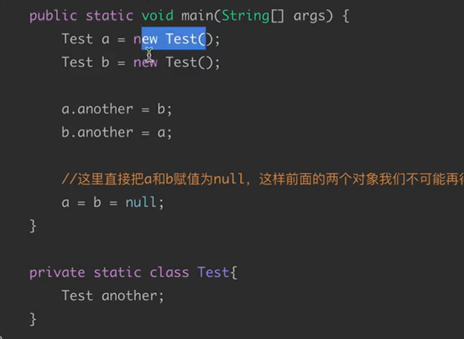
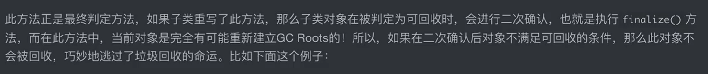
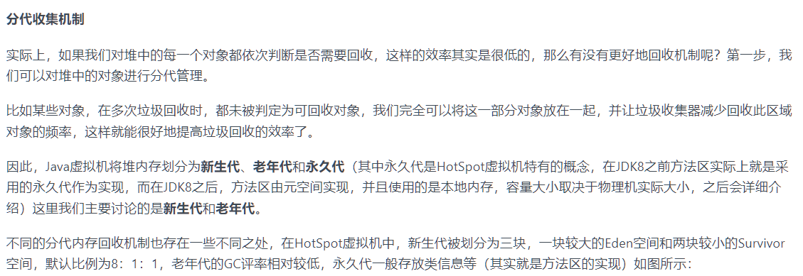
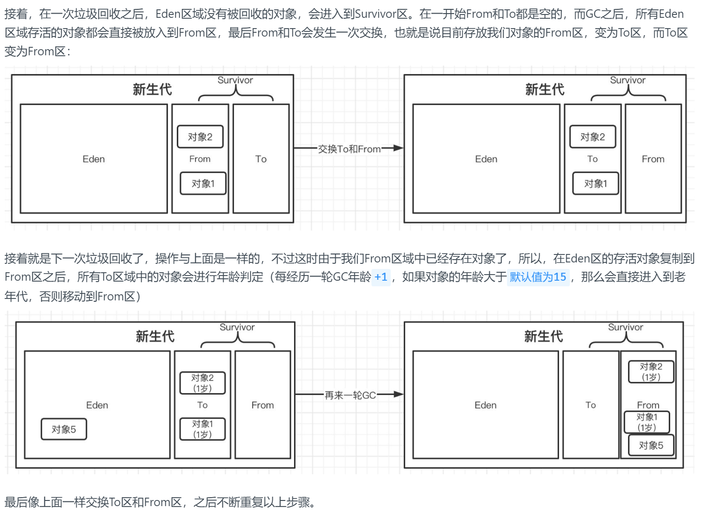
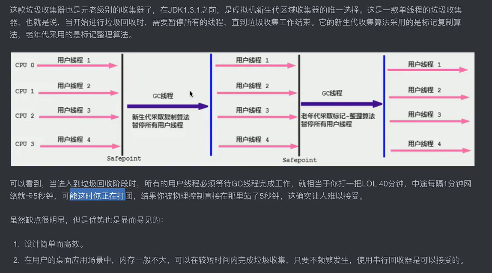

# 垃圾回收机制
### 引用计数法
创建引用变量

循环引用,当对象成为null就没办法了

可达性分析算法：

最终判定过程，此过程可以最后挽留对象

重写finalize方法，最后可以救赎被gc的对象

比如下面这个情况

注意：

同时，这个方法只能生效一次，躲得过初一躲不过十五

### 分代收集机制:

方法区使用永久代实现

>
> 垃圾收集也分为：
>Minor GC - 次要垃圾回收，主要进行新生代区域的垃圾收集。
>
>触发条件：新生代的Eden区容量已满时。
>
>Major GC - 主要垃圾回收，主要进行老年代的垃圾收集。
>
>Full GC - 完全垃圾回收，对整个Java堆内存和方法区进行垃圾回收。
>
>触发条件1：每次晋升到老年代的对象平均大小大于老年代剩余空间
>
>触发条件2：Minor GC后存活的对象超过了老年代剩余空间
>
>触发条件3：永久代内存不足（JDK8之前）
>
>触发条件4：手动调用System.gc()方法
>

在JDK8之前，使用 永久代保存类和元数据 （meta）信息，类加载时产生同时全程JVM不会主动进行清除，最终将会导致OOM异常；

>Java8 中，永久代已经被移除，被一个称为“元数据区”（元空间）的区域所取代。元空间
>的本质和永久代类似，元空间与永久代之间最大的区别在于：元空间并不在虚拟机中，而是使用
>本地内存。因此，默认情况下，元空间的大小仅受本地内存限制。类的元数据放入 native
>memory, 字符串池和类的静态变量放入 java 堆中，这样可以加载多少类的元数据就不再由
>MaxPermSize 控制, 而由系统的实际可用空间来控制

打印GC日志

VM选项: -XX:PrintGCDetails

Minor GC流程

#### 标记复制算法：

标记清除算法 利用GC算法，标记回收对象清除，但是会造成内存空隙，内存利用率低

标记复制算法：解决内存利用率低的问题

标记整理算法：

在一次GC之后仍然存在大量的老年代,效率较低，将会出现程序停顿



## 垃圾收集器实现：

### Serial收集器

### 当前垃圾收集器实现

### 并发垃圾收集器CMS
垃圾清理过程中不会打断其他线程

