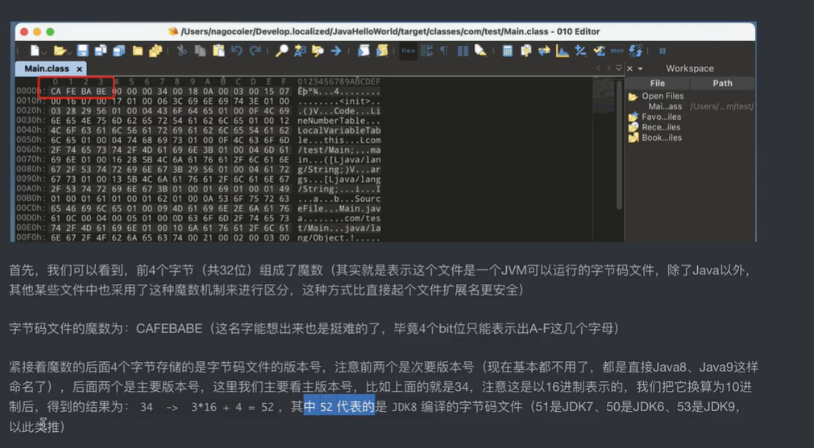
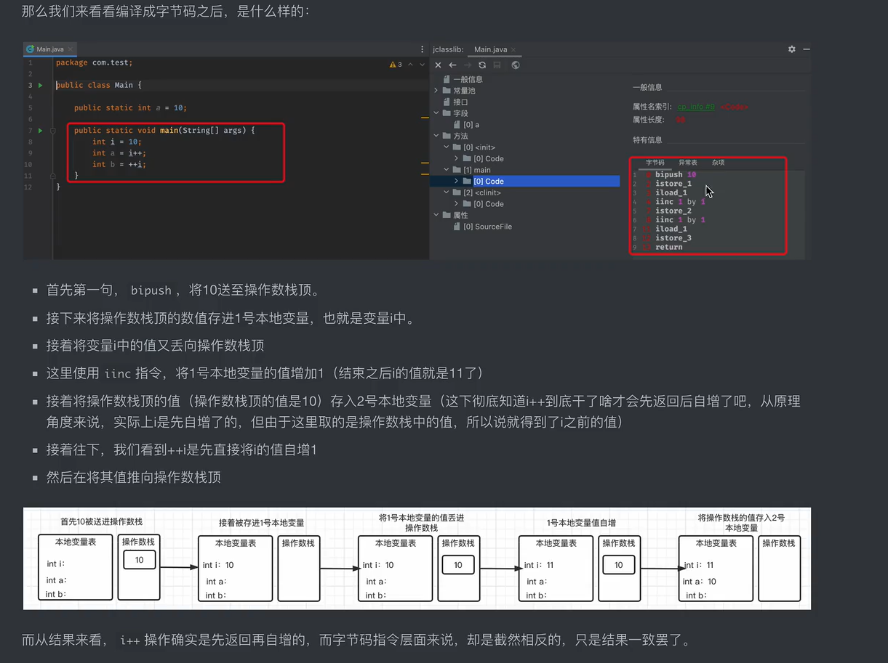

CAFE BABE ->表示这是一个.class文件

### 类加载机制

类加载的条件：

* 使用new关键字创建对象时
* 使用某个类的静态成员（包括方法和字段）的时候（当然，final类型的静态字段有可能在编译的时候被放到了当前类的常量池中，这种情况下是不会触发自动加载的）
* 使用反射对类信息进行获取的时候（之前的数据库驱动就是这样的）
* 加载一个类的子类时
* 加载接口的实现类，且接口带有default的方法默认实现时

### 字节码指令

先返回结果再进行自增或者先自增再给出结果

### Asm字节码框架

劝退，还是算了。。。

Spring实现的CGLib就是基于这个实现的。

### 类加载机制
