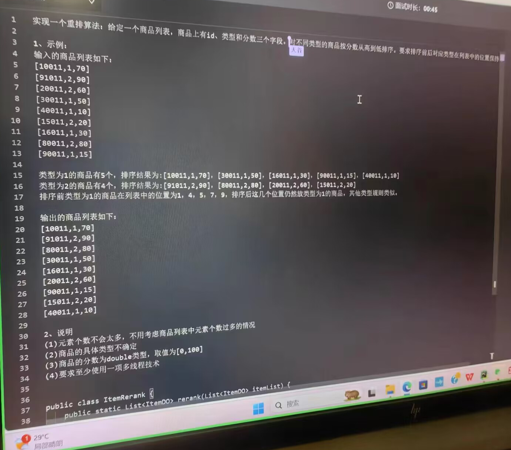

## 题目



难点：合并

解决方法：

实体类：
```java
package com.atguigu;

import lombok.AllArgsConstructor;
import lombok.Data;

/**
 * com.atguigu.ItemDO
 *
 * @author 春江花朝秋月夜
 * @since 2023/10/25 14:45
 */
@Data
@AllArgsConstructor
public class ItemDO {
    int id;//10011
    int type;//具体不确定
    double score;//[0，1000]

    @Override
    public String toString() {
        return "ItemDO{" +
                "id=" + id +
                ", type=" + type +
                ", score=" + score + '\n'+
                '}';
    }
}
```

方法：
```java
package com.atguigu;

import java.util.*;
import java.util.concurrent.ExecutorService;
import java.util.concurrent.Executors;
import java.util.concurrent.TimeUnit;
import java.util.stream.Collectors;

/**
 * com.atguigu.ItemRank
 *
 * @author 春江花朝秋月夜
 * @since 2023/10/25 14:46
 */
public class ItemRank {
    private static ExecutorService executorService= Executors.newFixedThreadPool(2);
    public static List<ItemDO> rerank(List<ItemDO> itemList) throws InterruptedException {
        List<Integer> type=new ArrayList<>();
        for (ItemDO itemDO:itemList) {
            type.add(itemDO.type);//添加类型，这可以用在类型数目不确定时候的遍历方法
        }

        //分组
        Map<Integer, List<ItemDO>> group = itemList.stream().collect(Collectors.groupingBy(ItemDO::getType));

        //排序
        Runnable sort=()->{
            group.forEach((key, value) -> value.sort((o1, o2) -> (int) (o2.getScore()-o1.getScore())));
        };
        List<ItemDO> res=new ArrayList<>();

        Runnable merge=()->{
            //合并排序依据：
            Map<Integer,Integer> typeSort=new HashMap<>();//按照原来的位置填进去
            for (Integer integer:group.keySet()) {
                typeSort.put(integer,0);
            }
            typeSort.keySet().forEach(System.out::println);
            //合并结果
            for (int i=0;i<type.size();i++) {
                Integer curType= type.get(i);//当前的类型
                List<ItemDO> tmp=group.get(curType);
                Integer index = typeSort.get(curType);
                res.add(tmp.get(index));
                typeSort.put(curType,index+1);
            }
        };
        executorService.submit(sort);
        executorService.submit(merge);
        executorService.awaitTermination(3, TimeUnit.SECONDS);
        executorService.shutdown();
        return  res;
    }
}

```
