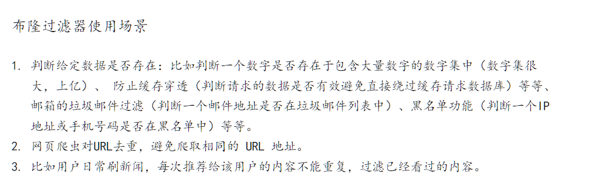
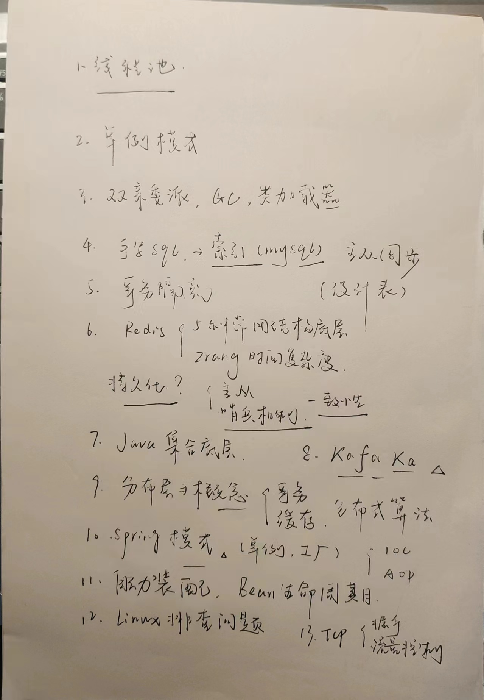
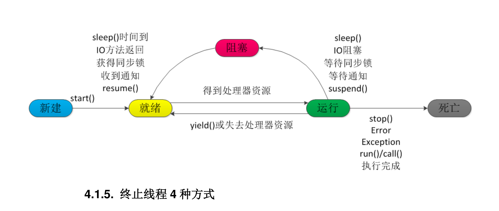

#### 基础知识

##### Hash是什么，有哪些常见的hash定址法

散列表算法希望能尽量做到不经过任何比较，通过一次存取就能得到所查找的数据元素 ，因而必
须要在数据元素的存储位置和它的关键字（可用 key 表示）之间建立一个确定的对应关系，使每个
关键字和散列表中一个唯一的存储位置相对应。因此在查找时，只要根据这个对应关系找到给定
关键字在散列表中的位置即可。这种对应关系被称为散列函数(可用 h(key)表示)。

* 1）直接定址法： 取关键字或关键字的某个线性函数值为散列地址。 即：h(key) = key 或 h(key) = a * key + b，其中 a 和 b 为常数。
* （2）数字分析法
* （3）平方取值法： 取关键字平方后的中间几位为散列地址。
* （4）折叠法：将关键字分割成位数相同的几部分，然后取这几部分的叠加和作为散列地址。
* （5）除留余数法：取关键字被某个不大于散列表表长 m 的数 p 除后所得的余数为散列地址， 即：h(key) = key MOD p p ≤ m
* （6）随机数法：选择一个随机函数，取关键字的随机函数值为它的散列地址， 即：h(key) = random(key)

##### 什么是排序二叉树

首先如果普通二叉树每个节点满足：左子树所有节点值小于它的根节点值，且右子树所有节点值
大于它的根节点值，则这样的二叉树就是排序二叉树

##### 为什么要重写hashcode和equals方法

回答：因为类本省的这两个方法调用时都只是去比较对象的内存地址，当我们new两个相同内容的对象，本来是要比较返回true的但是不重写的话比较
内存返回false，造成错误，故而需要重写这两个方法

##### 什么是深拷贝和浅拷贝

浅拷贝：简单的赋值拷贝操作

深拷贝：在堆区重新申请空间，进行拷贝操作

##### ArrayList和LinkedList区别

回答都实现了List接口作为数据存储管理的容器，场景上Arraylist内部通过动态数组实现，实现快速的随机访问，适用于频繁的读取操作，移动操作性能低，
不支持同步，线程不安全。LinkedList内部双向链表实现，适合插入删除操作，支持作为队列使用（因为实现了Deque接口），同样线程不安全，单线程性能较好。

##### HashMap缺点

>在JDK1.7和JDK1.8中的HashMap的默认初始容量为16，loadFactor均为0.75。
>
> [参考文章](https://blog.csdn.net/calm_encode/article/details/108829945?utm_medium=distribute.pc_relevant.none-task-blog-2~default~baidujs_baidulandingword~default-4-108829945-blog-121167507.235^v43^pc_blog_bottom_relevance_base2&spm=1001.2101.3001.4242.3&utm_relevant_index=7)

回答线程不安全，没有内置读写锁，头插产生死循环，put会覆盖，并发情况put/get可能为空

##### 头插法/尾插法

（jdk1.7）头插在尾部追加元素，（jdk1.8）尾插法，链表长度大于等于8转化红黑树，判断Map键值对数量超过64

##### HashTable为什么线程安全

回答remove，put，get都是同步的方法（synchronized关键字），底层通过数组+链表实现，只允许一个线程对其进行某种操作，所以并发性比ConcurrnetHashMap差

##### ConcurrentHashMap线程安全原因

jdk1.7对每个segment（段）加分段锁（ReentrantLock）实现段隔离保证并发安全 ，最多存在16个段

jdk1.8不再使用段，使用结点（Node）和CAS，Synchronized保证线程安全

> ConcurrentHashMap能保证多个线程同时进行put操作后数据不会错乱，而HashMap在多个线程同时进行put操作后数据会错乱结果无法预知。但是多线程同时操作get方法和put方式时，就无法保证并发线程安全。

##### token无感刷新

* 用户登录成功后，服务器会生成一个Token，并将其颁发给客户端。
* 前端会保存这个Token，并在每次请求时将其添加到请求头中，通常是`Authorization`字段。
* 后端服务器使用密钥对Token进行签名，以确保其真实性和完整性。
* 如果Token即将过期，后端服务器会在响应中返回一个新的Token，并将其作为响应头的一部分。
* 前端的拦截器会检查响应中是否存在新的Token，并将它保存在本地。
* 在后续的请求中，前端会继续使用最新的Token进行身份验证

##### 双Token机制

* Access Token：用于获取访问资源或执行操作的授权，有效期短。客户端发送请求时，在请求头携带此accessToken。
* Refresh Token：用来验证用户的身份，刷新accessToken，有效期长。当accessToken过期时，向服务端传递refreshToken来刷新accessToken。

##### 布隆过滤器

> 名叫 Bloom 的人提出了一种来检索元素是否在给定大集合中的数据结构，这种数据结构是高效且性能很好的，但缺点是具有一定的错误识别率和删除难度。并且，理论情况下，添加到集合中的元素越多，误报的可能性就越大。
>
> [参考文章](https://zhuanlan.zhihu.com/p/676766015)



##### Mq使用场景

**异步解耦**： 耗时而且不需要即时返回结果的操作。将这些操作可以做为「异步处理」，这样可以大大的加快请求的响应时间

**微服务解耦**：独立服务作为微服务，通过Mq实现App通信。

**流量削峰填谷**：MQ，可以将需要处理的消息全部放入其中，系统按照最大处理能力，去获取消息进行消费，这样就可以将一瞬间过来的请求，分散到一段时间内进行处理，避免了系统的崩溃。

**消息分发**：监听服务自己需要的消息

**分布式事务的数据一致性**：已被Seata取代

##### 算法

1.[前序遍历二叉树](https://leetcode.cn/problems/binary-tree-preorder-traversal/)

强化八股文的方向，感谢[学院同学](https://fansea.gitee.io/)的帮助：


> [原文链接](https://www.itbaima.cn/document/5tr1sm4ho6ygpt9q)
##### volatile 关键字 保证变量的可见性

带了这个关键字的变量JMM会把该线程本地内存中的变量强制刷新到主内存中去，并且这个写会操作会导致其他线程中的volatile变量缓存无效，这样，另一个线程修改了这个变时，当前线程会立即得知，并将工作内存中的变量更新为最新的版本

底层实现：内存屏障

内存屏障（Memory Barrier）又称内存栅栏，是一个CPU指令，它的作用有两个：

保证特定操作的顺序
保证某些变量的内存可见性（volatile的内存可见性，其实就是依靠这个实现的）
由于编译器和处理器都能执行指令重排的优化，如果在指令间插入一条Memory Barrier则会告诉编译器和CPU，不管什么指令都不能和这条Memory Barrier指令重排序。

所以volatile能够保证，之前的指令一定全部执行，之后的指令一定都没有执行，并且前面语句的结果对后面的语句可见。

最后我们来总结一下volatile关键字的三个特性：

原子性：其实之前讲过很多次了，就是要做什么事情要么做完，要么就不做，不存在做一半的情况。
可见性：指当多个线程访问同一个变量时，一个线程修改了这个变量的值，其他线程能够立即看得到修改的值。
有序性：即程序执行的顺序按照代码的先后顺序执行。

1. 保证可见性
2. 不保证原子性
3. 防止指令重排

最容易理解：

```java
    private static volatile int a = 0;

    public static void main(String[] args) throws InterruptedException {
        new Thread(() -> {
            while (a == 0);
            System.out.println("线程结束！");
        }).start();

        Thread.sleep(1000);
        System.out.println("正在修改a的值...");
        a = 1;
    }
```


##### 线程池：

类：ThreadPoolExecutor

```java
 public ThreadPoolExecutor(int corePoolSize,
                              int maximumPoolSize,
                              long keepAliveTime,
                              TimeUnit unit,
                              BlockingQueue<Runnable> workQueue,
                              ThreadFactory threadFactory,
                              RejectedExecutionHandler handler)
```
七个参数的实际意义：

1. corePoolSize：核心线程池大小，我们每向线程池提交一个多线程任务时，都会创建一个新的核心线程，无论是否存在其他空闲线程，直到到达核心线程池大小为止，之后会尝试复用线程资源。当然也可以在一开始就全部初始化好，调用prestartAllCoreThreads()即可。
2. maximumPoolSize：最大线程池大小，当目前线程池中所有的线程都处于运行状态，并且等待队列已满，那么就会直接尝试继续创建新的非核心线程运行，但是不能超过最大线程池大小。
3. keepAliveTime：线程最大空闲时间，当一个非核心线程空闲超过一定时间，会自动销毁。
4. unit：线程最大空闲时间的时间单位
5. workQueue：线程等待队列，当线程池中核心线程数已满时，就会将任务暂时存到等待队列中，直到有线程资源可用为止，这里可以使用我们上一章学到的阻塞队列。
6. threadFactory：线程创建工厂，我们可以干涉线程池中线程的创建过程，进行自定义。
7. handler：拒绝策略，当等待队列和线程池都没有空间了，真的不能再来新的任务时，来了个新的多线程任务，那么只能拒绝了，这时就会根据当前设定的拒绝策略进行处理。

比如我们可以自定也这样的一个线程：

```java
ThreadPoolExecutor executor =
            new ThreadPoolExecutor(2, 4,   //2个核心线程，最大线程数为4个
                    3, TimeUnit.SECONDS,        //最大空闲时间为3秒钟
                    new ArrayBlockingQueue<>(2));     //这里使用容量为2的ArrayBlockingQueue队列
```

##### 如何实现定时任务？

回答可以通过Spring自带的Scheduled定时计划和juc里面的Timertask

线程池能不能执行定时任务呢？我们之前如果需要执行一个定时任务，那么肯定会用到Timer和TimerTask，
但是它只会创建一个线程处理我们的定时任务，无法实现多线程调度，并且它无法处理异常情况一旦抛出未捕获异常那么会直接终止，显然我们需要一个更加强大的定时器。

JDK5之后，我们可以使用ScheduledThreadPoolExecutor来提交定时任务，它继承自ThreadPoolExecutor，并且所有的构造方法都必须要求最大线程池容量为Integer.MAX_VALUE，并且都是采用的DelayedWorkQueue作为等待队列。

##### 如何使用线程并发工具类CountDownLatch？

##### 说一下双亲委派机制

当一个类收到了类加载请求，他首先不会尝试自己去加载这个类，而是把这个请求委派给父
类去完成，每一个层次类加载器都是如此，因此所有的加载请求都应该传送到启动类加载其中，
只有当父类加载器反馈自己无法完成这个请求的时候（在它的加载路径下没有找到所需加载的
Class），子类加载器才会尝试自己去加载。
采用双亲委派的一个好处是比如加载位于 rt.jar 包中的类 java.lang.Object，不管是哪个加载
器加载这个类，最终都是委托给顶层的启动类加载器进行加载，这样就保证了使用不同的类加载
器最终得到的都是同样一个 Object 对象。

##### 线程的生命周期

线程经历五个生命周期：创建，就绪，运行，阻塞，消亡

创建：线程的new方法

就绪：调用start方法之后，将被JVM进行初始化

运行：调用run方法

阻塞：线程主动放弃对线程资源的掌控

消亡：直接调用该线程的 stop()方法来结束该线程—该方法通常容易导致死锁，不推荐使用



线程操作的基本方法：线程相关的基本方法有 wait，notify，notifyAll，sleep，join，yield 等

##### Spring事务传播机制：

###### 事务传播的定义：

事务传播行为主要用来描述由某一个事务传播行为修饰的方法被嵌套进另一个方法的事务中，该 事务如何传播。这个概述可能不好理解，换句话就是当一个事务方法被另一个事务方法调用时，这个事务方法应该如何进行。

spring中的事务级别#

###### REQUIRED

REQUIRED是Spring默认的传播机制。如果当前存在事务，则加入该事务；如果当前没有事务，则创建一个新事务。 REQUIRED传播机制最常用的情况是在一个事务 中进行多个操作，要么全部成功，要么全部失败。如果其中一个操作失败，整个事务都将被回滚。

###### SUPPORTS

SUPPORTS传播机制表示当前方法如果在一个事务中被调用，则加入该事务； 否则，以非事务的方式运行。SUPPORTS传播机制适用于对事务要求不高的操作，例如读取操作。

###### MANDATORY

MANDATORY传播机制表示当前方法必须在一个事务中被调用，否则将抛出异常。 MANDATORY传播机制适用于在需要事务的情况下调用方法。

###### REQUIRES_NEW

REQUIRES_NEW传播机制表示当前方法必须开启一个新事务运行，如果当前存在事务，则挂起该事务。 REQUIRES_NEW传播机制适用于对事务要求较高的操作，例如更新操作。

###### NOT_SUPPORTED

NOT_SUPPORTED传播机制表示当前方法不应该在事务中运行，如果存在事务，则挂起该事务。 NOT_SUPPORTED传播机制适用于对事务没有要求的操作，例如日志记录等。

###### NEVER

NEVER传播机制表示当前方法不应该在事务中运行，如果存在事务，则抛出异常。 NEVER传播机制适用于禁止在事务中运行的操作，例如安全检查等。

###### NESTED

NESTED传播机制表示当前方法必须在一个嵌套事务中运行，如果当前存在事务，则在该事务内开启一个嵌套事务；如果当前没有事务，则创建一个新事务。 NESTED传播机制适用于需要分步操作的场景，例如订单中创建订单和订单项的操作。

除了事务传播机制，Spring还提供了事务隔离级别和超时设置等事务管理功能，可以更加细粒度地控制事务。例如，可以根据业务需求选择适当的事务隔离级别， 避免数据不一致等问题；也可以设置事务超时时间，避免长时间占用数据库资源。

###### Spring配置声明式事务

配置DataSource
配置事务管理器
事务的传播特性
那些类那些方法使用事务
DataSource、TransactionManager这两部分只是会根据数据访问方式有所变化，比如使用Hibernate进行数据访问 时，DataSource实际为SessionFactory，TransactionManager的实现为 HibernateTransactionManager。

根据代理机制的不同，Spring事务的配置又有几种不同的方式：

* 第一种方式：每个Bean都有一个代理
*
* 第二种方式：所有Bean共享一个代理基类
*
* 第三种方式：使用拦截器
*
* 第四种方式：使用tx标签配置的拦截器
*
* 第五种方式：全注解

1、spring事务控制放在service层，在service方法中一个方法调用service中的另一个方法，默认开启几个事务？

spring的事务传播方式默认是PROPAGATION_REQUIRED，判断当前是否已开启一个新事务，有则加入当前事务，否则新开一个事务（如果没有就开启一个新事务），所以答案是开启了一个事务。

2、spring 什么情况下进行事务回滚？

Spring、EJB的声明式事务默认情况下都是在抛出unchecked exception后才会触发事务的回滚

unchecked异常,即运行时异常runntimeException 回滚事务;

checked异常,即Exception可try{}捕获的不会回滚.当然也可配置spring参数让其回滚.

spring的事务边界是在调用业务方法之前开始的，业务方法执行完毕之后来执行commit or rollback(Spring默认取决于是否抛出runtime异常). 如果抛出runtime exception 并在你的业务方法中没有catch到的话，事务会回滚。 一般不需要在业务方法中catch异常，如果非要catch，在做完你想做的工作后（比如关闭文件等）一定要抛出runtime exception，否则spring会将你的操作commit,这样就会产生脏数据.所以你的catch代码是画蛇添足。

#####  Mysql中数据隔离机制


|数据隔离机制 |   脏读   |   不可重复读   |   幻读   |
|:------| ---- | ---- | ---- |
| 串行化	  |  不会   |  不会	   |  不会  |
| 可重复读  |  不会   |  不会	   |  会  |
| 读已提交  |  不会   |  会	   |  会  |
| 读未提交  |  会   |   会	  |   会 |


此外，添加DEFAULT 使用数据库设置的隔离级别 ( 默认 ) ，由 DBA 默认的设置来决定隔离级别.这就组成了Spring的事务隔离机制

注意：

脏读 :所谓的脏读，其实就是读到了别的事务回滚前的脏数据。比如事务B执行过程中修改了数据X，在未提交前，事务A读取了X，而事务B却回滚了，这样事务A就形成了脏读。

不可重复读 ：不可重复读字面含义已经很明了了，比如事务A首先读取了一条数据，然后执行逻辑的时候，事务B将这条数据改变了，然后事务A再次读取的时候，发现数据不匹配了，就是所谓的不可重复读了。

幻读: 事务A首先根据条件索引得到10条数据，然后事务B改变了数据库一条数据，导致也符合事务A当时的搜索条件，这样事务A再次搜索发现有11条数据了，就产生了幻读。


##### 说一下Java里面你认识的锁

**乐观锁：**

>
乐观锁是一种乐观思想，即认为读多写少，遇到并发写的可能性低，每次去拿数据的时候都认为
别人不会修改，所以不会上锁，但是在更新的时候会判断一下在此期间别人有没有去更新这个数
据，采取在写时先读出当前版本号，然后加锁操作（比较跟上一次的版本号，如果一样则更新），
如果失败则要重复读-比较-写的操作。
java 中的乐观锁基本都是通过 CAS 操作实现的，CAS 是一种更新的原子操作，比较当前值跟传入
值是否一样，一样则更新，否则失败
>

**悲观锁：**

>
悲观锁是就是悲观思想，即认为写多，遇到并发写的可能性高，每次去拿数据的时候都认为别人
会修改，所以每次在读写数据的时候都会上锁，这样别人想读写这个数据就会 block 直到拿到锁。
java 中的悲观锁就是 Synchronized,AQS 框架下的锁则是先尝试 cas 乐观锁去获取锁，获取不到，
才会转换为悲观锁，如 RetreenLock。
>

**自旋锁：**

>
如果持有锁的线程能在很短时间内释放锁资源，那么那些等待竞争锁
的线程就不需要做内核态和用户态之间的切换进入阻塞挂起状态，它们只需要等一等（自旋），
等持有锁的线程释放锁后即可立即获取锁，这样就避免用户线程和内核的切换的消耗。

优点：一定程度上减少了线程阻塞拥堵的情况

缺点：cpu无用功

##### 计算机网络TCP

说一下一次完整的HTTP请求过程包含的步骤？

1. 进行域名解析
2. 发起TCP3次握手建立连接
3. 客户端发起http请求
4. 服务器响应请求，返回HTML代码
5. 客户端解析代码，并请求HTML代码中包含的资源【JS、CSS、图片等】
6. 浏览器对页面进行渲染
7. 4次挥手断开连接

什么是dns？

DNS即域名系统，是IP地址与域名相互映射的分布式数据库。主要功能是域名解析，即能根据域名解析出对应的IP地址。DNS属于应用层协议，使用UDP进行通信。

为什么dns使用的是udp协议？

_因为UDP工作方式简单方便，只需一次请求、一次响应即可完成解析工作。
而使用TCP需要三次握手建立连接、请求与应答、四次挥手等操作，复杂且耗时长。
UDP传输内容最大不能超过512字节，但是对于域名解析来说已经足够。_

五层协议 ：物理层，数据链路层，网路层，传输层，应用层

停止等待协议信道利用率：

数据分组发送时延TD

确认分组发送时延TA

收发双方（单程发送时延x2）RTT

信道利用率=（TD）/(TD+RTT+TA)

为了提升信道传输效率，接收方不必每次接收数据都发送ACK接收

回退N帧协议（滑动窗口协议）：使用指针动态调整窗口大小，滑动向前或者回退，限制窗口大小之类的
当发现出错的数据时将会退回已发送的N个数据分组

发生超时重传，或者接收方接收到误码主动丢弃需要发送方再次发送之后才会继续滑动窗口

网络适配器（网卡）：实现了串行通信和并行通信的转换，网络与主机，主机内部的通信是并行高速通信，但到达物理层应该使用的串行通信到局域网

mac地址：硬件地址或者叫物理地址 ，固化在网卡里面

网际协议（IP）：作为TCP/IP体系结构网络层里面的核心协议-IPv4

配套的四个协议：

地址解析协议，逆地址解析协议，网际控制报文协议，网际组管理协议

IPv4地址编址方式：

分类编址：

网络号，主机号，分为A-E五类

##### 说明线程和进程之间的区别

进程是执行的应用程序，线程是进程内部的执行序列，线程又称为轻量级进程

区别：

- 进程之间相互独立，进程内的线程独立共享，进程外则隔离
- 进程间通信IPC，线程之间可以直接读写 进程数据段实现通信
- 线程上下文切换比进程上下文切换更快
- 多线程OS中，进程不是一个可执行的实体。

线程的几个状态：


同步方法和同步代码块的区别是什么？

同步方法默认用this或者当前类class对象作为锁；
同步代码块可以选择以什么来加锁，比同步方法要更细颗粒度，我们可以选择只同步会发生同步问题的部分代码而不是整个方法；
同步方法使用关键字 synchronized修饰方法，而同步代码块主要是修饰需要进行同步的代码，用   synchronized（object）{代码内容}进行修饰；

关于二叉树

存储方式：

链式存储：
线性存储：第i歌元素的子节点-> 左孩子为2*i+1,右孩子为2*i+2