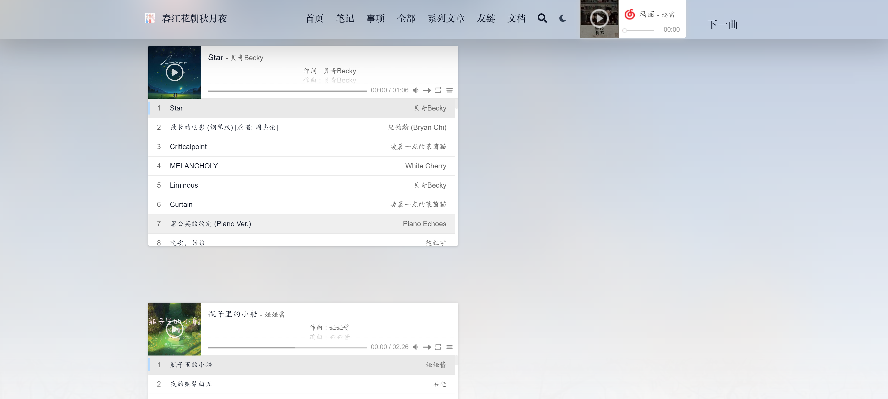

# 搭建本站音乐

搭建过程绕了一些弯子，吃了前端的亏，主要借鉴了[金圣皓](https://karlukle.site/)，得知了目前主流的博客音乐依托于APlayer&Meting JS,前者是嵌入HTML的音乐组件库，后者是可用通过网易，QQ音乐等网站的音乐插件，本网站作为静态页面，故只需通过CDN引入即可

网站搭建主题为Blowfish，在blog/layouts/shortcodes文件夹下添加album.html文件

这里采用的是网易音乐的歌单，获取歌单id自行从[网易云音乐歌单](https://music.163.com/#/discover/playlist)中获取

```html

<link rel="stylesheet" href="https://cdn.jsdelivr.net/npm/aplayer/dist/APlayer.min.css">
<script src="https://cdn.jsdelivr.net/npm/aplayer/dist/APlayer.min.js"></script>
<script src="https://cdn.jsdelivr.net/npm/meting@2.0.1/dist/Meting.min.js"></script>
<script src="https://cdn.jsdelivr.net/npm/color-thief@2.2.5/js/color-thief.min.js"></script>
<span style="color:#111827">
	<!--{{.Get 0}}作为歌单参数由引用组件处添加-->
<meting-js server="netease" type="playlist" id="{{.Get 0}}" autoplay="true" listFolded="true"></meting-js>
</span>
<hr/>
```

#### 在博客笔记中添加md文件


#### 效果：




