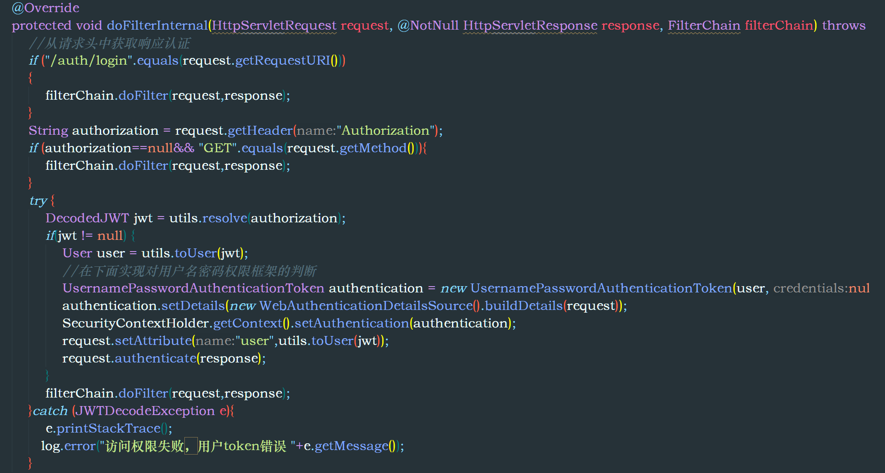

+++
title = "Spring-Security"
date = "2024-02-23"
author = "春江花朝秋月夜"
tags= ['spring']
+++

# 基于Spring6+JDK18的SpringSecurity环境的项目DEMO

项目地址：

#### 基本实现的功能

- Security通过数据库实现自定义登录
- 通过自己添加的过滤器链完成JWT+Token的请求权限认证
- Token加入Redis做无状态无Session处理
- 邮箱验证码收发功能

#### 注意事项

sql执行脚本在项目doc文件目录下，Security在Spring6下已经废除

通过WebSecurityAdaptor来实现HttpSecurity这个Bean的配置注入。

目前只支持Lamda表达式。

请在application.yml中自行配置自己的邮箱SMTP服务

配置案例：

```java

    @Bean
    public SecurityFilterChain filterChain(HttpSecurity http) throws Exception {

        return http
                .authorizeHttpRequests(conf->conf
                        .requestMatchers("/**").permitAll()
                )
                .formLogin(conf -> conf
                        .loginProcessingUrl("/auth/login").permitAll()
                        .successHandler(new LoginSuccessHandler(accountService,jwtUtils,stringRedisTemplate))
                        .failureHandler(new LoginFailureHandler())
                )
                .addFilterBefore(jwtAuthenticationFilter, UsernamePasswordAuthenticationFilter.class)
                .csrf(AbstractHttpConfigurer::disable)//关闭跨域漏洞防御配置
                .logout(conf->conf
                        .logoutUrl("/auth/logout")
                        .logoutSuccessHandler(new LogOutHandler(redisTemplate,jwtUtils)))
                .exceptionHandling(conf->conf.accessDeniedHandler((request, response, accessDeniedException)
                        -> System.out.println("当前异常的登录信息："+accessDeniedException)))
                .build();
    }

```

#### 搭建要点

登录用户实体必须实现UserDetails接口，数据层，业务层（实际处理登录逻辑，俗称Impl）必须实现

UserDetailsService接口，同时重写

public UserDetails loadUserByUsername(String username) 方法；

例如：

```java
   Impl

    @Resource
    UserMapper userMapper;
    
    @Override
    public UserDetails loadUserByUsername(String username){
        User user = userMapper.loadUserByUsername(username);
        if (user==null){
            throw new UsernameNotFoundException("用户名不存在！");
        }
        User userDetails = new User();
        userDetails.setUsername(username);
        userDetails.setPassword(user.getPassword());
        return userDetails;
    }

```

通过自定义的Filter同时继承 OncePerRequestFilter 类，类似于网关处理Request+Response

控制非登录的资源请求权限认证。




范围	描述

icon	要在时间线视觉效果中使用的图标。

header	每个条目的标题

badge	放置在右上角徽章内的文本

subheader	条目的副标题









样式测试
<ul>
  <li>Java</li>
  <li>Python</li>
  <li>Latex</li>
</ul>



此生无悔二次元








