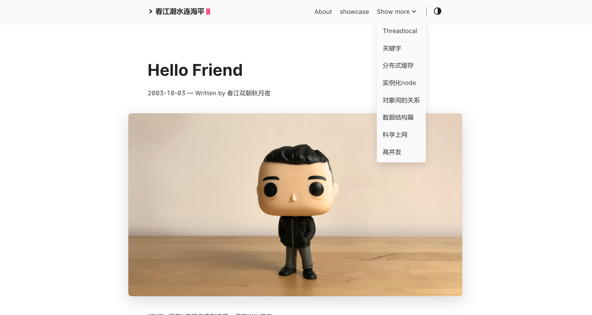
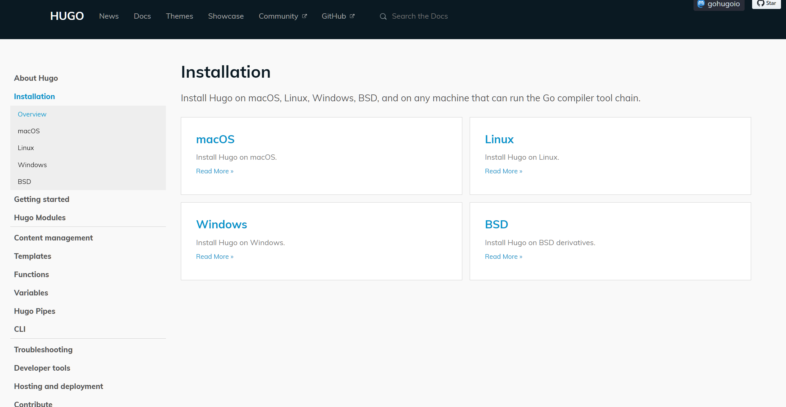
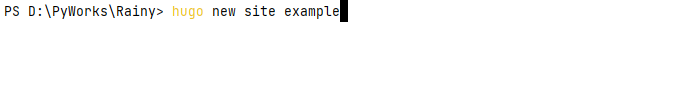
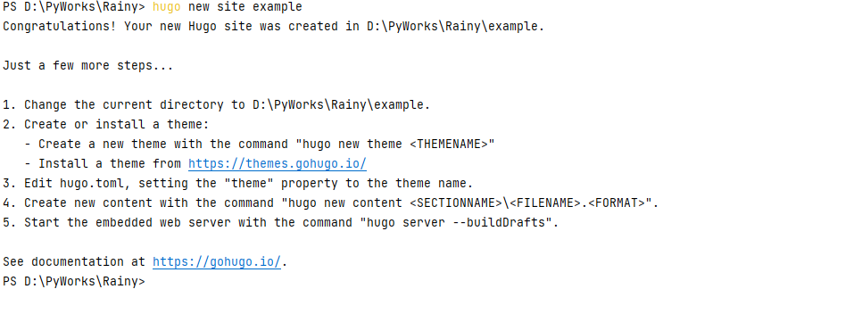
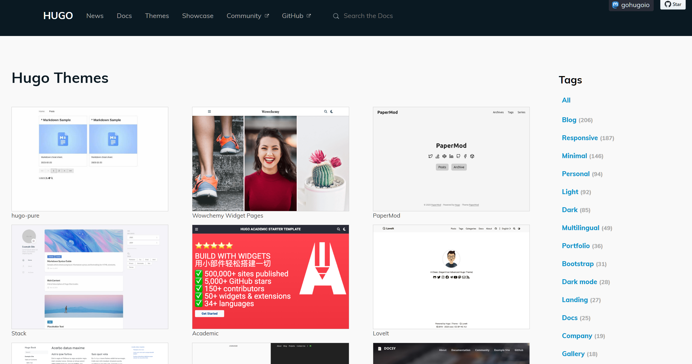
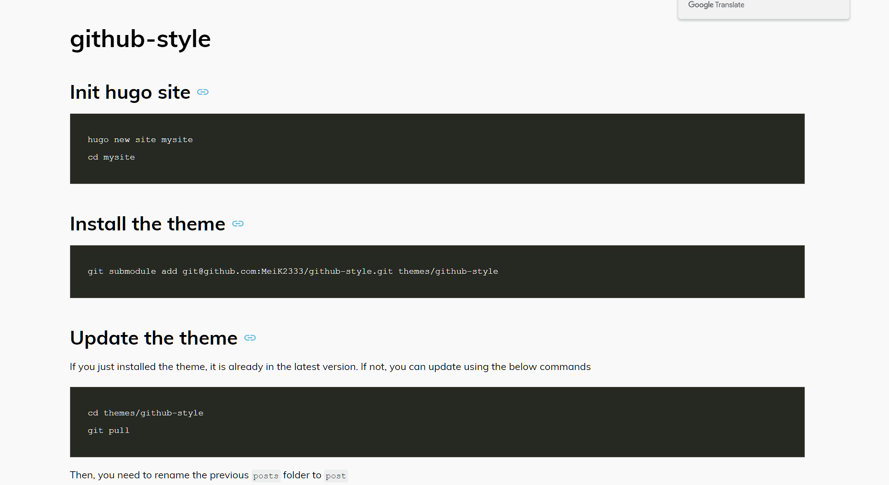
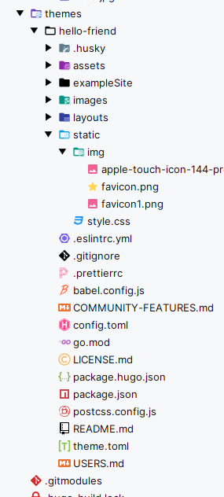

# 如何通过Hugo这个框架来搭建一款属于自己的博客呢？

>
> 观前提醒：这篇笔记借鉴了下面两个作者：
>
> 一是：[**小棉尾巴**](https://cuttontail.blog/blog/create-a-wesite-using-github-pages-and-hugo/#the-top)
>

#### 事件契机
我其实原本就知道github的pages自动部署博客功能，当时大二不熟练，今天目睹专业大佬的博客，自然也就重新搞起来了。

本人搭建的博客：



#### 第一步下载HuGo框架：



以Windows为例：只需打开CMD执行下面这个命令

```bat
winget install Hugo.Hugo.Extended
```
等待下载完成重启Shell命令窗口即可，Hugo将会自动配置环境变量。

检查是否安装成功：
```bat
  hugo version 
```

#### 第二部创建Hugo博客项目

只需要在文件夹下面新建终端使用如下命令，hugo将会自动创建你的项目名称文件夹
，同时弹出一个主题链接
```bat
hugo new site +你的项目名称
```
现在你需要进入你的项目也就是命令： cd 你的项目名称

同时将项目注册为git根
```bat
  git init
```

例如：


点击[https://themes.gohugo.io/.](https://themes.gohugo.io/.)这个链接



如下就是一些主题了：



随意选取一个之后点击Download就会进入主题的github仓库，然后需要

比如这个：



执行install the theme 里面的命令
```bat
git submodule add git@github.com:MeiK2333/github-style.git themes/github-style
```
下载的主题插件将会进入themes目录里面:



接着拷贝exampleSite目录下面的content,static,config.toml到自己的项目里面覆盖自己项目的目录。同时记得删除hugo.toml配置文件

#### 第三步，几个重要的命令

- 第一个是：hugo server:类似于npm run serve/dev 将会部署项目，这时候自己访问[http://127.0.0.1:1313/](http://127.0.0.1:1313/)就可以查看自己的网站
- 第二个是：hugo new 文件路径+文件名称.md则是创建笔记，hugo将会自主创建文档
- 第三个是：hugo ,hugo将会编译markdown文件为html文件存储到public文件夹下面同时部署到网站上

#### 最后一步

将public注册为git根绑定github上你的仓库同时提交文件即可。

感谢
