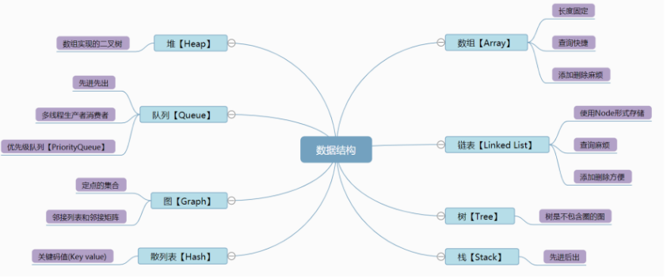
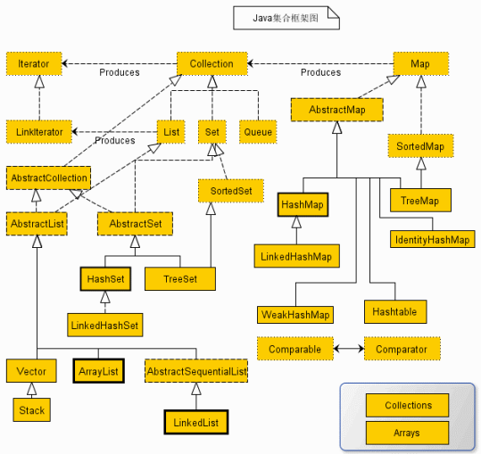
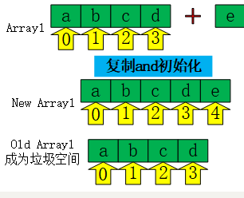
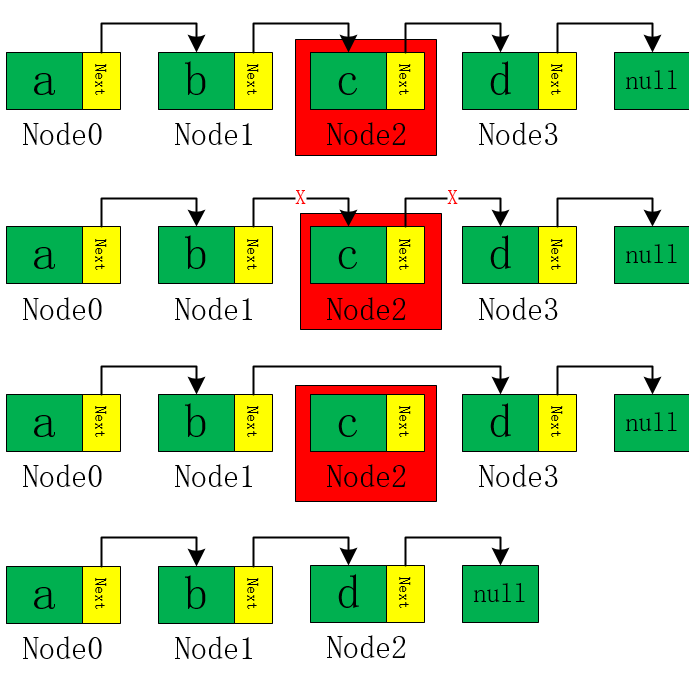
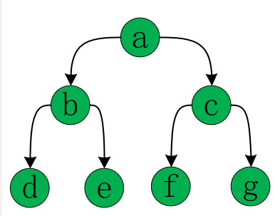
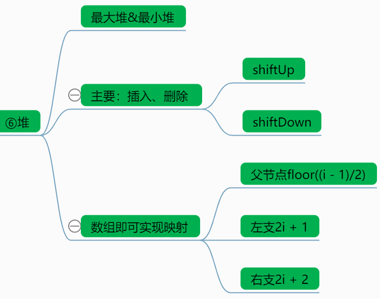

+++
title = '数据结构篇'
date = 2023-10-03T20:52:20+08:00
draft = false
tags = ["算法"]
description="数据结构常识"

+++











### 数组：

```java
1 public class Demo1_Array {
 2     public static void main(String[] args) {
 3         String [] array=new String[5];//需要初始化长度
 4         array[0]="hello";
 5         array[1]="world";
 6         array[4]="Mufasa";
 7 //        array[5]="right or not";//ArrayIndexOutOfBoundsException
 8         for(String str:array){
 9             System.out.print(str+"、");//hello、world、null、null、Mufasa、
10         }
11     }
12 }
```

```java
 1 public class Demo1_Array2 {
 2     public static void main(String[] args) {
 3         String [] array={"hello","world",null,null,"Mufasa"};//实例化&赋值
 4         array = (String[])resizeArray(array,10);
 5         for(String str:array){
 6             System.out.print(str+"、");//hello、world、null、null、Mufasa、
 7         }
 8     }
 9 
10     private static Object resizeArray(Object oldArray, int newSize) {//数组扩容！！！真麻烦，还利用反射机制来实现
11         int oldSize = java.lang.reflect.Array.getLength(oldArray);//获取旧数组长度,向上转型！！！
12 //        int oldSize =oldArray.length;//无法在此使用，因为array内容的是不定类型
13         Class elementType = oldArray.getClass().getComponentType();//获取对象类别
14         Object newArray = java.lang.reflect.Array.newInstance(elementType,newSize);//利用Java的反射机制实例化新数组
15         int preserveLength = Math.min(oldSize, newSize);//判断是否需要copy数据
16         if (preserveLength > 0)
17             System.arraycopy(oldArray, 0, newArray, 0, preserveLength);
18         return newArray;//oldArray切断索引成为垃圾由Runtime.getRuntime().gc();回收处理
19     }
20 }
```

# [具体参考资料](https://www.cnblogs.com/Mufasa/p/11213982.html)
