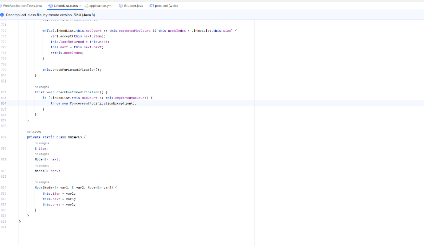

+++
title = '实例化Node'
date = 2023-10-03T20:52:56+08:00
draft = false
tags = ["Java SE"]
description= "介绍了为什么Java不可以实例化node"

+++


#  如何从 Java 中的 LinkedList 类外部声明 Node 类型？

标签 [java](https://www.coder.work/blog?tag=java) [linked-list](https://www.coder.work/blog?tag=linked-list)
如何声明 Node 类型的变量？ Node是LinkedList的内部类，在我正在编写的程序的main方法中，我想创建一个Node变量。但在下面代码片段的最后一行中，我收到错误消息“Nose 在 LinkedList 中具有私有(private)访问权限”。为什么我不能使用 Node 类型？

```
import java.util.LinkedList;

public class MinSplit {
    public static long leastAmount;

    public static void main(String args[]) {
    LinkedList list = new LinkedList();
    LinkedList.Node node = new LinkedList.Node();
```

**最佳答案**
因为它被声明为私有(private)。它是 LinkedList 类的内部实现细节，您没有理由创建实例。显然，这是 Java 团队经过深思熟虑的设计决定，旨在保持 API 的整洁并避免由于人们破坏列表数据结构而导致的问题。
如果您想要实例化 Node 类以便可以对 LinkedList 执行某种操作，请再考虑一下。没有任何公共(public) API 以允许您将 Node 添加到 LinkedList 或使用它的方式公开 Node 类型任何其他方式。您可能需要从头开始实现您自己的链表类。
如果您希望将 Node 类用于其他目的，您应该声明一个新类或在第 3 方库中查找合适的类。

### 从LinkedList的源码中可看出，Node是LinkedList（双向链表）的私有化内部类，外部无法访问，更不可能被实例化


[具体参考](https://www.codenong.com/31178688/)
