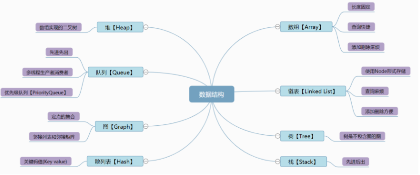

+++
title = 'ThreadLocal'
date = 2023-10-03T20:51:27+08:00
draft = false
tags = ["Java SE"]
description= "ThreadLocal真的是一个很烦的东西"
+++
特点：线程隔离，相互是隔离的，不影响的,每个线程都自己玩自己的，只操作自己的单独的变量副本

内部维护的是ThreadLocalMap，所以有key和value

当key指向的值为null时，value不被清理，由于key是弱引用，此时就会造成内存泄露，所以必须要通过ThreadLocal里面的remove方法手动删除值，避免内存泄露。


ThreadLocalMap里面面由一个个由数组组成的key-value，组成了Entry

由ThreadLocal来设置值，删除值

弱引用非常容易GC，很容易造成内存泄露，所以需要将key为null的entry清除

引用关系：Thread-> ThreadLocal->Entry（弱）->key（弱）->value(强)（不清除时容易发生内存泄露）
```java
//内部类，实=实现
static ThreadLocalMap createInheritedMap(ThreadLocalMap parentMap) {
        return new ThreadLocalMap(parentMap);
    }


static class ThreadLocalMap {
    static class Entry extends WeakReference<ThreadLocal<?>> {
        /** The value associated with this ThreadLocal. */
        Object value;

        Entry(ThreadLocal<?> k, Object v) {
            super(k);
            value = v;
        }
    }
    
    private static final int INITIAL_CAPACITY = 16;
    
    private Entry[] table;


    private int size = 0;
    
    private int threshold; // Default to 0
	
    private void setThreshold(int len) {
        threshold = len * 2 / 3;
    }
    
    private static int nextIndex(int i, int len) {
        return ((i + 1 < len) ? i + 1 : 0);
    }
    
    private static int prevIndex(int i, int len) {
        return ((i - 1 >= 0) ? i - 1 : len - 1);
    }
    ThreadLocalMap(ThreadLocal<?> firstKey, Object firstValue) {
        table = new Entry[INITIAL_CAPACITY];
        int i = firstKey.threadLocalHashCode & (INITIAL_CAPACITY - 1);
        table[i] = new Entry(firstKey, firstValue);
        size = 1;
        setThreshold(INITIAL_CAPACITY);
    }

    private ThreadLocalMap(ThreadLocalMap parentMap) {
        Entry[] parentTable = parentMap.table;
        int len = parentTable.length;
        setThreshold(len);
        table = new Entry[len];

        for (Entry e : parentTable) {
            if (e != null) {
                @SuppressWarnings("unchecked")
                ThreadLocal<Object> key = (ThreadLocal<Object>) e.get();
                if (key != null) {
                    Object value = key.childValue(e.value);
                    Entry c = new Entry(key, value);
                    int h = key.threadLocalHashCode & (len - 1);
                    while (table[h] != null)
                        h = nextIndex(h, len);
                    table[h] = c;
                    size++;
                }
            }
        }
    }
}
```
