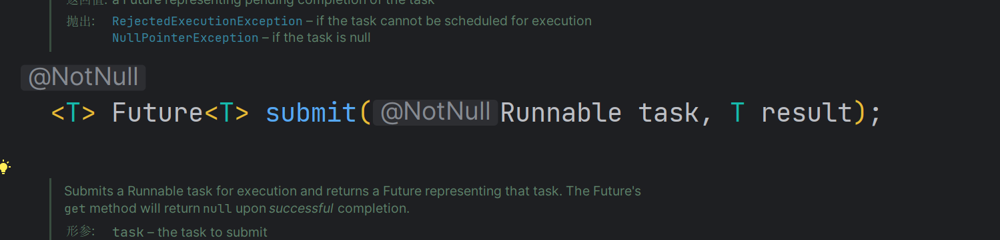
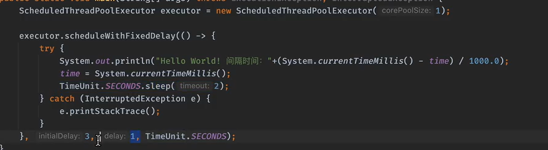
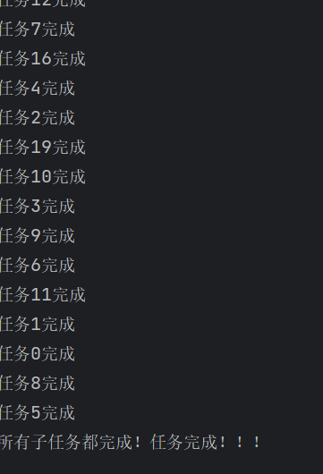

# 线程池

>
> new Thread缺点：频繁创建和销毁，浪费了线程资源，短时间创建大量线程和销毁
> 线程池是有限可重复使用的线程，用完需要归还
> 


```java
//构造方法，含有七个参数
public ThreadPoolExecutor(int corePoolSize,//核心线程池大小
                              int maximumPoolSize,//最大线程池大小
                              long keepAliveTime,//线程最大空闲时间
                              TimeUnit unit,//最大空闲时间单位
                              BlockingQueue<Runnable> workQueue//线程等待队列，当超出最大容量时，任务进入等待队列) {
        this(corePoolSize, maximumPoolSize, keepAliveTime, unit, workQueue,
             Executors.defaultThreadFactory(),//线程创建工厂，可自定义
		defaultHandler//拒绝策略，实在不能加入新的任务时，拒绝任务);
    }
```
## 根据CPU类型分配线程池大小


## ThreadPoolExecutor
```java
    public static void main(String[] args) throws InterruptedException {
        ThreadPoolExecutor executor =
                new ThreadPoolExecutor(2, 4,   //2个核心线程，最大线程数为4个
                        3, TimeUnit.SECONDS,        //最大空闲时间为3秒钟
                        new ArrayBlockingQueue<>(2));     //这里使用容量为2的ArrayBlockingQueue队列

        for (int i = 0; i < 6; i++) {   //开始6个任务
            int finalI = i;
            executor.execute(() -> {
                try {
                    System.out.println(Thread.currentThread().getName()+" 开始执行！（"+ finalI);
                    TimeUnit.SECONDS.sleep(1);
                    System.out.println(Thread.currentThread().getName()+" 已结束！（"+finalI);
                } catch (InterruptedException e) {
                    e.printStackTrace();
                }
            });
        }

        TimeUnit.SECONDS.sleep(1);    //看看当前线程池中的线程数量
        System.out.println("线程池中线程数量："+executor.getPoolSize());
        TimeUnit.SECONDS.sleep(5);     //等到超过空闲时间
        System.out.println("线程池中线程数量："+executor.getPoolSize());

        executor.shutdownNow();    //使用完线程池记得关闭，不然程序不会结束，它会取消所有等待中的任务以及试图中断正在执行的任务，关闭后，无法再提交任务，一律拒绝
        //executor.shutdown();     同样可以关闭，但是会执行完等待队列中的任务再关闭
    }
}
```
#### ArrayBlockingQueue
作为有界的阻塞队列，具有响应的容量，可以自行设置，对比SynchronousQueue没有容量，选这个会出现爆栈的问题，原因
是线程池ThreadPoolExecutor发现容量超出时会poll线程，但SynchronousQueue没有容量poll无意义。
在线程池里面的等待队列需要具有容量。

#### 线程池的拒绝策略
线程池超过最大的容量时，需要拒绝这个任务。

- AbortPolicy(default): 直接抛异常
- CallerRunsPolicy: 直接让提交任务的线程运行这个任务，如果向主线程提交了任务就让主线程去执行这个任务，谁提交谁执行
- DiscardOldestPolicy: 丢弃队列中最近的任务，替换为当前任务
- DiscardPolicy: Do nothing

自定义拒绝策略和线程生产工厂


任务过程出现异常，线程池当中执行任务时发生异常，线程将会自动销毁

## ExecutorService
可以使用Executors工具类来快速创建线程池：

```java
    ExecutorService executor = Executors.newFixedThreadPool(2);   //直接创建一个固定容量的线程池
```

>ExecutorService本质内部实现其实是ThreadPoolExecutor，所以创建的线程都不是核心线程

```java
//内部实现
public static ExecutorService newFixedThreadPool(int nThreads) {
    return new ThreadPoolExecutor(nThreads, nThreads,
                                  0L, TimeUnit.MILLISECONDS,
                                  new LinkedBlockingQueue<Runnable>());
}
```

直接将最大线程和核心线程数量设定为一样的，并且等待时间为0，因为压根不需要，并且采用的是一个无界的LinkedBlockingQueue作为等待队列。

```java
//创建单个线程
public static ExecutorService newSingleThreadExecutor() {
    return new FinalizableDelegatedExecutorService
        (new ThreadPoolExecutor(1, 1,
                                0L, TimeUnit.MILLISECONDS,
                                new LinkedBlockingQueue<Runnable>()));
}
```
这里并不是直接创建的一个ThreadPoolExecutor对象，而是套了一层FinalizableDelegatedExecutorService，目的是内部套了一层，外部不可见，不可修改，保证安全性

> 由于executorService内部直接最大容量为Integer.	MAX_VALUE,非常大，不安全

##### newCachedThreadPool


注意生成的线程池里面都不是核心线程，同时最大容量非常大，需要慎用
## 执行带返回值的任务：

> ExecutorService执行任务有两种方法：submit和execute

接受返回值的只有submit


```java
public static void main(String[] args) throws InterruptedException, ExecutionException {
        ExecutorService executorService=Executors.newSingleThreadExecutor();
        Future<String> future= executorService.submit(()->{
            TimeUnit.SECONDS.sleep(3);
            return "你好世界";
        });
        System.out.println(future.cancel(true));//取消任务，这时候里面的字串将不会再返回出来
        executorService.shutdown();
        System.out.println(future.get());
    }
```

### 定时任务ScheduledThreadPoolExecutor

```java
        ScheduledThreadPoolExecutor executor=new ScheduledThreadPoolExecutor(1);
//        executor.schedule(()-> System.out.println("开始定时任务"),3,TimeUnit.SECONDS);
//        ScheduledFuture<String> scheduledFuture=executor.schedule(()-> "开始定时任务",3,TimeUnit.SECONDS); 
//        System.out.println(scheduledFuture.isDone());
        //固定频率进行定时计划：
        executor.scheduleAtFixedRate(()-> System.out.println("hello!"),3,1,TimeUnit.SECONDS);
//        executor.shutdown();
```

线程延迟线程池：ScheduledWithFixedDelay

```java
protected void finalize() {    //在GC时，会执行finalize方法，此方法中会关闭掉线程池，释放资源
        super.shutdown();
    }
```
## 线程池实现原理

```java
//这个就是我们指定的阻塞队列
private final BlockingQueue<Runnable> workQueue;

//再次提醒，这里没加锁！！该有什么意识不用我说了吧，所以说ctl才会使用原子类。
public void execute(Runnable command) {
    if (command == null)
        throw new NullPointerException();     //如果任务为null，那执行个寂寞，所以说直接空指针
    int c = ctl.get();      //获取ctl的值，一会要读取信息的
    if (workerCountOf(c) < corePoolSize) {   //判断工作线程数量是否小于核心线程数
        if (addWorker(command, true))    //如果是，那不管三七二十一，直接加新的线程执行，然后返回即可
            return;
        c = ctl.get();    //如果线程添加失败（有可能其他线程也在对线程池进行操作），那就更新一下c的值
    }
    if (isRunning(c) && workQueue.offer(command)) {   //继续判断，如果当前线程池是运行状态，那就尝试向阻塞队列中添加一个新的等待任务
        int recheck = ctl.get();   //再次获取ctl的值
        if (! isRunning(recheck) && remove(command))   //这里是再次确认当前线程池是否关闭，如果添加等待任务后线程池关闭了，那就把刚刚加进去任务的又拿出来
            reject(command);   //然后直接拒绝当前任务的提交（会根据我们的拒绝策略决定如何进行拒绝操作）
        else if (workerCountOf(recheck) == 0)   //如果这个时候线程池依然在运行状态，那么就检查一下当前工作线程数是否为0，如果是那就直接添加新线程执行
            addWorker(null, false);   //添加一个新的非核心线程，但是注意没添加任务
      	//其他情况就啥也不用做了
    }
    else if (!addWorker(command, false))   //这种情况要么就是线程池没有运行，要么就是队列满了，按照我们之前的规则，核心线程数已满且队列已满，那么会直接添加新的非核心线程，但是如果已经添加到最大数量，这里肯定是会失败的
        reject(command);   //确实装不下了，只能拒绝
}
```

#### addWorker实现
```java
private boolean addWorker(Runnable firstTask, boolean core) {
  	//这里给最外层循环打了个标签，方便一会的跳转操作
    retry:
    for (;;) {    //无限循环，老套路了，注意这里全程没加锁
        int c = ctl.get();     //获取ctl值
        int rs = runStateOf(c);    //解析当前的运行状态

        // Check if queue empty only if necessary.
        if (rs >= SHUTDOWN &&   //判断线程池是否不是处于运行状态
            ! (rs == SHUTDOWN &&   //如果不是运行状态，判断线程是SHUTDOWN状态并、任务不为null、等待队列不为空，只要有其中一者不满足，直接返回false，添加失败
               firstTask == null &&   
               ! workQueue.isEmpty()))
            return false;

        for (;;) {   //内层又一轮无限循环，这个循环是为了将线程计数增加，然后才可以真正地添加一个新的线程
            int wc = workerCountOf(c);    //解析当前的工作线程数量
            if (wc >= CAPACITY ||
                wc >= (core ? corePoolSize : maximumPoolSize))    //判断一下还装得下不，如果装得下，看看是核心线程还是非核心线程，如果是核心线程，不能大于核心线程数的限制，如果是非核心线程，不能大于最大线程数限制
                return false;
            if (compareAndIncrementWorkerCount(c))    //CAS自增线程计数，如果增加成功，任务完成，直接跳出继续
                break retry;    //注意这里要直接跳出最外层循环，所以用到了标签（类似于goto语句）
            c = ctl.get();  // 如果CAS失败，更新一下c的值
            if (runStateOf(c) != rs)    //如果CAS失败的原因是因为线程池状态和一开始的不一样了，那么就重新从外层循环再来一次
                continue retry;    //注意这里要直接从最外层循环继续，所以用到了标签（类似于goto语句）
            // 如果是其他原因导致的CAS失败，那只可能是其他线程同时在自增，所以重新再来一次内层循环
        }
    }

  	//好了，线程计数自增也完了，接着就是添加新的工作线程了
    boolean workerStarted = false;   //工作线程是否已启动
    boolean workerAdded = false;    //工作线程是否已添加
    Worker w = null;     //暂时理解为工作线程，别急，我们之后会解读Worker类
    try {
        w = new Worker(firstTask);     //创建新的工作线程，传入我们提交的任务
        final Thread t = w.thread;    //拿到工作线程中封装的Thread对象
        if (t != null) {      //如果线程不为null，那就可以安排干活了
            final ReentrantLock mainLock = this.mainLock;      //又是ReentrantLock加锁环节，这里开始就是只有一个线程能进入了
            mainLock.lock();
            try {
                // Recheck while holding lock.
                // Back out on ThreadFactory failure or if
                // shut down before lock acquired.
                int rs = runStateOf(ctl.get());    //获取当前线程的运行状态

                if (rs < SHUTDOWN ||
                    (rs == SHUTDOWN && firstTask == null)) {    //只有当前线程池是正在运行状态，或是SHUTDOWN状态且firstTask为空，那么就继续
                    if (t.isAlive()) // 检查一下线程是否正在运行状态
                        throw new IllegalThreadStateException();   //如果是那肯定是不能运行我们的任务的
                    workers.add(w);    //直接将新创建的Work丢进 workers 集合中
                    int s = workers.size();   //看看当前workers的大小
                    if (s > largestPoolSize)   //这里是记录线程池运行以来，历史上的最多线程数
                        largestPoolSize = s;
                    workerAdded = true;   //工作线程已添加
                }
            } finally {
                mainLock.unlock();   //解锁
            }
            if (workerAdded) {
                t.start();   //启动线程
                workerStarted = true;  //工作线程已启动
            }
        }
    } finally {
        if (! workerStarted)    //如果线程在上面的启动过程中失败了
            addWorkerFailed(w);    //将w移出workers并将计数器-1，最后如果线程池是终止状态，会尝试加速终止线程池
    }
    return workerStarted;   //返回是否成功
}
```

##  并发工具类
### 计数器锁（CountDownLatch）

多任务同步神器。它允许一个或多个线程，等待其他线程完成工作,典型应用场景：多个线程分段相加最后统计所有线程的和

>要实现这个需求，那么有一个很麻烦的地方，我们不知道任务到底什么时候执行完毕，那么可否将最终统计延迟一定时间进行呢？但是最终统计无论延迟多久进行，
> 要么不能保证所有任务都完成，要么可能所有任务都完成了而这里还在等。

```java
    public static void main(String[] args) throws InterruptedException {
        CountDownLatch latch=new CountDownLatch(20);
        for (int i = 0; i < 20; i++) {
        int finalI=i;
        new Thread(()->{
        try {
        Thread.sleep((long) (2000 * new Random().nextDouble()));
        System.out.println("任务"+finalI+"完成");
        }catch (InterruptedException e){
        e.printStackTrace();
        }
        latch.countDown();   //每执行一次计数器都会-1
        }).start();
        }
        //开始等待所有的线程完成，当计数器为0时，恢复运行
        latch.await();   //这个操作可以同时被多个线程执行，一起等待，这里只演示了一个
        System.out.println("所有子任务都完成！任务完成！！！");
        }

```
例子： 用四个线程实现对1到10000完成累计加和
```java
    public static void main(String[] args) throws InterruptedException {
        long begin=System.currentTimeMillis();
       CountDownLatch latch=new CountDownLatch(4);
       int res[]=new int[4];
        for (int i = 0; i < 4; i++) {
            int finalI=i;
            new Thread(()->{
                int sum=0;
                int numbersPerThread = (int) Math.ceil((double) 100/ 4);
                int startNumber = finalI * numbersPerThread + 1;
                int endNumber = (finalI + 1) * numbersPerThread;
                for (int j =startNumber ; j <=endNumber; j++) {
                  sum+=j;
                }
                System.out.println(sum);
                res[finalI]=sum;
                latch.countDown();   //每执行一次计数器都会-1
            }).start();
        }
        //开始等待所有的线程完成，当计数器为0时，恢复运行
        latch.await();   //这个操作可以同时被多个线程执行，一起等待，这里只演示了一个
        int result=0;
        for (Integer integer:res) {
            result+=integer;
        }
        long end=System.currentTimeMillis();
        System.out.println("所有子任务都完成！任务完成,结果是"+result+"花费时间："+(end-begin)+"ms");
    }

```
实现效果：


- 共享锁是线程共享的，同一时刻能有多个线程拥有共享锁。
- 如果一个线程刚获取了共享锁，那么在其之后等待的线程也很有可能能够获取到锁，所以得传播下去继续尝试唤醒后面的结点，不像独占锁，独占的压根不需要考虑这些。
- 如果一个线程刚释放了锁，不管是独占锁还是共享锁，都需要唤醒后续等待结点的线程。

实现原理：

在工具构建的时候创建多个共享锁，调用countDown（）调用时就可以减去一把锁，当state减为0时即可获取共享锁，实现方式是通过
链表向后继节点一个个从等待状态唤醒
### 循环屏障CyclicBarrier

>循环屏障会不断阻挡线程，直到被阻挡的线程足够多时，才能一起冲破屏障，并且在
> 冲破屏障时，我们也可以做一些其他的任务。这和人多力量大的道理是差不多的，当人足够多时方能冲破阻碍，
> 到达美好的明天。当然，屏障由于是可循环的，所以它在被冲破后，会重新开始计数，继续阻挡后续的线程：

```java
CyclicBarrier barrier = new CyclicBarrier(5);  //创建一个初始值为5的循环屏障
```
屏障最大容量：parties
特点：等待线程冲破阻碍的时候才可以 一起完成任务，完成任务之后继续等待，直到下一次达到最大值 。

当await状态下的线程被中断，屏障将会被破坏，这一轮不能使用，除非重新开始

### 信号量 Semaphore

限制信号容量，在一段任务中，要求
只能部分线程完成这段工作的时候完成

###  线程之间进行数据交换 Exchanger

实现两个线程之间进行数据交换的通信，只有当两个线程完成交换之后才可以完成任务，否则线程阻塞。

### Fork/Join框架

>   ForkJoinPool pool = new ForkJoinPool();

- fork指的是划分任务，任务约分越细
- join指的是加入任务，任务开始执行


## END
