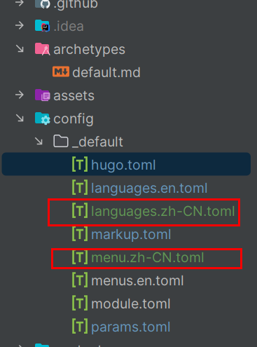

+++
title = 'Help'
date = 2024-04-30T16:17:35+08:00
draft = false
tags = ["帮助文档"]
+++

# 如何使用Hugo+Blowfish?

## 新建文章

使用命令新建文章，新建文章生成在content目录下
将会使用archrtypes/default.md格式添加新文件头部配置键。

```cmd
PS D:\JavaWork\qvisl9.github.io> hugo new help/index.md
Content "D:\\JavaWork\\qvisl9.github.io\\content\\help\\index.md" created
PS D:\JavaWork\qvisl9.github.io>
```

## 分类

blowfish的分类相对来说不是很完善效果如下：


实现方式很简单，需在头部配置键中添加tags项

就像这样子：


主题将会识别配置键并自动检索所有带有此项的文章生成分类页面

## 系列
blowfish的是带有系列配置项的，效果如下：


类似上述的操作，需要添加头部配置项：


**注意！！！请将文件命名为index.md，否则博客主题将无法自动为文章进行分类和添加相应的功能**

## 图标
添加自己的图标和文章图片，放在assets目录下，icon作为 图标文件夹，添加相应图标后可显示对应的图片，如下：


## i18n国际化

hugo.toml文件下：

```toml
theme = "blowfish" # UNCOMMENT THIS LINE
# baseURL = "https://your_domain.com/"
defaultContentLanguage = "zh-CN"
```
添加并编辑相对于的文件：



添加特定翻译：


例如：

```yaml
article:
  anchor_label: "锚点"
  date: "{{ .Date }}"
  date_updated: "Updated: {{ .Date }}"
  draft: "草稿"
  edit_title: "编辑内容"
  reading_time:
    other: "{{ .Count }} 分钟"
  reading_time_title: "预计阅读"
  # table_of_contents: "Table of Contents"
  word_count:
    one: "{{ .Count }} 字"
    other: "{{ .Count }} 字"
  part_of_series: "这是系列文章之一."
  part: "部分"
  this_article: "本文"
  related_articles: "相关文章"

```

### 自定义


在**params.toml**文件中编辑自己的配置键值，下面举一些常见例子


例如下面两种效果：


### 短代码

blowfish是支持自定义化和自己编写短代码实现自己的扩展功能的，例如：


在index.md中，我添加了一行段代码：
```txt
 (list limit=1000 title="全部文章")
```

其实际对应主题中的这个文件，功能是将文章或这对应的给定参数进行
排列，排列样式取决于前面提到的params.toml的配置键


### 自定义添加自己的短代码

例如在自己的博客目录中，我们可以添加自己的layouts目录，blowfish将会覆盖原有的layouts目录
也就是优先级更高。


就像这样子：


其他可评论....
