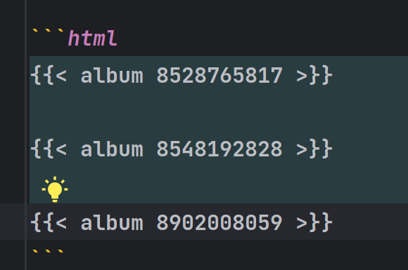

# 搭建本站音乐

搭建过程绕了一些弯子，吃了前端的亏，主要借鉴了[金圣皓](https://karlukle.site/)，得知了目前主流的博客音乐依托于APlayer&Meting JS,前者是嵌入HTML的音乐组件库，后者是可用通过网易，QQ音乐等网站的音乐插件，本网站作为静态页面，故只需通过CDN引入即可

Meting Js参数,[官方文档](https://github.com/metowolf/MetingJS#option)

```html
<!--MetingJS参数详情-->

<!--
id='外链播放器id',必须参数
type=[song=单曲, playlist=歌单, album=专辑, search=搜索结果, artist=艺术家],必须参数
server=[netease=网易云音乐, tencent=QQ音乐, kugou=酷狗音乐, xiami=虾米音乐, baidu=百度音乐],必须参数
fixed=启用固定模式，固定在左下角,默认false
mini=启用迷你模式,默认false
preload=[none,metadata,auto]
mutex=[互斥锁，默认true],默认false
order=[random=随机播放,list=列表播放]
loop=[all=全部循环, one=循环一次 ,none=不循环]
volume=[音量，默认0.7]
lrc-type=[歌词类型，默认0]
list-folded=[列表是否折叠，默认false]
list-max-height=列表最大高度,默认340px
storage-name=本地存储存储密钥，用于存储播放器设置,默认metingjs
-->
```

网站搭建主题为Blowfish，在blog/layouts/shortcodes文件夹下添加album.html文件

这里采用的是网易音乐的歌单，获取歌单id自行从[网易云音乐歌单](https://music.163.com/#/discover/playlist)中获取

```html

<link rel="stylesheet" href="https://cdn.jsdelivr.net/npm/aplayer/dist/APlayer.min.css">
<script src="https://cdn.jsdelivr.net/npm/aplayer/dist/APlayer.min.js"></script>
<script src="https://cdn.jsdelivr.net/npm/meting@2.0.1/dist/Meting.min.js"></script>
<script src="https://cdn.jsdelivr.net/npm/color-thief@2.2.5/js/color-thief.min.js"></script>
<span style="color:#111827">
	<!--{{.Get 0}}作为歌单参数由引用组件处添加-->
<meting-js server="netease" type="playlist" id="{{.Get 0}}" autoplay="true" listFolded="true"></meting-js>
</span>
<hr/>
```

#### 在博客笔记中添加md文件



#### 效果：


