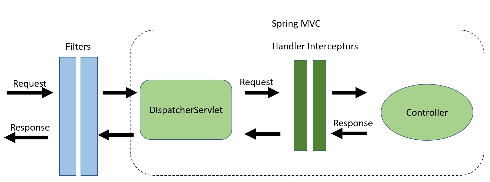

# Table

说出自己实习经历中负责的最出彩的项目并介绍情况

八股文：

List使用for循环遍历增加或删除元素是否可行?

不可以，回抛出(ConcurrentModificationException)

原因：remove和add操作会导致modCount和迭代器中的expectedModCount不一致。

> 解释：涉及到fail-fast机制，也就是一旦检测到可能发生错误，就立马抛出异常，程序不继续往下执行，在Java中对集合的操作经常涉及到fail-fast机制，
> 当多个线程对同一个集合的内容进行操作时，就可能会产生fail-fast事件

解决办法：普通for循环、使用Iterator进行元素删除、使用Stream的filter、使用fail-safe的类等。

数组转成集合：

```java
//1:
List list = new ArrayList<>(Arrays.asList("a", "b", "c"))
//2:
Integer [] myArray = { 1, 2, 3 };
List myList = Arrays.stream(myArray).collect(Collectors.toList());
//基本类型也可以实现转换（依赖boxed的装箱操作）
int [] myArray2 = { 1, 2, 3 };
List myList = Arrays.stream(myArray2).boxed().collect(Collectors.toList());
```

线程池使用方法，如果超过核心线程池大小，新创建的线程放入哪一个队列？

询问MVC模式，说出其数据流走向，如何对其前后做出规范型操作？

过滤器和拦截器，内部区别，源码看得不是很仔细。

Spring 的Bean生命周期，对前后顺序做扩展如何操作？

拦截器和过滤器Servlet和内部方法拦截问题。



Filter 可在请求到达 DispatcherServlet 之前对其进行拦截，因此非常适合执行粗粒度任务，例如

认证。

- 日志记录和审计。
- 压缩图像和数据。
- 任何希望与 Spring MVC 解耦的功能。

HandlerInterceptor 会拦截 DispatcherServlet 与 Controller 之间的请求。这是在 Spring MVC 框架内完成的，提供了对 Handler 和 ModelAndView 对象的访问。这减少了重复代码，并允许实现更细粒度的功能，例如：

- 处理横切关注点，如应用日志记录。
- 详细的权限检查。
- 操作 Spring Context 或 Model。

SQL优化策略，提到了索引，立马问到索引，场景是三张表，建立了联合索引，查询时候使用Where A=B=C 会不会走联合索引。

什么情况下适合使用索引，当表字段数据是重复相等的时候是否适合建立索引？

总体看来主要是八股文的问答，不足点是框架和索引被批评了。

关于事务，定义的业务异常（错误的），按理来说应该是超类异常，而不是业务异常回滚，问的问题是包括的大范围事务，内部抛出的是其他异常会不会回滚的问题。

如何使用线程池的问题？当超过了核心线程池大小但是没有超过最大线程池大小的时候，会发生什么别的事情？

* **核心线程池** ：
* 当线程池的当前线程数小于核心线程池大小时，线程池会直接创建新的线程来处理任务。
* **超过核心但未达到最大** ：
* 如果当前线程数已经达到核心线程池大小，但仍未超过最大线程池大小，新的任务将被放入指定的工作队列（`workQueue`）中进行排队。
* **当队列满时** ：
* 如果工作队列满了，并且当前线程数仍在最大线程数之内，线程池会创建新的线程来处理任务，直到达到最大线程池大小。
* 一旦达到最大线程池大小，如果还有任务需要处理，线程池将根据配置的拒绝策略来决定如何处理这些任务（如抛出异常、丢弃任务或调用者运行等）。

什么时候新的任务会被加入到工作队列中？

新的任务会被加入到工作队列中的情况主要取决于线程池的状态和配置。具体来说，以下是一些关键情境：

1. **核心线程数已满**

* 当线程池的当前活动线程数已经达到核心线程数（`corePoolSize`）时，新的任务将被放入工作队列中，而不是立即创建新的线程。

1. **线程池配置**

* 如果线程池的最大线程数（`maximumPoolSize`）未达到，且核心线程数已满，新任务会被添加到工作队列中。
* 工作队列的类型也会影响任务的处理方式。例如，使用不同类型的队列（如 `ArrayBlockingQueue`、`LinkedBlockingQueue`、`SynchronousQueue`）会导致不同的行为。

1. **工作队列已满**

* 如果工作队列满了并且当前线程数还未达到最大线程数，则线程池会根据配置尝试创建新的线程来处理任务。
* 一旦线程池的活动线程数达到了最大线程数，且工作队列也满了，新的任务将根据设定的拒绝策略进行处理。

介绍快速排序：

```cpp
#include <iostream>


#include <vector>

using namespace std;

// 分区函数
int partition(vector<int>& arr, int low, int high) {
    int pivot = arr[high]; // 选择最后一个元素作为基准
    int i = low - 1; // 小于基准的元素的索引

    for (int j = low; j < high; j++) {
        if (arr[j] < pivot) {
            i++;
            swap(arr[i], arr[j]); // 交换元素
        }
    }
    swap(arr[i + 1], arr[high]); // 将基准放到正确的位置
    return i + 1; // 返回基准的位置
}

// 快速排序函数
void quickSort(vector<int>& arr, int low, int high) {
    if (low < high) {
        int pi = partition(arr, low, high); // 获取基准的索引

        // 递归排序左半部分
        quickSort(arr, low, pi - 1);
        // 递归排序右半部分
        quickSort(arr, pi + 1, high);
    }
}

// 主函数
int main() {
    vector<int> arr = {10, 7, 8, 9, 1, 5};
    int n = arr.size();

    quickSort(arr, 0, n - 1); // 调用快速排序

    cout << "排序后的数组：";
    for (int i : arr) {
        cout << i << " ";
    }
    cout << endl;

    return 0;
}
```

1.快速排序使用的是分治递归的思想来进行排序的，首先是找到基准元素，小于基准放左边，大于基准放右边。

2.对左右基准重复1操作，直到所有排序完成。
