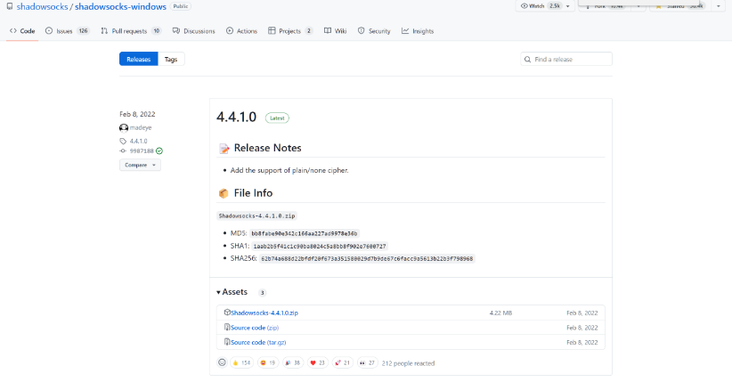
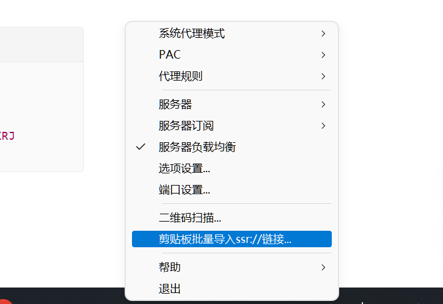
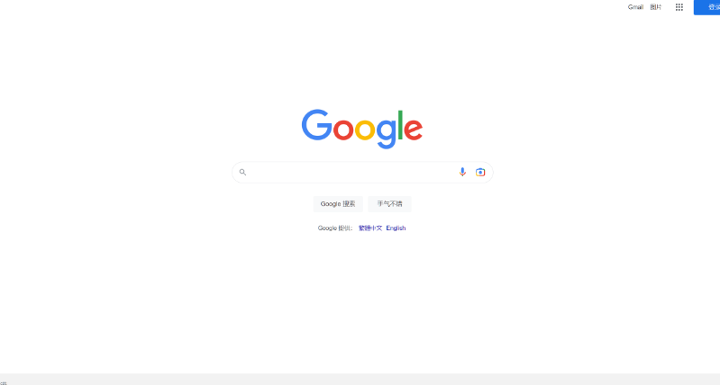

+++
title = '科学上网'
date = 2023-10-03T22:43:25+08:00
draft = false
tags = ["杂记"]
description="翻墙备忘录"

+++

## 先放一张跳墙成功的画面：

#### 科学上网难吗？

结论：很简单！！！


### 首先是我在配置代理时候发现的几个好的站点：如下

科学上网主要有两个代理方法，但实际内核应该是一样的：

### 这里有关于两个不同的翻墙方法的说明链接

第一个：


第二个：


参考链接：[SSR配置说明](http://www.symml.com/post/27524.html)   [ssr链接方式](https://coderschool.cn/2498.html)

## 如何翻墙啊，说了那么多。

### 第一步：下载

下载链接
蓝色款（不推荐，本文也不采用）：



然后点击zip下载即可。ss的好处是没被墙，可以直接到git上下载。

> #### 红色款（强烈推荐！！！）：这里我直接放上zip，因为国内无法下载，我已经提前翻墙下载好咯。


### 下好后：


##### 先复制下面的链接，然后点击ShadowssocksR-dotnet4.0.exe！！！！

#### 首先准备好ssr链接。这个方法最简单。

```latex
ssr://Y20xLWhrLmh1dGFvbm9kZTIudG9wOjEyNDA1OmF1dGhfYWVzMTI4X3
NoYTE6Y2hhY2hhMjAtaWV0ZjpodHRwX3NpbXBsZTpTSFZVWVc5RGJHOTFaQS8_b
2Jmc3BhcmFtPU16WmhNV0V6TWpVd05TNXRhV055YjNOdlpuUXVZMjl0JnByb3RvcGFyYW0
9TXpJMU1EVTZTSEF6VlVVNE5YTmhWMjl2UjFOTlJnJnJlbWFya3M9NmFhWjVyaXZJQzBnU1VWUVRDQXRJ
Rk5UTDFOVFVpQXRJREExJmdyb3VwPTVhU0g1NVNvVVZIdnZKb3pORFF6T1RVMk5qRXk
```

这里我们选择用SSR,影梭的粉红色飞机。



出现飞机图标后，左键点击它！！！


选择剪贴板导入SSR链接。

##### 代理规则设置为全局：

#### 

##### 选择PAC为绕过常见即可。

## 接下来就可以愉快上网啦！


#### 可以看到左下角IP地址也是香港的


### 最后，注意安全，上网愉快！

