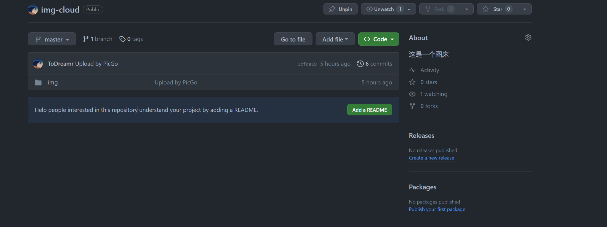
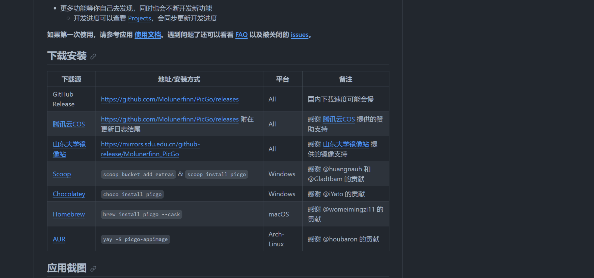
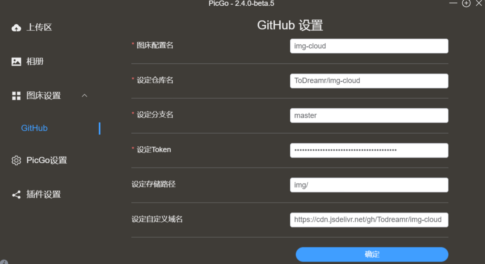
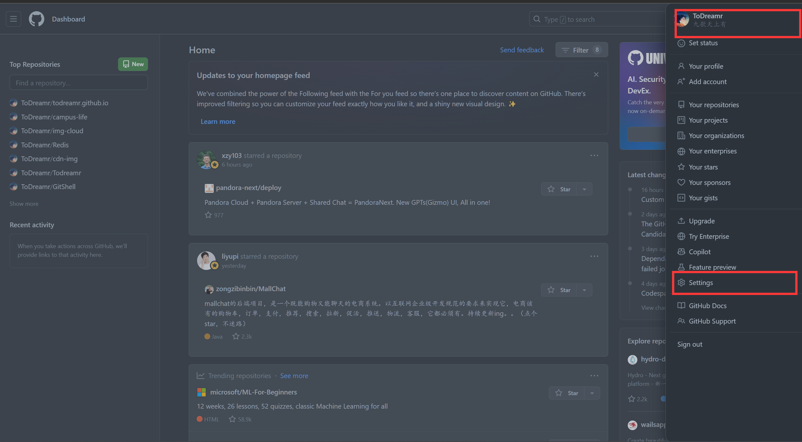
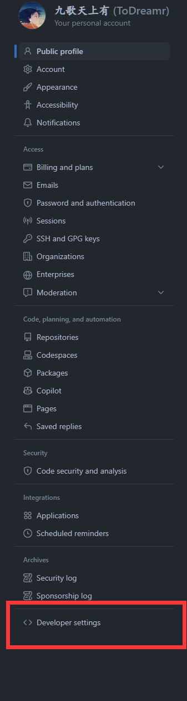
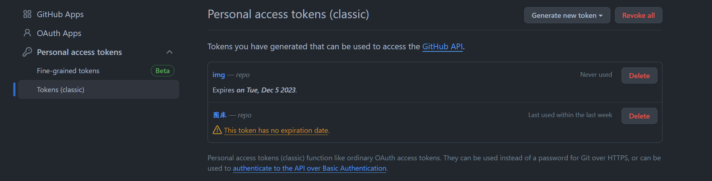

# 通过GitHub+PicGo+CDN搭建自己的图床

图床一般是指储存图片的服务器，有国内和国外之分。国外的图床由于有 空间距离等因素决定访问速度很慢影响图片显示速度。国内也分为单线空间、 多线空间和cdn加速三种。#
CDN 是构建在数据网络上的一种分布式的内容分发网。 CDN 的作用是采用 流媒体服务器 集群技术，克服单机系统输出带宽及并发能力不足的缺点，可极大提升系统支持的 并发流数目，减少或避免 单点失效带来的不良影响。#
github搭建仓库

下载 [PicGO](https://github.com/Molunerfinn/PicGo)
配置 [CDN](https://www.jsdelivr.com/)

### 创建仓库

### PICGO

配置加速

如何配置token？

首先到github上选择生成自己的token：

点击首页选择设置：

下拉到develop settings

选择下方生成GitHub token：

输入GitHub 账户密码之后得到token

将token保存好，粘贴到PicGo里面即可。
