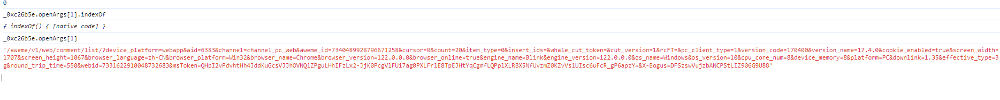
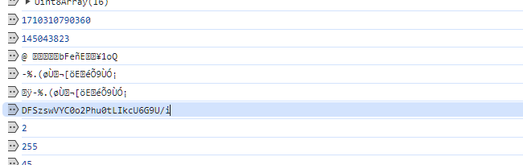
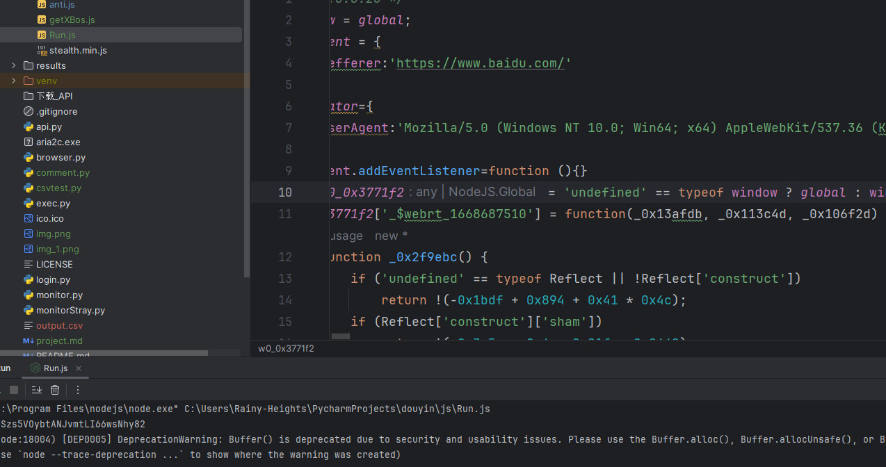
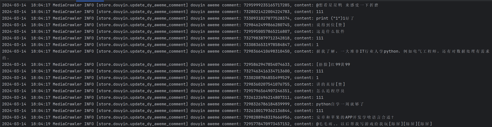

## 目的：使用爬虫爬取都应指定视频下方的所有评论

接电商小公司的面试需求

[参考视频](https://www.bilibili.com/video/BV1Qu411w7Gr/?spm_id_from=333.880.my_history.page.click)

知道了爬虫的基本原理是模仿正常用户的操作获取相关信息，下面是实际操作的记录

过程：

- 先是去抖音网站获取评论的api接口，拉取下来后使用ApiPost测试发现返回"block"阻塞信息
- 而后添加了相关请求头，发现加入User-Agent是关键信息
- 然而每次获取不同的视频发现有更改的参数：XBogus，这个参数是网站后台通过函数循环调用自己生成的（反爬）
- 遂通过浏览器断点调试最终追踪堆栈到生成函数：

```js
function _0x5a8f25(_0x48914f,  _0xa771aa) {
        return ('undefined' == typeof window ? global : window)['_$webrt_1668687510'](args)
}
```

- 于是通过Node调试js文件，模拟循环过程生成参数

```js
window = global;

document = {
    refferer:'https://www.baidu.com/'
}

document.addEventListener=function (){}

navigator={
    userAgent:'Mozilla/5.0 (Windows NT 10.0; Win64; x64) AppleWebKit/537.36 (KHTML, like Gecko) Chrome/122.0.0.0 Safari/537.36'
}

document.addEventListener=function (){}

 window.rainy=_0x5a8f25;

```

- 其实这里就已经涉及到js逆向的知识了，当时不知道
- 于是在python中编写代码如下

```python
import csv
import execjs
import requests

# 执行js脚本
ctx = execjs.compile(open('js/Run.js', mode='r', encoding='gbk').read())

# 2个必须加入的参数
header = {
    'User-Agent': 'Mozilla/5.0 (Windows NT 10.0; Win64; x64) AppleWebKit/537.36 (KHTML, like Gecko) Chrome/122.0.0.0 '
                  'Safari/537.36',
    'Referer': 'https://www.douyin.com/'
}

# 测试发现最多只能查询50页
cursor = input("输入起始查询分页数")
count = input("输入终止查询分页数")
url = ('https://www.douyin.com/aweme/v1/web/comment/list/?')

# 比较发现三个参数 需要单独分析
# x-bos,token,cursor
# aweme_id为作品id
arg1 = ('device_platform=webapp&aid=6383&channel=channel_pc_web&aweme_id=7331940186147933474cursor=' + str(cursor) + '&count='
        + str(count) +
        '&item_type=0&insert_ids=&whale_cut_token=&cut_version=1&rcFT=&pc_client_type=1&version_code=170400'
        '&version_name=17.4.0&cookie_enabled=true&screen_width=1707&screen_height=1067&browser_language=zh-CN'
        '&browser_platform=Win32&browser_name=Chrome&browser_version=122.0.0.0&browser_online=true&engine_name=Blink'
        '&engine_version=122.0.0.0&os_name=Windows&os_version=10&cpu_core_num=8&device_memory=8&platform=PC&downlink'
        '=1.35&effective_type=3g&round_trip_time=550&webid=7331622910048732683&msToken=hqxyFiEvhisE9d09ik0BsoXlpZs49u8r'
        '-WVP6f7rWmZs8QtFKXsKT2V7jPuo0x3IgvGbFDdvE6gAb1VCZWFYN_0qL_8qP8jSFGVaBJKqbC8noxhnjfdXLDQ1ofFR&')

xb = arg1 + '&XBogus=' + ctx.call('window.rainy', arg1)
url += xb
print(url)

response = requests.request('GET', url, headers=header)


json_data = response.json()   # 获取json数据

text = json_data['comments'] #类型为list
# print(type(text))
# 遍历 list集合
user = []

columns = ['用户', '评论']

data = {
    '用户': [],
    '评论': []
}

with open('results/comment.csv', 'w', newline='', encoding='utf-8') as file:
    writer = csv.writer(file)
    # 写入标题行，只包含指定的列
    writer.writerow([col for col in columns])

    for item in text:
        data['评论'].append(item['text'])
        print(item['text'])
        # 获取评论用户
        user.append(item['user'])
    for item in user:
        data['用户'].append(item['nickname'])
        print(item['nickname'])
    for row in zip(*(data[col] for col in columns)):
        writer.writerow(row)

```

测试结果：


其他调试过程：

[测试视频](https://www.douyin.com/video/7344577217386548492?modeFrom=)

爬取测试对象：

[测试链接](https://www.douyin.com/aweme/v1/web/comment/list/?device_platform=webapp&aid=6383&channel=channel_pc_web&aweme_id=7331940186147933474&cursor=0&count=20&item_type=0&insert_ids=&whale_cut_token=&cut_version=1&rcFT=&pc_client_type=1&version_code=170400&version_name=17.4.0&cookie_enabled=true&screen_width=1707&screen_height=1067&browser_language=zh-CN&browser_platform=Win32&browser_name=Chrome&browser_version=122.0.0.0&browser_online=true&engine_name=Blink&engine_version=122.0.0.0&os_name=Windows&os_version=10&cpu_core_num=8&device_memory=8&platform=PC&downlink=10&effective_type=4g&round_trip_time=100&webid=7331622910048732683&msToken=qG-hyrgeVnU31Bm0u88O-EFec0d6ZVnGbLGuERwWipjsOk9d6BEgYmIcJPzZK5fZxQLShRLGfs8uyaYeTWziAPh54zR9aG1ttUdqM58GZZqxyDNjoJi93R5nKg==&X-Bogus=DFSzKwGLaxkANxA/tL1B5z6G9UMX)


发现在断点处生成了xbox



日志断点打印找到了xbogs



获取成功：



## 这种方式的爬取效率太低，遂尝试[github项目](https://github.com/NanmiCoder/MediaCrawler.git)爬取

负责人要求爬取推荐关键词的爬取，同时提到了代理这个说法，貌似是一个加大爬取量的东西，恰好这个项目里面有

发现效果非常好：



甚至模拟了扫码登陆这样的功能，不过看原理应该是使用python的内置浏览器模拟方法。后续有时间继续研究代理方法（不过需要付费看起来）