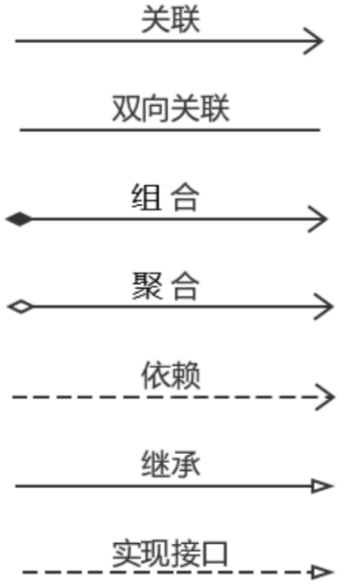

# UML类图

> UML——Unified modeling language UML(统一建模语言)，是一种用于软件系统分析和设计的语言工具，它用于帮助软件开发人员进行思考和记录思路的结果

* UML本身是一套符号的规定，就像数学符号和化学符号一样，这些符号用于描述软件模型中的各个元素和他们之间的关系，比如**类、接口、实现、泛化、依赖、组合、聚合**等

###### 设计类的原则：

* 设计一个类中的信息和行为要 `高内聚`
* 设计多个类, 类之间要 `低耦合`

对于 `继承(泛化)、实现(实现)`这两种关系比较简单，它们体现的是一种类与类、或者类与接口之间的 `纵向关系`。 其他的四种关系则体现的是类与类、或者类与接口之间的 `引用/横向关系`。这四种关系所表现的强弱程度来看，从强到弱依次为：`组合>聚合>关联>依赖`。

