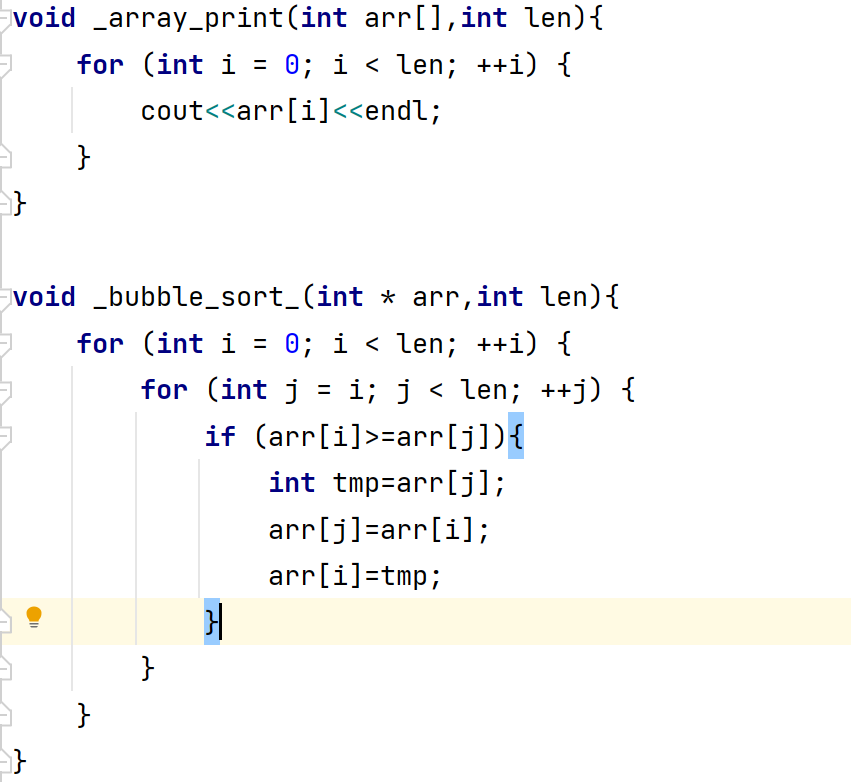
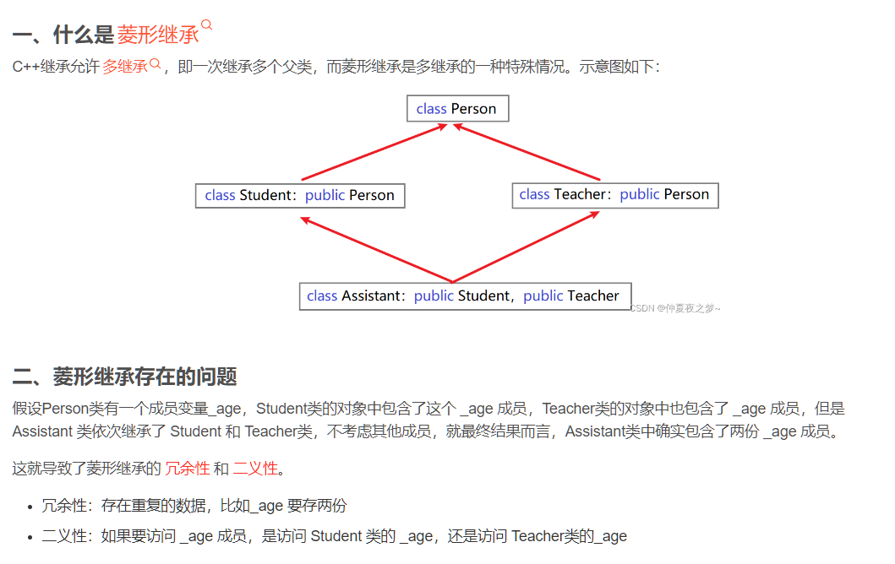

+++
title = 'C++'
date = 2023-10-27T20:52:20+08:00
draft = false
tags = ["语言"]
description="鉴于未来数据结构和算法的实现我想通过C++来实现，现在简要总结下C++的常用方法和数据结构类型"
+++

# C++实现数据结构和初步的认识

> 鉴于未来数据结构和算法的实现我想通过 C++来实现，现在简要总结下 C++的常用方法和数据结构类型

### 头文件和方法声明

等同于 C 语言

#### 标准输入输出函数

```c++
    std::cout << "Hello, World!" << std::endl;
```

> 引入 using namespace std;这可以避免函数要不断的添加前缀

```c++
   using namespace std;
   ...
   int input;
   cout<<"Hello world"<<endl;//输出函数
   cin>>input;
   printf("%d",input);
   ...
```


### 传递函数的不同方式



#### const 修饰指针

- 修饰常量
- 修饰指针
- 修饰常量和指针

```c++
int main() {

	int a = 10;
	int b = 10;

	//const修饰的是指针，指针指向可以改，指针指向的值不可以更改
	const int * p1 = &a;
	p1 = &b; //正确
	//*p1 = 100;  报错


	//const修饰的是常量，指针指向不可以改，指针指向的值可以更改
	int * const p2 = &a;
	//p2 = &b; //错误
	*p2 = 100; //正确

    //const既修饰指针又修饰常量
	const int * const p3 = &a;
	//p3 = &b; //错误
	//*p3 = 100; //错误

	system("pause");

	return 0;
}

```

### 空指针和野指针

#### NUll Point

```c++
int main() {

	//指针变量p指向内存地址编号为0的空间
	int * p = NULL;

	//访问空指针报错
	//内存编号0 ~255为系统占用内存，不允许用户访问
	cout << *p << endl;

	system("pause");

	return 0;
}

```

#### Wild Point

```c++
int main() {

	//指针变量p指向内存地址编号为0x1100的空间
	int * p = (int *)0x1100;

	//访问野指针报错
	cout << *p << endl;

	system("pause");

	return 0;
}

```

#### 数组作为函数展示：

```c++
void array_print(int arr[],int len){
    for (int i = 0; i < len; ++i) {
        cout<<arr[i]<<endl;
    }
}

void bubble_sort_(int * arr,int len){
    for (int i = 0; i < len; ++i) {
        for (int j = i; j < len; ++j) {
            if (arr[i]>=arr[j]){
                int tmp=arr[j];
                arr[j]=arr[i];
                arr[i]=tmp;
            }
        }
    }
}
int main(){
    int arr[]={10,2,4,4,3,5,9,1,3};
    bubble_sort_(arr,8);
    array_print(arr,8);
}
```

> 当数组名传入到函数作为参数时，被退化为指向首元素的指针

#### 删除数组元素空间

```c++
int arr[] = new[10];//声明数组
delete[] arr;//释放数组空间
```

> 内存发生取消和回收：

```c++
int  *a=new int [10];
    cout<<a<<endl;
    int *p=a;
    delete[] a;
    int *m=p;
    cout<<p<<endl;
    cout<<m<<endl;
```

### 引用

语法： 数据类型 &别名 = 原名

例子：

```c++
int a = 10;
int b = 20;
//int &c; //错误，引用必须初始化
int &c = a; //一旦初始化后，就不可以更改
c = b; //这是赋值操作，不是更改引用
```

#### 函数传参：

```c++
//1. 值传递
void mySwap01(int a, int b) {
	int temp = a;
	a = b;
	b = temp;
}

//2. 地址传递
void mySwap02(int* a, int* b) {
	int temp = *a;
	*a = *b;
	*b = temp;
}

//3. 引用传递
void mySwap03(int& a, int& b) {
	int temp = a;
	a = b;
	b = temp;
}
```

引用传参：

```cpp
class RainyInteger {
    friend ostream &operator<<(ostream& out,RainyInteger rainyInteger);
public:
    RainyInteger(){
        //初始化数据：
        this->rainy_num=0;
    }
     void speak(RainyInteger *r){
        cout<<r->rainy_num<<endl;
    }
private:
    int rainy_num;
};
main(){
    RainyInteger integer;
    integer.speak(& integer); //传入引用而不是指针，否则报错
}
```

### 类

#### 注意事项

> 在 C++中实例化一个类不需要用 new。也可以用 new，但是区别是：不使用 new，开辟栈空间，使用 new 开辟的空间为堆空间。这显然是因为程序员只操作堆空间的原因使然

**与 C 语言结构体的区别**

访问控制符是唯一区别，所有的结构体默认 public，但是类则是 private

**类的构造函数，析构函数和拷贝构造函数**

#### 静态变量和成员变量

> 静态变量语法：static 数据类型 变量名
>
> 类里面：类::变量名

> 成员变量语法：数据类型 变量名

静态方法类似，同时在头文件里面定义的时候可以具有方法体

代码如下：

```c++
People.h
using namespace std;
class People {
public:
    People(int age,string name){
        this->age=age;
        this->name=name;
    }
    //作用函数
    void speak(People *p){
        cout<<p->name<<endl;//相当于this.name
        cout<<p->age<<endl;
    }
    int age;
    string name;
    static string defaultName;
    static void defaultFunc();
};
```

```c++
People.cpp
#include "People.h"
//静态变量
string People::defaultName;

void People::defaultFunc() {

}
```

#### 构造函数（Constructor）

构造函数语法：类名(){}

在定义有参构造函数后，不再提供无参构造函数

#####析构函数（Destructor），通 Java,可重载，释放内存时使用

析构函数语法：~类名(){}

- 构造函数，没有返回值也不写 void
- 函数名称与类名相同
- 构造函数可以有参数，因此可以发生重载
- 程序在调用对象时候会自动调用构造，无须手动调用,而且只会调用一次

#### 拷贝构造函数

> 如果属性有在堆区开辟的，一定要自己提供拷贝构造函数，防止浅拷贝带来的问题

```c++
//
// Created by Rainy-Heights on 2023/10/27.
//

#ifndef OBJECT_C_STUDENT_H
#define OBJECT_C_STUDENT_H

#include <iostream>

using namespace std;
class Student {
public:
    Student(){
        cout<<"这是无构造函数"<<endl;
    }
    Student(int age,string name){
        cout<<"这是有参构造函数"<<endl;
        _stu_age=new int [age];
        _stu_name=name;
    }
    //拷贝构造 函数
    Student(const Student &student){
        cout<<"拷贝构造函数"<<endl;
        _stu_name=student._stu_name;
        _stu_age=new int [*student._stu_age];//指向对象的值，这里还是实现了值的拷贝
    }
    ~Student(){
        cout<<"析构函数"<<endl;
    }

public:
    int *_stu_age;
    string _stu_name;
};


#endif //OBJECT_C_STUDENT_H

```

> ==如果用户定义有参构造函数，c++不在提供默认无参构造==，但是会提供默认拷贝构造
>
> ==如果用户定义拷贝构造函数，c++不会再提供其他构造函数==

#### this 指针

成员函数访问时候的隐形的 this 指针变量

this 对于类来说就是自己的地址

例如：

```c++
RainyInteger * getAddr(){
        return this;
    }
```

### 友元

相当于内部标志为 friend 即可访问私有成员

- 全局函数作为友元：

```c++
class StrictBoy{
        friend void func(StrictBoy * strictBoy);
public:
    StrictBoy(){
        this->girlFriend="女朋友";
        this->money=520;
    }
private:
    String girlFriend;
public:
    int money;
void func(StrictBoy * strictBoy){
    cout<<strictBoy.girlFriend<<endl;//可以访问私有的变量了，牛头人既视感
}
};
```

- 类作为友元

```c++
class Building;
class goodGay
{
public:

	goodGay();
	void visit();

private:
	Building *building;
};


class Building
{
	//告诉编译器 goodGay类是Building类的好朋友，可以访问到Building类中私有内容
	friend class goodGay;

public:
	Building();

public:
	string m_SittingRoom; //客厅
private:
	string m_BedRoom;//卧室
};

Building::Building()
{
	this->m_SittingRoom = "客厅";
	this->m_BedRoom = "卧室";
}

goodGay::goodGay()
{
	building = new Building;
}

void goodGay::visit()
{
	cout << "好基友正在访问" << building->m_SittingRoom << endl;
	cout << "好基友正在访问" << building->m_BedRoom << endl;
}

void test01()
{
	goodGay gg;
	gg.visit();

}

int main(){

	test01();

	system("pause");
	return 0;
}

```

- 成员函数作为友元：

```c++
class Building;
class goodGay
{
public:

	goodGay();
	void visit(); //只让visit函数作为Building的好朋友，可以发访问Building中私有内容
	void visit2();

private:
	Building *building;
};


class Building
{
	//告诉编译器  goodGay类中的visit成员函数 是Building好朋友，可以访问私有内容
	friend void goodGay::visit();

public:
	Building();

public:
	string m_SittingRoom; //客厅
private:
	string m_BedRoom;//卧室
};

Building::Building()
{
	this->m_SittingRoom = "客厅";
	this->m_BedRoom = "卧室";
}

goodGay::goodGay()
{
	building = new Building;
}

void goodGay::visit()
{
	cout << "好基友正在访问" << building->m_SittingRoom << endl;
	cout << "好基友正在访问" << building->m_BedRoom << endl;
}

void goodGay::visit2()
{
	cout << "好基友正在访问" << building->m_SittingRoom << endl;
	//cout << "好基友正在访问" << building->m_BedRoom << endl;
}

void test01()
{
	goodGay  gg;
	gg.visit();

}

int main(){

	test01();

	system("pause");
	return 0;
}

```

#### 运算符重载：

作用：**实现对类变量的自定义运算方法**

可实现重载的运算符：

- 加号运算符
- 左移运算符
- 递增运算符
- 赋值运算符
- 关系运算符
- 函数调用运算符

```c++
//这里是表示对输出流里面的操作符实现重载
ostream& operator-(ostream& out,Person& p){
out<<"通过友元实现对私有变量的访问"<<p.m_A<<p.m_B;
}
```

表示的意义就是对符号进行了自定义

**案例**

#### 实现自己的数据类型

```c++
雨山的整型数据

class RainyInteger {
    friend ostream &operator<<(ostream& out,RainyInteger rainyInteger);
public:
    RainyInteger(){
        //初始化数据：
        this->rainy_num=0;
    }
    //前置++操作
    RainyInteger& operator++(){
        rainy_num++;
        return *this;
    }
    //后自增操作：???
    RainyInteger& operator++(int){
        RainyInteger tmp= *this;
        rainy_num++;
        return  tmp;
    }
     void speak(RainyInteger *r){
        cout<<r->rainy_num<<endl;
    }
private:
    int rainy_num;
};
```

#### 内联函数 inline

```c++
 inline int max(int a,int b){

 }
```

### 继承

> 语法：class 子类 : 继承方式 父类

```c++
class Father{

};
class Child1: public Father;
class Child2: private Father;
class Child3: protected Father;
```

#### 构造和析构顺序：

子类继承自父类之后，调用子的构造函数将会造成父类的构造函数的调用，析构函数则相反，因为清理先从最小的子类开始清理。

#### 菱形继承问题

简而言之就是父类被多个子类继承，多个子类被某一个孙子类同时继承，导致得问题是使得当孙子类继承两个子类中含有相同变量或者字段时造成二义

示意图：



解决办法->虚继承 关键字：**virtural**

在基类的两个子类中继承基类时，使用 virtual 关键字。虚继承基类。使得基类的属性成员只有一份。

```c++
class Animal
{
public:
	int m_Age;
};

class Sheep : virtual public Animal {};
class Tuo   : virtual public Animal {};
class SheepTuo : public Sheep, public Tuo {};

```

#### 继承之后子类获得了什么？

公共变量和方法肯定是获得了。

同时：

> 父类中私有成员也是被子类继承下去了，只是由编译器给隐藏后访问不到

#### 多态

- 静态多态: 函数重载 和 运算符重载属于静态多态，复用函数名
- 动态多态: 派生类和虚函数实现运行时多态

区别：

- 静态多态的函数地址早绑定 - 编译阶段确定函数地址
- 动态多态的函数地址晚绑定 - 运行阶段确定函数地址

```c++

class Animal
{
public:
	//Speak函数就是虚函数
	//函数前面加上virtual关键字，变成虚函数，那么编译器在编译的时候就不能确定函数调用了。
	virtual void speak()
	{
		cout << "动物在说话" << endl;
	}
};

class Cat :public Animal
{
public:
	void speak()
	{
		cout << "小猫在说话" << endl;
	}
};

class Dog :public Animal
{
public:

	void speak()
	{
		cout << "小狗在说话" << endl;
	}

};
//我们希望传入什么对象，那么就调用什么对象的函数
//如果函数地址在编译阶段就能确定，那么静态联编
//如果函数地址在运行阶段才能确定，就是动态联编

void DoSpeak(Animal & animal)
{
	animal.speak();
}
//
//多态满足条件：
//1、有继承关系
//2、子类重写父类中的虚函数
//多态使用：
//父类指针或引用指向子类对象

void test01()
{
	Cat cat;
	DoSpeak(cat);


	Dog dog;
	DoSpeak(dog);
}


int main() {

	test01();

	system("pause");

	return 0;
}

```

#### 虚函数和纯虚析构

在多态中，通常父类中虚函数的实现是毫无意义的，主要都是调用子类重写的内容

因此可以将虚函数改为纯虚函数

纯虚函数语法：virtual 返回值类型 函数名 （参数列表）= 0 ;

当类中有了纯虚函数，这个类也称为==抽象类==

#### 虚函数的前提：

-
- 基类，派生类拥有原型相同的成员函数
- virtual 关键字

#### 虚析构函数

-
- 虚析构函数是为了解决基类指针指向派生类对象，并用基类的指针销毁派生类对象

#### 纯虚函数

多态使用时，如果子类中有属性开辟到堆区，那么父类指针在释放时无法调用到子类的析构代码

解决方式：将父类中的析构函数改为虚析构或者纯虚析构

虚析构和纯虚析构共性：

可以解决父类指针释放子类对象
都需要有具体的函数实现
虚析构和纯虚析构区别：

如果是纯虚析构，该类属于抽象类，无法实例化对象
虚析构语法：

virtual ~类名(){}

纯虚析构语法：

virtual ~类名() = 0;

类名::~类名(){}

-
- 纯虚函数没有函数体，其作用实在基类中为派生类保留一个函数接口，方便派生类根据需要对它实现，实现多态。

函数的可变长参数：

```c++
flaot avg(int size,...){
}
```

### C++模板

#### 函数模板

建立一个通用函数，其函数返回值类型和形参类型可以不具体制定，用一个虚拟的类型来代表。

```c++
template<typename T>
函数声明或定义
```

template — 声明创建模板

typename — 表面其后面的符号是一种数据类型，可以用 class 代替

T — 通用的数据类型，名称可以替换，通常为大写字母

看起来和 java 里面的泛型比较像

注意事项：

- 自动类型推导，必须推导出一致的数据类型 T,才可以使用
- 模板必须要确定出 T 的数据类型，才可以使用

```cpp
//1、指定传入的类型
void printPerson1(Person<string, int> &p)
{
	p.showPerson();
}
void test01()
{
	Person <string, int >p("孙悟空", 100);
	printPerson1(p);
}

```

类模板成员类外实现：

```cpp
#include <string>

//类模板中成员函数类外实现
template<class T1, class T2>
class Person {
public:
	//成员函数类内声明
	Person(T1 name, T2 age);
	void showPerson();

public:
	T1 m_Name;
	T2 m_Age;
};

//构造函数 类外实现
template<class T1, class T2>
Person<T1, T2>::Person(T1 name, T2 age) {
	this->m_Name = name;
	this->m_Age = age;
}

//成员函数 类外实现
template<class T1, class T2>
void Person<T1, T2>::showPerson() {
	cout << "姓名: " << this->m_Name << " 年龄:" << this->m_Age << endl;
}


```

### STL 基本认识

- STL(Standard Template Library,标准模板库)
- STL 从广义上分为: 容器(container) 算法(algorithm) 迭代器(iterator)
- 容器和算法之间通过迭代器进行无缝连接。
- STL 几乎所有的代码都采用了模板类或者模板函数

STL 大体分为六大组件，分别是:容器、算法、迭代器、仿函数、适配器（配接器）、空间配置器

- 容器：各种数据结构，如 vector、list、deque、set、map 等,用来存放数据。
- 算法：各种常用的算法，如 sort、find、copy、for_each 等
- 迭代器：扮演了容器与算法之间的胶合剂。
- 仿函数：行为类似函数，可作为算法的某种策略。
- 适配器：一种用来修饰容器或者仿函数或迭代器接口的东西。
- 空间配置器：负责空间的配置与管理。

容器：置物之所也

STL 容器就是将运用最广泛的一些数据结构实现出来

常用的数据结构：数组, 链表,树, 栈, 队列, 集合, 映射表 等

这些容器分为序列式容器和关联式容器两种:

序列式容器:强调值的排序，序列式容器中的每个元素均有固定的位置。
关联式容器:二叉树结构，各元素之间没有严格的物理上的顺序关系

算法：问题之解法也

有限的步骤，解决逻辑或数学上的问题，这一门学科我们叫做算法(Algorithms)

算法分为:质变算法和非质变算法。

质变算法：是指运算过程中会更改区间内的元素的内容。例如拷贝，替换，删除等等

非质变算法：是指运算过程中不会更改区间内的元素内容，例如查找、计数、遍历、寻找极值等等

迭代器：容器和算法之间粘合剂

提供一种方法，使之能够依序寻访某个容器所含的各个元素，而又无需暴露该容器的内部表示方式。

每个容器都有自己专属的迭代器

迭代器使用非常类似于指针，初学阶段我们可以先理解迭代器为指针

#### 常见的容器
