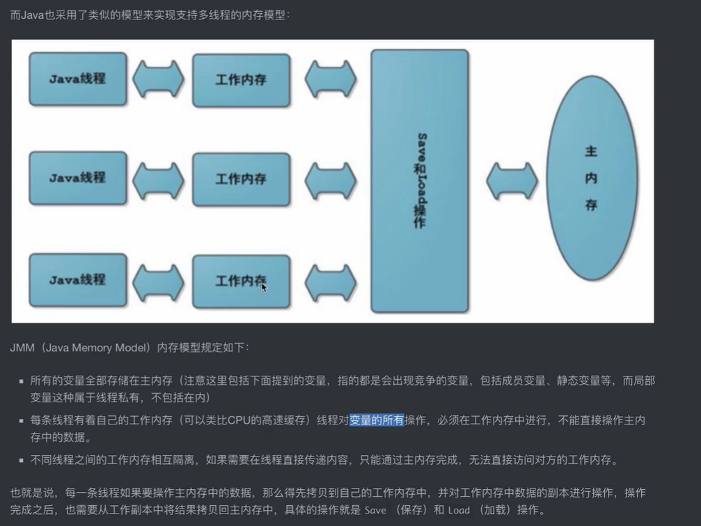
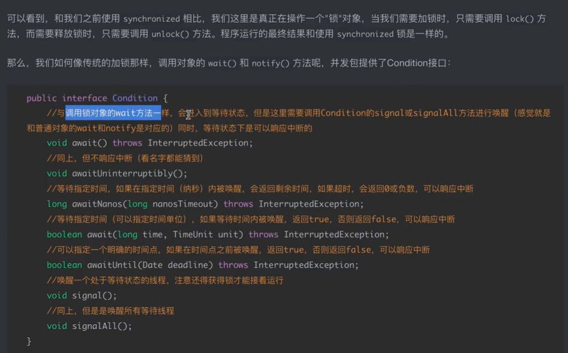
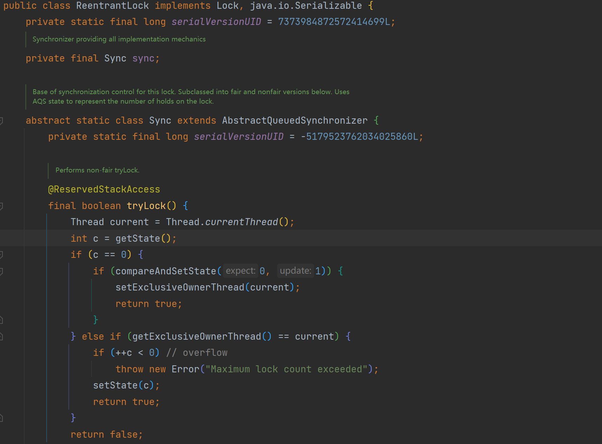

+++
title = 'Java-Concurrent'
date = 2023-10-09T19:49:34+08:00
draft = false
tags= ["并发编程"]
description= "并发编程基础"

+++

# Java 并发编程

### 轻量级锁：

检查当前对象的mark word是否有被其他线程占用，假如没有就会在当前栈帧里面建立一个
锁记录，复制并存储当前对象的mark word 信息。

不像重量级锁需要向系统申请互斥量，

### CAS（无锁算法）


显然，当cas失败的时候，说明有线程进入了这个同步代码块，这个时候，虚拟机将会检查
当前对象的mark word是否指向当前对象的栈帧，是的话就说明当前已经获得锁，否则不是-》退化为重量级锁(不可逆)
解锁时，同样使用CAS算法操作，同时唤醒挂起的线程

### 偏向锁

当某个锁频繁的被同一个线程获取，对轻量级锁进行优化，所以偏向锁专门为单个线程服务，此时，无须再进行CAS操作，当其他线程
又开始抢锁，偏向锁可能退化为轻量级锁。注意当调用对象的hashCode（）方法，由于mark word 数据结构无法
保存hash值，偏向锁直接退化为轻量级锁。

<b> 锁的退化不可逆</b>

### 锁消除和锁优化

代码块中有可能不会总是出现请求锁和释放锁的问题，（比如循环中加锁），此时锁为了优化出现锁消除和锁优化

## Java内存模型（JMM）



主内存： 存放对象实例的部分
工作内存：虚拟机栈的部分，放入cpu的高速缓存里面。 自增操作不是由一个指令实现的！！！包括获取，修改和保存

```java
class Test{
  private static volatile int sum=0;//成员变量,这样的变量必须是当前的对象所拥有的
  //加入了volatile关键字之后，线程之间可以感知彼此的值
  @Test
  void LockTestAdd() throws InterruptedException {
    //没有加锁的时候，由于线程之间不能感知对方的值，最终结构可能不会是200
    Thread th1 = new Thread(() -> {
      for (int i = 0; i < 100; i++)
        sum++;
    });

    Thread th2 = new Thread(() -> {
      for (int i = 0; i < 100; i++)
        sum++;
    });
    th1.start();
    th2.start();
    Thread.sleep(100);
    System.out.println(sum);
  }
}
```

### 重排序

由于JVM虚拟机和编译器的优化，指令可能出现重排序，在这种情况下可能出现不符合预期的情况

### volatile关键字（无法保证原子性，但能保证可见性）


load和save操作，将主内存中的变量拷贝到本地，只对本地变量进行操作。

volatile实现原理就是改变成员变量时，save的工作区的变量无效。重新更新主内存中的变量值，
volatile关键字会禁止指令重排序。


```java
class VolatileTest{
  
private static volatile int sum=0;//成员变量,这样的变量必须是当前的对象所拥有的
    //加入了volatile关键字之后，线程之间可以感知彼此的值,但还是无法保证原子性操作，不能达到预期效果
    @Test
    void LockTestAdd() throws InterruptedException {
        //没有加锁的时候，由于线程之间不能感知对方的值，最终结构可能不会是200
        Thread th1 = new Thread(() -> {
            for (int i = 0; i < 1000; i++)
                    sum++;
        });
       Thread th2 = new Thread(() -> {
            for (int i = 0; i < 1000; i++) {
                sum++;
            }
        });
        th1.start();
        th2.start();
        Thread.sleep(100);
        System.out.println(sum);
    }
}

```

JVM编译器下面的顺序执行：

### Happens Before 原则（之前的对之后的可见）

程序次序规则，监视器锁原则，volatile关键字原则（写操作在读操作之前），

#### start(线程启动规则)

A线程用start调用B线程，那么A在B之前（A happens before B）

#### join线程加入规则

A线程join线程B，那么B在A之前（B happens before A）

#### 程和线程的区别

程序软件 > 进程 > 线程

### 锁的框：Lock

为了代替传统的synchronized,notify,wait,notifyAll关键字，Lock接口->ReentrantLock可重入锁



## 可重入锁（排他锁）

多次加锁，其他线程想要得到锁需要把多次的锁释放才可以获取这把锁

当存在线程想要获取锁但是锁没有释放的时候，此时这些线程将会进入线程队列里面

### 公平锁和非公平锁（AQS）



公平锁始终保持先到先得到锁，非公平锁则是在等待队列中所有等待线程同时尝试获取锁，获取不到则再次进入等待队列

```txt
ReentrantLock lock=new ReentrantLock(false);//公平锁不一定总是保持公平。队列同步器
        Runnable runnable=()->{
            System.out.println(Thread.currentThread().getName() + "开始尝试获取锁资源");
            lock.lock();

            System.out.println(Thread.currentThread().getName() + "成功😺😺😺😺😺😺😺😺😺获取锁资源");
            lock.unlock();
        };

        for (int i = 0; i < 10; i++) {
            new Thread(runnable,"T"+i).start();
        }
```

### 读写锁：

> 除了可重入锁之外，还有一种类型的锁叫做读写锁，当然它并不是专门用作读写操作的锁，
> 它和可重入锁不同的地方在于，可重入锁是一种排他锁，当一个线程得到锁之后，另一个线程必须等待其释放锁，否则一律不允许获取到锁。而读写锁在同一时间，是可以让多个线程获取到锁的，它其实就是针对于读写场景而出现的。
>
> 读写锁维护了一个读锁和一个写锁，这两个锁的机制是不同的。
>
> 读锁：在没有任何线程占用写锁的情况下，同一时间可以有多个线程加读锁。
>
> 写锁：在没有任何线程占用读锁的情况下，同一时间只能有一个线程加写锁。

显然读锁是可以重复获取的但是写锁不能，当一个线程同时拥有写锁和读锁的时候，先申请读锁
然后释放写锁，此时其他的线程又可以获取读锁，只剩下读锁，此时称之为“锁降级”。
在仅仅持有读锁的时候去申请写锁，称为“锁升级”，这时候ReentryReadWriteLock类不支持。

### 队列同步器AQS（AbstractQueuedSynchronizer）

继承关系：Lock-> Sync -> AbstractQueuedSynchronizer

### 多线程并发环境下的ABA问题

```java
//ABA问题的版本号解决方法
        AtomicReference<String> atomicReference=new AtomicReference<>("A");
        System.out.println(atomicReference.compareAndSet("a", "c"));
        String hello = "hello";
        String world = "world";

        Runnable r=()->{
            System.out.println(atomicReference.compareAndSet("A", "B"));
        };
        for (int i = 0; i < 100; i++) {
            new Thread(r).start();
        }
```

可以看到多个线程尝试去修改的时候出现了一个true

解决办法：添加版本号，每次修改的时候对版本号（stamp）进行修正

## 并发容器

比如在对链表添加元素的时候，还没有完成对链表扩容之前，其他线程插队，非法插入元素，就会造成数组越界的报错。

* ConcurrentHashMap:在jdk1.7之前的实现方法，比如在原子类里面实现LongAdder具有压力分散的思想，提高了性能，选择将数据一段一段的存储，这样就减少了等待，当线程访问锁的时候只占用锁的一小部分
* jdk8之后，实现方法是通过cas算法配合锁机制实现的。由于HashMap利用了哈希表，容量越大，加锁的粒度就会越细。

```java
//原子类的测试操作
        //ABA问题的版本号解决方法
        CopyOnWriteArrayList<Object> objects = new CopyOnWriteArrayList<>();
        //读取不加锁，写数据需要加锁，所以性能还行
        //专用于多线程环境下的容器
        LinkedList<Object> list = new LinkedList<>();//没有发生并发异常
        ArrayList<Object> list1 = new ArrayList<>();
        ConcurrentHashMap<Integer, String> map = new ConcurrentHashMap<>();
        HashMap<Integer, String> hashMap = new HashMap<>();
        Runnable r=()->{
            for (int j = 0; j < 100; j++) {
                int finalI=j;
                objects.add("aaa");
                map.put(finalI,"aaa");
                hashMap.put(finalI,"aaa");
            }
        };
        for (int i = 0; i < 100; i++) {
            new Thread(r).start();
        }
        TimeUnit.SECONDS.sleep(1);
```

### 阻塞队列（BlokingQueue）

生产者消费之模型：

```java
 //测试阻塞队列实现生产者消费者模型
        BlockingQueue<Object> queue=new ArrayBlockingQueue<>(1);//窗口只能放一个菜，阻塞队列的容量
        Runnable supplier=()->{
          while (true){
              try {
                  String name = Thread.currentThread().getName();
                  System.err.println(time()+"生产者"+name+"正在准备餐品");
                  TimeUnit.SECONDS.sleep(3);
                  System.err.println(time()+"生产者"+name+"已出餐");
                  queue.put(new Object());
              }catch (InterruptedException e){
                  e.printStackTrace();
                  break;
              }
          }
        };

        Runnable consumer=()->{
            while (true){
                try {
                    String name = Thread.currentThread().getName();
                    System.out.println(time()+"消费者"+name+"正在等待餐品");
                    queue.take();
                    System.out.println(time()+"消费者"+name+"已取餐");
                    TimeUnit.SECONDS.sleep(4);
                    System.out.println(time()+"消费者"+name+"已吃完");
                }catch (InterruptedException e){
                    e.printStackTrace();
                    break;
                }
            }
        };
        for (int i = 0; i < 2; i++) {
            new Thread(supplier,"supplier"+i).start();
        }
        for (int i = 0; i < 3; i++) {
            new Thread(consumer,"consumer"+i).start();
        }
    }
    public static String time(){
        SimpleDateFormat format = new SimpleDateFormat("HH:mm:ss");
        return "["+format.format(new Date())+"]";
    }
```

常见的阻塞队列：ArrayBlokingQueue(有界缓冲阻塞队列),SynchronousQueue(无缓冲阻塞队列),LinkedBlokingQueue(无界带缓冲阻塞队列)

```java
public boolean offer(E e) {
        Objects.requireNonNull(e);//检查当前的队列是否为空
        final ReentrantLock lock = this.lock;//对当前线程加锁
        lock.lock();
        try {
            if (count == items.length)
                return false;
            else {
                enqueue(e);
                return true;
            }
        } finally {
            lock.unlock();
        }
    }
```

```java
public E take() throws InterruptedException {
        final ReentrantLock lock = this.lock;
        lock.lockInterruptibly();
        try {
            while (count == 0)
                notEmpty.await();//当当前线程读取到队列为空时，由于take操作时阻塞的，需要挂起当前线程，等待直到队列里面有值
            return dequeue();
        } finally {
            lock.unlock();
        }
    }
```

#### SynchronousQueue(没有任何容量，插入和取出是一一对应的)

```java
SynchronousQueue<String> queue=new SynchronousQueue<>();
        new Thread(()->{
            try {
                System.out.println(queue.take());
            } catch (InterruptedException e) {
                throw new RuntimeException(e);
            }
        }).start();
        queue.put("sss");
```

这是一个特殊的队列，内部维护了一个抽象类Transfer（put和take操作糅合在一起了），
里面有一个方法：transfer（E e,bolean timed,long nanos）直接通过生产者和消费者模型来实现数据的传递。
当新的元素put进去线程将会阻塞。直到元素被take。同时这个类维护了公平锁和非公平锁两种方法。

> 

当当前队列里面有元素但是没有线程来取元素时候，就会开启自旋，当自旋一定次数之后还没有来取就会挂起
#####  PriorityBlockingQueue优先队列

构造方法：PriorityQueue<Integer> queue=new PriorityQueue<Integer>(10,Integer::compare);

传入容量和函数逻辑（优先逻辑）
#### DelayQueue延时队列

特殊地方：存储的元素必须是继承自Delayed接口的类，同时元素类必须实现Delayed接口。

使用时可以实现延时出队，按照同时的时候按照优先级（自己实现）进行出队，这样就可以实现缓存了。

底层实现：
```java
  public class DelayQueue<E extends Delayed> extends AbstractQueue<E>
        implements BlockingQueue<E> {
    private final transient ReentrantLock lock = new ReentrantLock();
    private final PriorityQueue<E> q = new PriorityQueue<E>();  //通过内部维护的优先队列来实现元素的存储，而不是本身进行存储
}
```
#### 主要常见的阻塞队列总结如下：

* ArrayBlokingQueue底层通过数组实现的阻塞队列，可以设置初始的容量，换句话容量是固定的
* LinkedTransferQueue
* SynchronousQueue要求入队和出队必须同时进行，一一对应，原因是内部维护了一个抽象类tansfer，需要等到消费者和生产者同时到齐才可以完成交接工作，支持公平和非公平
* PriorityBlokingQueue优先队列，元素的获取顺序按照优先级决定
* DelayQueue能够实现延迟获取元素，同样支持优先级，要求加入的元素必须继承Delayed接口

### 数据字典

常见的常用的数据，具有分级的特点，现在将比如省份县市地点的信息维护成一张表就可以是实现
据字典，通常具有id，parent_id这些字段，维护父级和子级的关系。

关于ElementUi的数据字典的显示方法就是检查hasChildren字段的值进行渲染

### 线程池

引入原因：频繁创建和销毁线程对系统资源的浪费十分严重，为了合理分配和调用系统资源，产生了线程池的技术

实现原理：将已创建的线程复用，利用池化技术，就像数据库连接池一样，我们也可以创建很多个线程，然后反复地使用这些线程，而不对它们进行销毁。

由于线程池可以反复利用已有线程执行多线程操作，所以它一般是有容量限制的，当所有的线程都处于工作状态时，那么新的多线程请求会被阻塞，直到有一个线程空闲出来为止，实际上这里就会用到我们之前讲解的阻塞队列。


